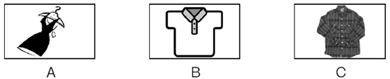

 

**第一部分　中考语法在线**

[TOC]

 

## 第1讲　名词

第一组

(　　)1.—What can I do for you?

​    —I'd like two ________.

​    A.box of apple     B．boxes of apples    

C．box of apples  D．boxes of apple

(　　)2.Peter regards Zhongshan as his second ________ because he has lived there for ten years.

​    A.family B．house    C．home D．room

(　　)3.The singer felt very sorry and decided he would never drive again after drinking.The traffic accident was really a ________ to him.

​    A.game  B．pleasure   C．skill D．lesson

(　　)4.Today, we have many other ________ to pay besides coins or paper money.

​    A.excuses     B．ways        C．chances D．plans

(　　)5.Stop making so much ________.The children are sleeping.

A．noise     B．voice    C．sound    D．sounds

(　　)6.There is not enough ________ in the corner to put the table.

​    A.place     B．room C．floor     D．ground

(　　)7.—Do the dishes, Mike, or I will tell Mum!

​    —Mind your own ________， Sue!

​    A.action  B．duty    C．business   D．way

(　　)8.—Taking a walk in the evening is a good ________.

​    —So it is; it keeps us healthy.

​    A.habit       B．hobby    C．rule   D．favor 

(　　)9.—I hear you will go to Hainan for vacation.

​    —It's one of the ________ of my family.We will discuss it before we make a decision.

​    A.plans  B．orders   C．rules D．games

(　　)10.Which is the way to the ________？

A．shoe factory  B．shoes factory C．shoe's factory D．shoes' factory

(　　)11.Mary's skirt is the same as her ________.

​    A.sisters  B．brother      C．brother's  D．sister's

(　　)12.We need to come up with a(n) ________ and make a decision at once.

​    A.information B．advice  C．idea  D．news

(　　)13.—What would you like to drink?

​    —________， please.

​    A.Rice B．Meat    C．Water  D．Bread

(　　)14.Please pick up the ________.Don't keep it on the floor.

A．paper   B．boxes   C．books      D．bottles

(　　)15.Mr.Black gave us ________ on how to learn English well.

​    A.an advice     B.many advices    

C．some advice       D.some advices

(　　)16.—Do you like ________？

​    —No.I prefer rose, the colour of your dress.

​    A.orange  B．oranges   C．carrot D．carrots

(　　)17.—Excuse me, are you ________？

​    —No, we are ________.

A．American; Englishman B．American; Germans

C．American; Germen D．Englishman; Americans

(　　)18.All the ________ teachers enjoy themselves on March 8th, because it is their own holiday.

​    A.man           B．men         

C．woman       D．women

(　　)19.—Why didn't you take a taxi back last night?  

—Because I didn't have any ________ with me.

​      A．books B．bicycles  C．friends  D．money

(　　)20.________ fathers made them have piano lessons.

A．Peter and Ann's      B．Peter's and Ann's

C．Peter's and Ann      D．Peter and Ann

第二组

(　　)1.The teacher had something to tell him, so he went to ________.

A．the teachers' B．the teacher C．the teachers D．teacher

(　　)2.We will have a ________ holiday after the exam.

A．two month B．two­month C．two month's D．two­months

(　　)3.This is my________ book.

A．sister Lily B．sister's Lily  C．sister's Lily's  D．sister Lily's

(　　)4.I have to speak to my grandpa loudly because something is wrong with his ________.

​      A．eyes          B．ears           C．hands          D．legs

(　　)5.—Mr.Smith always has ________ to tell us.

​    —So he does.

​     A．some piece of news              B.some pieces of newses

​     C．some piece of newses         D.some pieces of news 

(　　)6.How many________ are there in the international village?

A．Japanese B．Russian  C．American  D．German

(　　)7.This class ________ now.Miss Gao is teaching them.

A．are studying B．is studying C．be studying D．studying

(　　)8.—I've got a little ________ in my house.

—Why not keep two or more?

A．juice  B．mice  C．bread D．fish

(　　)9.There are many ________ playing on the playground.

​    A.child    B．children  C.man teachers  D．men teacher

(　　)10.—What is your favorite food?

—I like ________ best.I had a large bowl last night.

A．potato noodle   B．potatoes noodle 

 C．potato noodles   D．potatoes noodles 

(　　)11.—Would you like some ________？ 

—No, thank you.I'm not hungry at all.

A．tea B．water  C．bread D．coffee

(　　)12.—You didn't send me an e­mail last night, did you?

 —Sorry.My ________ broke down.I couldn't get online.

A．computer B．car   C．clock D．camera

(　　)13.Lots of things are made of ________.We must protect ________.

A．woods; woods  B．wood; wood

 C．wood; woods D．woods; wood

(　　)14.—How many ________ teachers are there in your school?

​    —________ them ________ over two hundred.

​    A.woman; The number of; is       B．women; The number of; is

​    C.woman; A number of; is        D．women; A number of; are

(　　)15.Are these your ________？

A．tomato B．potatos  C．radioes  D．photos

(　　)16.—Oh, dear! There isn't enough ________ for us in the lift.

​    —No hurry.Let's wait for the next.

​    A.floor    B．seat    C．room     D．ground

(　　)17.My________ of this weekend's activity is going out with some good friends.

A．idea B．opinion  C．mind  D．way

(　　)18.________ mother can't come to the meeting because she has gone to Guangzhou.

​    A．Sally's and Jane      B．Sally and Jane's

​    C．Sally's and Jane's      D．Sally and Janes'

(　　)19.You should do more ________.Don't always sit at the desk busy doing your________.

A．exercise; exercises   B．exercises; exercise

 C．exercises; exercises D．exercise; exercise

(　　)20.The old man used to raise many ________ to make a living on the farm.

​    A.duck   B．horse C．bird    D．sheep

 

 

## 第2讲　冠词

(　　)1.—What ________ useful book it is!

​    —Yeah, it tells you how to play ________ guitar.

​    A.an; the     B．a; a   C．a; the   D．an; a

(　　)2.My mother cooked ________ delicious meal.After ________ meal, we went shopping.

​    A.a; /    B．the; /    C．a; the   D．an; the 

(　　)3.Mr.Wang has worked as ________ English teacher for more than 10 years.

​      A．/       B．a        C．an       D．the

(　　)4.A spaceship flies at about eleven kilometers ________ second.

​    A./     B．the    C．a      D．an

(　　)5.How strange! These years my birthday always falls ________.

​    A.on the Sunday B．on a Sunday C．on Sunday D．at a Sunday

(　　)6.I see a map on ________ right.From the map, I know Dalian is in ________ north of China.

​    A.the; the    B．the; a  C．a; the  D．a; a

(　　)7.Beijing, ________ capital of China, has ________ long history.

​    A.a; a  B．the; /   C．the; a  D．/; the

(　　)8.Let's have ________ break; I want to make ________ telephone call.

​    A.a; a      B．a; the       C．the; a D．the; the

(　　)9.As is known to us all, ________ tiger is in ________ danger of becoming extinct.

A．the; a   B．the; / C．a; / D．/; the

(　　)10.It is ________ popular way among the young people to chat on the Internet now.

​    A.a B．an   C．the D．/

(　　)11.—Why do you like Jack?

​     —Because he is ________ honest boy.

​    A.a   B．an     C．the   D．/

(　　)12.Learning ________ country's language is a better way to know ________ culture behind it.

​    A.the; a    B．a; the    C．/; the   D．a; /

(　　)13.The education of ________ young is always ________ hot and serious topic.

A．/; / B．the; a C．/; the D．the; /

(　　)14.—How was ________ dinner at Mike's house?

​        —It was great.Mike's mum is ________ wonderful cook.

​    A.a; the      B．the; a        C．the; the     D．a; a

(　　)15.—Did you get there by ________ bike?

​        —No, I took ________ taxi.

​    A.a; a           B．/; a   C．the; the       D．/; the

(　　)16.I like music, but I don't like ________ music of this film.

​        A．a       B．an       C．the       D．/

(　　)17.There's ________ apple on the table.________ apple is for my little brother.

​        A．a; An  B．an; An       C．the; An    D．an; The

(　　)18.The evening party was really fun.We had ________ great time.

​    A.a  B．an    C．the   D．/

(　　)19.The market for ________ used computers is getting larger and larger as ________ years go on.

A．/; /  B．the; /  C．the; the D．/; the

(　　)20.This novel can make you laugh and cry at ________ same time.

​    A.a  B．an    C．the   D．/

(　　)21.I usually go to school on ________ foot.

​    A.a  B．the   C．/   D．an

  (　　)22.The Changjiang River is one of ________ longest rivers in________ world.

 A．the; /  B．/; /  C．the; the  D．the; a

(　　)23.The cakes are delicious.I'd like to have ________ third one as ________ second one I ate was too small.

A．the; the B．a; the  C．the; a D．a; a

(　　)24.________number of students have gone to Shanghai.

 A．/ B．The  C．A  D．An

(　　)25.________ science is one of the most important subjects.

 A．A B．An   C．The  D．/

(　　)26.He gets up early in ________ morning, but goes to bed late at________ night.

 A．the; a  B．/; the  C．the; /  D．an; a

 (　　)27.________September is the ninth month of a year.

  A．A  B．An    C．The D．/

(　　)28.David comes from________ United Kingdom of Great Britain and Northern Ireland.

A．a  B．the  C．an D．/

(　　)29.We can't see________ sun in ________ sky in the evening.

  A．the; the  B．/; the  C．the; / D．a; /

(　　)30.—Did you happen to see ________ black and ________ white cat?

—Are they missing? I told you to take care of them.

A．a; /   B．the; /  C．the; the D．a; the

 

 

## 第3讲　代词

第一组

(　　)1.Mr.Wang is very friendly, and ________ like him very much.

  A．we          B．us     C．our  D．ours

(　　)2.—Excuse me, are these books ________？  

​    —No, they are ________ classmate's.

​        A．his; he   B．hers; hers      C．your; mine   D．yours; my

(　　)3.—Is Miss White ________ English teacher, Maria?   

​    —No, she teaches ________ geography.

​        A．your; my   B．you; mine     C．you; us    D．your; us

(　　)4.—Could I have some milk?

​    —Certainly.There's ________ in the bottle.

​    A.little     B．a little       C．a few      D．few

(　　)5.Millie gave ________ a baby cat yesterday that hurt ________ when it fell from a tree.

​    A.me; it    B．myself; itself    C．me; itself   D．myself; it 

(　　)6.—Who is the best friend of ________ at school?  

​    —I think Helen is.We often help each other.

​    A.mine   B．his    C．yours     D．hers

(　　)7.—Linda, help ________ to some fruit.

​        —Thank you.

​        A．you   B．yours     C．yourself   D．yourselves

(　　)8.—There is still a copy of this book in the library.Will you go and borrow ________？

   —No, I will buy ________ in the bookstore.

​    A.one; it         B．one; one      C．it; one        D．it; it

(　　)9.________ is the population of the city?

A．How many     B．What  C．How many people     D．How much

(　　)10.The teacher asked the boy many questions, but he only answered ________ of them.

​    A．some       B．lots       C．each         D．few

(　　)11.My sister has two skirts.One is yellow, ________ is black.

​         A．other  B．another    C．others  D．the other

(　　)12.Don't just wait for others' help.God helps those who help ________.

​    A．him          B．himself         C．them         D.themselves

(　　)13.—Do you want tea or coffee?

​        —________.I really don't mind.

​        A．None     B．Either        C．Neither      D．All

(　　)14.—Wow！You've got so many skirts.

​        —But ________ of them are in fashion now.

​        A．all     B．both         C．neither    D．none

(　　)15.—Which of these two English books will you borrow?

​    —I'll borrow ________ of them.Because they are very interesting.

​    A.either       B.all           C．neither       D.both

(　　)16.I hope I can find ________ for my son in the shop.

A．good something B．something good

C．anything good D．good anything

(　　)17.All of us find ________ necessary to take exercise every day.

​    A.this  B．that    C．it    D．them

(　　)18.Things made by hand are usually more expensive than ________ produced in factories.

​    A.these  B．this     C．that     D．those

(　　)19.Make sure you've got the tickets and guidebooks and ________ before you leave.

​        A．something   B．anything      C．everything   D．nothing

(　　)20.—Do you have anything important to say for yourself? 

​    —________ except sorry.

​    A．Something   B．Nothing     

 C．Anything     D．Everything

第二组

(　　)1.We didn't learn ________ in this lesson.

​        A．something new  B．new something  

 C．anything new  D．new anything

(　　)2.—Look! Do you know ________ man under the tree?

​    —Sorry.It's too far to see ________ clearly.

   A．this; him     B．that; his   C．this; his    D．that; him

(　　)3.Each of us has ________ life goals, which will guide us to a bright future.Without life goals, we may waste our lifetime.

​    A.a little B．few  C．a few D．little

(　　)4.—There is no salt left.Jim, would you like to get ________？

​    —OK, Mum!

​    A.it     B．one    C．some     D．any

(　　)5.*Harry* *Potter* is so interesting a book that lots of teenagers like to read ________.

​    A.it          B．this          C．that    D．one

(　　)6.________ is my son.Do you like to play with ________？

A．You; you  B．She; her  C．I; me  D．He; him

(　　)7.I tried several skirts on, but ________ of them looked nice.

   A．either     B.neither     C．none     D．all

(　　)8.—Did you find ________ in the room?

—No, we found________ there.

A．anybody; nobody  B．somebody; everybody

 C．anybody; somebody  D．everybody; anybody

(　　)9.—How did your uncle learn to play the guitar?

​    —By ________.

   A．myself   B．yourself   C．herself   D．himself

(　　)10.Helen and Mary are good friends.________ often help each other.

​    A．Them      B．Theirs       C．They       D．Their

(　　)11.Sorry, I can't answer your question.I know ________ about the subject.

A．a little  B．little  C．few D．a few

(　　)12.She asked me not to lend the book to________.

A．others B．the other  C．another  D．the others

(　　)13.________of us is sure to get good grades in the exam.

A．Everyone B．Every  C．Each D．Everything

(　　)14.—Do you know ________ this dictionary belongs to?

​    —Let me see.Oh, it's ________.

​    A．who does; mine   B．who; me 

  C．whose; mine   D．who; mine

(　　)15.—John, someone in your class phoned you this morning.

—Oh, who was ________？

​    A.he B．she  C．it D．that

(　　)16.The price of a cup of coffee is higher than________ of a glass of tea.

A．it B．price  C．that D．one

(　　)17.There are many flowers and trees on ________ sides of the Century Road.

​    A．each      B．every      C．both    D．all

(　　)18.—When shall we meet again?

—Make it ________ day you like.It's all the same to me.

​    A.one  B．any  C．another D．all

(　　)19.—Did you see Peter and Mike?

​    —No, I saw ________ of them.

​    A．neither      B.either    C.both     D.none

(　　)20.________ office is much smaller than________.

A．Ours; your  B．Our; yours 

 C．Their; our  D．Theirs; ours

 

 

## 第4讲　数词

(　　)1.Last year, I visited a chemical factory.There are about ________ workers in it.

A．six thousands       B.six thousand     

C．six thousands of    D.six thousand of

(　　)2.Football is so exciting that ________ people in the world play it.

​       A．million of     B．millions of     

C．two millions of     D．two million of

(　　)3.Now it's ________.The show is about to start.

 A．forty to five   B．fourteen to five

  C．ninth    D．two quarters past five 

(　　)4.Tomorrow is the boy's ________ birthday.

​    A．tenth     B．thirteen  C．ten  D．the thirteenth

(　　)5.Nowadays ________ of business letters are written in English.

A．two third B．two thirds   C．two three  D．second three

(　　)6.He became a famous writer all over the world.At that time he was only in ________.

​    A.his 20's  B．the 20's   C．his twenties  D．the twenties

(　　)7.My father will have a ________ holiday next month.He'll take me to Qingdao.

​    A.ten days  B．ten day's   C．ten­day D．ten days'

(　　)8.Can you imagine what life will be like in ________ time?

A．20 years'    B．20 year's    C．20­years'     D．20­years

(　　)9.Although I have failed four times, my father encouraged me to have ________ try.

A．a fifth B．a five   C．the five  D．the fifth

(　　)10.—What are we going to learn?

​    —________.

A．8 Lesson  B．The 8 Lesson  C．Lesson 8  D．The Lesson 8

(　　)11.—How often do you practice the piano?

​        —________ a week.

A．Two  B．Twice    C．Second  D．The second

(　　)12.—When is Children's Day?

​        —It's on ________.

A．June 1th       B.one June    C．the June first       D.June 1st

(　　)13.This new kind of material is ________ lighter than the old one.

A．three times B．third time   C．three time  D．third times

(　　)14.The old man went to college at the age of ________.

A．sixty B．sixties   C．sixty years old  D．sixtieth

(　　)15.—How deep is the river?

​        —It is ________.

A．four meter deep    B.four meters deep   

 C．four­meter deep     D.four­meters­deep

(　　)16.Shakespeare was born in ________.

A．1660s  B．1660's  C．the 1660 D．the 1660's

(　　)17.Bill said they were going to have ________ holiday.

A．a two­week's B．a two­week   C．two weeks'  D．two weeks

(　　)18.My father left home at about ________.

A．six thirty  B．thirty six  C．thirty to six  D．six past thirty

(　　)19.The ________ man on the left is Beckham, a famous football player.

A．two  B．second  C．three  D．twice

(　　)20.Both of the two rulers are broken.I want to buy a ________ one.

A．three   B．third  C．fourth   D．/

(　　)21.I live on ________ floor of the hotel, so I have to take a lift.

A．twenty­seventh  B．twenty­seven

 C．the twenty­seven  D．the twenty­seventh

(　　)22.My good friend Tim studies at ________ Middle School.

A．16  B．the 16  C．16th No. D．No.16

(　　)23.—How long will you stay there?

—For________.

A．one and two days B．one and two day

 C．one or two day  D．a day or two

(　　)24.—Which is your seat?

—________.

A．The two, Row 5 B．The second, Row 5

 C．The second, 5 Row D．The two, 5 Row

(　　)25.—What's the date today?

—It's________.

A．Saturday B．June  C．June 1st D．June 2st  

(　　)26.In the past two years, many tall buildings have been built in our city.The tallest is an ________ that stands in the center.

A．80­floor building B．60­floor building 

 C．80­floor buildings  D．70 floors building

(　　)27.It took me________ to find out the key to the drawer.

A．one and half hours B．one and a half hours

 C．one and a half hour D．one and half hour    

(　　)28.—How long is the new bridge? Do you know?

​    —Yes.It's about ________.

​    A.one thousand one hundred and eighty meters

​    B.one thousand and one hundred fifty meters

​    C.two thousands one hundred forty meters

​    D.two thousands seventy and three meters

(　　)29.I have made ________ dumplings.Now I'm making the ________ one.

​    A．twenty; twentieth­first     B．twenty; twenty­first

​    C．twentieth; twenty­first     D．twenty; twenty­one

(　　)30.He was born ________.

​    A．on November 6, 1985     B．on 1985 December

​    C．in 1985 December 6      D．in December 6, 1985

 

 

## 第5讲　介词

第一组

(　　)1.Can you answer this question ________ English?

A．by     B．in    C．with   D．from

(　　)2.I wrote ________ my brother last Saturday, but I haven't heard ________ him up to now.

​    A.from; to  B．to; of   C．to; to D．to; from

(　　)3.Look ________ the map ________ China ________ the wall, please.

A．after; of; in        B．at; of; in  C．after; in; on    D．at; of; on 

(　　)4.The moonlight goes ________ the window and makes the room bright.

​    A.across  B．through   C．over  D．in

(　　)5.Let's hurry, or we'll be late ________ school.

A．to      B．at       C．with     D．for

(　　)6.—Why are most children under too much pressure?

​    —Because their parents always compare them ________ others.

​    A.with  B．by   C．at  D．for

(　　)7.They will have a maths test ________ two days.

A．for     B．at     C．in    D．after

(　　)8.The manager was very satisfied ________ his work.

A．in      B．on      C．about    D．with

(　　)9.More and more young people in China celebrate Christmas Day ________ December 25th.

​    A.at  B．on  C．in  D．for

(　　)10.It's a bad manner to laugh ________ people when they are ________ trouble.

A．over; in    B．at; in     C．in; at    D．at; for

(　　)11.—Can I join Oxfam Trail Walker?

​        —Only if you are ________ eighteen.

​     A．over B．on   C．less D．below

(　　)12.Mr.Black got to Hangzhou ________ a few days.

A．in      B．after     C．on     D．at

(　　)13.A little monkey is playing ________ a tree and there are a lot of bananas ________ it.

A．on; on   B．in; on    C．on; in   D．in; in

(　　)14.The teacher is sitting ________ the desk, correcting our homework.

​     A．in the front of   B．in front   C．in front of   D．front of

(　　)15.Edison was very interested ________ science when he was a boy.

A．to    B．on     C．in    D．about

(　　)16.Mike does his exercises ________ seven ________ the evening.

A．on; to   B．at; in   C．by; of   D．at; on

(　　)17.The doctor worked ________ five hours ________ a rest.

A．for; with       B．on; without C．about; having    D．for; without

(　　)18.—Is Jack good at basketball?

​        —Yes.________ basketball he is also good at table tennis.

​    A.Except  B．Besides   C．But  D．Beside

(　　)19.—I joined the League ________ May, 2009.What about you? 

​    —I've been a League member ________ three years.

​    A.in; for  B．on; in        C．on; for D．in; since

(　　)20.The teacher will be free ________.

​    A.10 minutes ago B．after 10 minutes

 C．in 10 minutes D．10 minutes

第二组

(　　)1.We can be thankful every day, not just Thanksgiving Day.

A．in       B．on       C.to      D.by

(　　)2.—What is a writing brush, do you know?

—It's ________ writing and drawing.

A．with      B．to     C．for     D．by

(　　)3.Japan lies ________ the east of China.

A．to       B．in     C．about    D．at

(　　)4.The train leaves at 6：00 p．m., so I have to be at the station________5：40 p．m.at least.

A．until B．after  C．by D．around

(　　)5.Who has taken my book ________ mistake?

A．by  B．with  C．of  D．for

(　　)6.I made the coat ________ my own hands.It was made ________ hand not with a machine.

A．in; in  B．in; with C．with; by  D．with; with

(　　)7.Not all of us know the difference ________ wheat, oat and barley.

A．among B．between C．from D．in

(　　)8.That woman will quarrel ________ everybody ________ anything.

A．about; about B．about; with C．with; about D．with; with

(　　)9.—What's the matter________ Mr.White？He is through wet (全身湿透)．

—His car ran ________ the river.

A．with; into  B．for; in  C．with; to D．to; at

(　　)10.—When did Mr.Green arrive in London?

—He arrived there ________ the evening of December 6th.

A．at       B．in     C．on    D．to

(　　)11.Books are made ________ paper while paper is mainly made ________ wood.

A．of; of B．from; from C．of; from   D．from; of

(　　)12.My father goes to work ________ his car.

A．by B．in  C．on D．about

(　　)13.On the way ________ the mountain village, we found the local houses different from ours.

A．to         B．by       C．at         D．on

(　　)14.—Jack, is maths difficult to learn in high school?

—Sure.No subject can be learned well ________ hard work.

A．without     B．through     C．by      D．with

(　　)15.The man ________ Mary was so tall that she could hardly see the show.

A．in front of B．in the front of

C．at the back of  D．at the beginning of

(　　)16.Granny took a look at us ________ her glasses.

A．by       B．through    C．on      D．in

(　　)17.We had our breakfast ________ a quarter ________ seven.

A．/; to      B．in; to     C．at; to     D．on; to

(　　)18.Another grand bridge will be built ________ the Pearl River in our city.

A．along B．up  C．on D．across

(　　)19.I'll leave Beijing for Guangzhou ________ a week while my brother will leave Guangzhou for Beijing ________ our National Day.

A．in; in B．after; in   C．after; after D．in; after

(　　)20.The huge picture looks more beautiful ________ the blue sky.

A．against  B．to  C．over D．under

 

 

## 第6讲　连词

(　　)1.Linda tried to become an excellent teacher, ________ at last she succeeded.

​    A.so        B．or        C．but        D．and

(　　)2.Money is very important, ________ it's not the most important thing.

​     A．or         B.and           C．but       D.so

(　　)3.He didn't go to school yesterday ________ he was ill.

​    A.because  B．because of    C．if    D.so    

(　　)4.You have coughed for several days, Bill.Stop smoking, ________ you'll get better soon.

​    A．but       B．after     C．or    D．and

(　　)5.We will go to the square to watch the raising of national flag ________ it rains tomorrow.

​    A．when   B．if    C．since    D．unless

(　　)6.The rain is very heavy ________ we have to stay at home.

​    A.but B．because   C．so  D．when

(　　)7.I was going to bed ________ Mr.Zhang rang.

​    A.as       B．when      C．before      D．and

(　　)8.________ I had walked for six hours, I was very tired.

​    A.After       B．Before  C．When    D．Until

(　　)9.—Why do you like this TV program?

​    —________ it's very interesting and exciting.

​    A.Though  B．Because   C．So  D．As

(　　)10.—What shall we do now?

​    —________ it's raining hard, let's stay at home.

​    A．So       B．Since   C．Though      D．If

(　　)11.Because I got up very late this morning, ________ I was late for class.

​    A.but B．/  C．so  D．and

(　　)12.________ Lisa ________ Lucy may go with you because one of them must stay at home to take care of the dog.

​    A．Not only; but also    B．Neither; nor   C．Both; and  D．Either; or

(　　)13.Mr.Green speaks very loudly ________ all the people can hear him clearly.

​    A.so that B．when    C．because D．while

(　　)14.—Would you like to go to the concert with me?

​    —I'd love to, ________I'm afraid I have no time.

​    A.so       B．or       C．and         D．but

(　　)15.The film “Kung Fu Panda” is ________ interesting ________ I would like to see it again.

​    A.such; that     B．too; to       C．as; as       D．so; that

(　　)16.Don't forget to wash your hands ________ you have meals.

​    A．before   B．until   C．though   D．unless

(　　)17.—Mom, shall we have supper now?

​    —Oh, we won't have supper ________ your dad comes back.

​    A.until  B．since   C．while  D．after

(　　)18.English is understood all over the world ________ Turkey is spoken by only a few people outside Turkey itself.

​    A.while     B．when     C．if      D．as

(　　)19.________ Amy likes to go to the cinema, but she doesn't like to see horror films.

​    A．Since     B．As     C．Though    D．/

(　　)20.________ you can't answer this question, we have to ask someone else for help.

  A．Although  B．While  C．Whether  D．Since

(　　)21.—________ Mary ________ Alice has joined the music club because they have no time.

​    —It's a pity! 

​    A.Both; and       B．Either; or          

 C．Neither; nor       D．Not only; but also

(　　)22.Although it's raining, ________ they are still working in the fields.

​    A./        B.but      C.and     D．so

(　　)23.Francis did the task ________ his brother.  

​    A.as good as   B．as better as   C．as well as  D．as best as

(　　)24.—Would you like to go for a walk with me, Allen?

​    —I'd love to, ________ you don't want to go alone.

​    A.until B．before  C．if D．after

(　　)25.________ he was in poor health, he worked just as hard as everyone else.

​    A.But         B.Although       C.Because      D．If

(　　)26.Basketball has a history of nearly 300 years.Today it is still loved by ________ the young ________ the old.

​    A.both; and  B．either; or  C．not; but D．neither; nor

(　　)27.Please write to me ________ you arrive in New York.

​    A.as well as   B．so long as    C．as far as     D．as soon as

(　　)28.Hurry up, ________we can't catch the early bus.

​    A.and  B．or  C．so D．but

(　　)29.The little child has walked for a long time, ________ he can't go on walking.

​    A.but  B．and  C．or D．so

(　　)30.________ you go across the road, you must be careful.

​    A.Since B．After   C．When D．Before

 

 

## 第7讲　形容词和副词

第一组

(　　)1.My box is ________ than his.

A．a lot more heavier   B．heavy   C．a lot heavier   D．a lot heavy 

(　　)2.Wei Fang is only six, but she speaks English ________ her mother.           

A．as good as   B．as better as   C．as well as   D．as best as

(　　)3.The bridge is ________ that one we saw in that small town.

A．twice as long      B．twice as long as   C．twice long   D．twice longer 

(　　)4.Do you think math is ________ than English?

​    A.difficult  B．as difficult   C．more difficult D．most difficult

(　　)5.The man was not ________ when he heard the ________ words.

A．frightening; frightening      B．frightened; frightened                   

C．frightening; frightened      D．frightened; frightening

(　　)6.I have ________ to tell you.Maybe you will be ________ in it.

A．interesting something; interested  B.something interesting; interesting 

 C．something interesting; interested        D.interesting something; interesting

 (　　)7.Is David ________ to catch the kite?

​    A.tall enough   B.enough tall  C．long enough      D.enough long

(　　)8.On a cold night, he had to send his ________ wife to the hospital.

​    A.ill B．sick  C．illing D．sicking

(　　)9.—I think winter is a beautiful season, especially when it snows.

​    —Me, ________.

​    A.too  B．either   C．also D．as well

(　　)10.Lots of visitors come to Nanjing because it is ________ city.

​    A.so a beautiful          B．very a beautiful

 C．such beautiful a       D．quite a beautiful  

(　　)11.—Bill, who's the little boy in the picture?

​    —It's me.I am much ________ now, aren't I?

​    A.strong  B．stronger   C．strongest  D．the strongest

(　　)12.The population of Australia is ________ than that of China.

​    A.fewer  B．smaller  C．larger  D．more

(　　)13.There are ________ new words in Lesson Four than in Lesson One.

​    A.many  B．much more  C．many more D．more a few

(　　)14.—Have you ever seen *Tom* *and* *Jerry?*

—Sure.It is one of ________ cartoons I have ever seen.

​    A.wonderful  B．the most wonderful

 C．more wonderful D．the more wonderful

(　　)15.Cathy was born blind so she has ________ seen our beautiful world.

​    A.often  B．sometimes  C．seldom D．never

(　　)16.What have I done to make you so ________？

​    A.more happy  B．happily  C．very happy  D．happy

(　　)17.The apples is ________ those facing south.

A．not big as   B．not as so big as   C．not so big as   D．not so as big as

(　　)18.Who will be ________， Jim, Kim, or Ben?

A．fast   B．faster   C．more faster   D．the fastest

(　　)19.She was ill yesterday, but she is ________ to go to school today.            

A．enough good   B．good enough  C．enough well  D．well enough

(　　)20.My sister is a hard­working student.She has read ________ books than I.

A．many   B．much   C．more   D．a lot of 

第二组

(　　)1.They felt ________ because they were told the ________ news.

​    A．excited; exciting   B．exciting; excited

​    C．exciting; exciting   D．excited; excited

(　　)2.I think he sings ________ of all.But my brother says Kate is great and no one can sing ________ in our class.

A．better; better   B．best; best   C．good; better   D．best; better 

(　　)3.The dress feels ________.I know it's ________ made.

A．good; good   B．well; well   C．good; well   D．well; good

(　　)4.I can't get anything on TV.There must be ________ with it.

A．wrong something  B．wrong nothing

 C．something wrong  D．nothing wrong

(　　)5.Linda has received ________ that she is unable to get a job.

A．such little education B．so little education

 C．a such little education  D．a so little education

(　　)6.Many students think foreign languages are ________ science subjects.

A．more difficult as  B．less difficult than

 C．much difficult than D．so difficult as

(　　)7.________ the temperature is, ________ water turns into steam.

A．The high; the fast B．Higher; faster

 C．The more higher; the faster  D．The higher; the faster

(　　)8.He eats ________ food, so he is ________ fat.

A．much too; too much  B．much too; too many

 C．too much; much too  D．too much; many too

(　　)9.—Who is Ren Changxia?

—A great policewoman.She always thought ________ of others than herself.

A．more B．much  C．less  D．most

(　　)10.Kate felt ________ when she saw the lovely dress in the clothes shop.

A．pleased  B．tired  C．well  D．good

(　　)11.Do not use so much water.It's ________.

​    A．healthy   B．useful     C．wasteful    D．rude

(　　)12.Knowledge is money.But I think it is ________ money.

A．as important as  B．so important as

 C．more important than  D．the same as 

(　　)13.—I think our chemistry teacher is working hard.He teaches us ________.

—Yes, but he hasn't come today.He doesn't feel ________.

A．good; well B．good; good 

 C．well; better  D．well; well

(　　)14.Laptops are smaller and lighter so that they can be carried very ________.

A．clearly B．regularly C．easily D．carefully

(　　)15.I found he looked________ than last time when I went to see him.

A．better  B．well  C．good D．worrying

(　　)16.The mother looked ________ because her son hadn't been back.

A．worry  B．worried

 C．to worry  D．worrying

(　　)17.This sweater doesn't fit me.It's a bit small.Could you give me ________ one?

A．a large  B．a larger  C．the largest  D．a smaller

(　　)18.I know you are very ________， but this time we should do it more ________.

​    A．careful; carefully   B．carefully; careful  

C．careful; careful    D．carefully; carefully

(　　)19.Of course, Lin is ________ students in our class.

A．good   B．better   C．the best   D．one of the best 

(　　)20.—Do you like the show?

—________.I can't stand it any more.

A．Great   B．Important   C．Happy   D．Terrible

 

 

## 第8讲　动词的分类

第一组

(　　)1.The soup ________ salty.We need add some water to it.

​    A.tastes   B．sounds   C．smells   D．looks

(　　)2.I've never seen him.He ________ be a new comer.

A．can    B．may    C．must   D．have to

(　　)3.My sister ________ her thick coat and went out.

A．was in   B．put on   C．wore   D．dressed

(　　)4.Hurry up, Mike.You must get to the airport an hour before the plane ________.

A．gets off   B．turns off      C．takes off     D．puts off

(　　)5.With the help of the Internet, information can ________ every corner of the world quickly.

​    A.go      B．land      C．reach     D．arrive

(　　)6.In order to speak English better, we ________ be afraid of losing face, because the most important thing is to practice.

​    A.should    B．shouldn't      C．have to    D．must

(　　)7.—Be quiet.Mr.Smith is coming.

​    —Don't worry.It ________ be him.Mr.Smith is much taller.

​    A.mustn't   B．must      C．can't     D．can

(　　)8.We must ________ using plastic bags in order to protect the earth.

​    A.give out     B．give up      C．give away  D．give in

(　　)9.You are ill.You had better ________ the doctor right now.

A．look at    B．see        C．watch     D．read

(　　)10.—How long may I keep the book?

​    —You ________ keep it for two weeks.

​    A.may  B．must    C．will     D．need

(　　)11.—What are you doing? 

​    —I'm ________ the key to the door.

​    A.finding  B．looking after    C．looking for    D．looking

(　　)12.These cabbages ________ well because they ________ nice.

​    A.look; sell    B．sell; are looked   C．sell; look    D．are sold; look  

(　　)13.—Look at the sign！

 —Oh, I see.We ________ waste water.

A．can     B．must        C．mustn't     D．needn't

(　　)14.My grandpa is sleeping.Will you please ________ the radio?

​    A.turn down      B．turn up         C．turn on      D．turn in

(　　)15.—Mom, must I clean my room now?

​    —Yes, you ________.Your room is dirty.

  A．can       B．may        C．might      D．must

(　　)16.We have ________ up early in order to catch the early bus.

A．used to get B．been used to get

C．used for getting D．been used to getting

(　　)17.—________ you pass me that book?

​         —Sure.

​    A．Could   B．Should   C．Must   D．Might

​    (　　)18.—Can you swim?

​     —No, I ________.

​    A．couldn't   B．may not   C．needn't   D．can't

​    (　　)19.—Have you finished ________ the plane model?

​    —I'm afraid I have to work for another two days.

​    A．making   B．make   C．made   D．to make 

​    (　　)20.I can't go out because I ________ finish the work before 10.

​    A．can   B．must   C．may   D．could

第二组

(　　)1.They ________ eat meat a lot, but now they ________ eating lots of vegetables.

​        A．used to; used to      B．are used to; are used to 

​        C．used to; are used to    D．are used to; used to 

(　　)2.—Do you mind my ________ your pen?

​    —Of course not.I'm busy ________.

A．use; cook    B．using; cooking   C．use; cooking  D．using; cook 

(　　)3.—Must I stay here until 9?

—No, you ________.You can go home as usual.

A．mustn't   B．can't   C．needn't   D．shouldn't 

(　　)4.Don't ________ food to the party.If you do, I'll take it away.

​    A.take   B．bring   C．carry   D．fetch

(　　)5.________ he ________ the film?

A．Do; saw   B．Did; seen   C．Does; sees   D．Has; seen 

(　　)6.The Whites ________ in the small town and live a peaceful life.

A．settle down   B．set down   C．sit down   D．send to  

(　　)7.I heard him ________ something in the garden.He ________ French, so I don't know what it's about.

​    A.talk; said     B.say; spoke  C．speak; said    D.speak; spoke

(　　)8.—Have you decided where to go for your summer vacation?

​    —Not yet.We ________ go to Qingdao.It is a good place for vacation.

​    A.may B．should    C．need  D．must

(　　)9.The sports meeting will ________ next week.It ________ us 3 days to prepare for it.

​    A.happen; cost      B.happen; paid

 C．take place; took  D.take place; spent

(　　)10.You look tired.You ________ go out now.

 A．had better   B．had good   C．had better not   D．had not better

(　　)11.Can you ________ me the book from the hall？I want to read before sleep.

A．give   B．show   C．pass    D．fetch

(　　)12.Mike didn't get wet because his teacher ________ him an umbrella.

​    A.lent  B．discovered   C．borrowed D．taught

(　　)13.Don't ________ others.Sometimes you make mistakes too.

​    A.knock at B．laugh at   C．look at D．arrive at

(　　)14.—Mr.Wang, must I come again on Sunday morning to clean the windows?

​    —No, you ________.I have asked others to do it.

​    A.don't have to B．mustn't   C．can't  D．shouldn't

(　　)15.—Please ________ the paper, Jimmy! 

​    —But I haven't checked it yet, Mr.Black.

​    A.hand in    B．take out    C．look at    D．go through  

(　　)16.Your idea ________ like a good one.You are really a clever man!

​    A.looks  B．sounds   C．feels D．stays

(　　)17.Jack didn't pass the exam, but I believe he ________ pass it next time if he works harder.

​    A.must B．may  C．can D．need

(　　)18.—Should I finish the job first?

  —I'm afraid you ________.

​    A．have to   B．may   C．might   D．can

(　　)19.He has many hobbies, so he ________ many hobby teams at school.

​     A．joins in   B．takes part in   C．joins   D．attends

(　　)20.Mr.Li is ill, so Mr.Wang ________ of him to go on the business trip.

A．takes the place   B．takes place   C．has the place   D．has place 

 

 

## 第9讲　动词的时态和语态

第一组

(　　)1.________ the washing machine ________？A lot of clothes need washing.

A．Has; repaired      B．Does; repaired 

C．Has; been repaired    D．Does; been repaired 

(　　)2.—Could you help me water the flowers? I ________ my homework.

—No problem.

 A．do   B．did   C．am doing   D．have to doing 

(　　)3.I can't stand the show.I think it's the worst show that ________.

A．I will see   B．I see   C．I ever saw   D．I've ever seen 

(　　)4.Some students in Shanghai ________ e­bags for several months.

A．have   B．have had      C．had     D．will have

(　　)5.Look! The boys ________ football on the playground.

​    A.plays       B．play         C．are playing  D．played

(　　)6.—Have you ever been to Zhuhai?  

​    —Yes, ________.

​    A.I was      B．I do         C．I am  D．I have

(　　)7.Mid­autumn Day ________ before or after National Day.They are close to each other.

​    A.come B．comes  C．came  D．has come

(　　)8.I didn't hear you because I ________ the news on the radio.

​    A.listen to  B．am listening to    C．listened to  D．was listening to

(　　)9.I ________ my homework.I guess I can't join you.

​    A.don't finish  B．didn't finish    C．haven't finished   D．won't finish

(　　)10.—Are you going to the bank, Laura?

​    —No, I ________ to the bank already.

​    A.have been      B．have gone    C．am going  D．went

(　　)11.After a big party, the rubbish ________ everywhere.It's so terrible.

​     A．can find   B．finds   C．can be find   D．can be found 

(　　)12.Mr.Black is going to marry a girl he ________ in Japan last year.

​    A.meets   B．met       C．has met D．would meet

(　　)13.—It's difficult for village children to cross the river to school.

​     —I think a bridge ________ over the river.

​     A．should be built   B．will build   C．is built   D．was built 

(　　)14.—Do you know Lucy's grandma?

​    —Of course.She is a kind woman, but she has ________ for about a year since she ________ in the accident.

​    A.been dead; was killed              B.died; was killed

 C．been dead; killed                D.died; killed

(　　)15.So far this year, many new houses ________ in Wenchuan with the help of the government.

A．build     B．are built   C．will build    D．have been built

(　　)16.—You have found your lost umbrella, haven't you?

​    —Yes.I ________ it behind the door this afternoon.

A．have found    B．will find      C．found    D．find

(　　)17.I remember the man.I ________ him last year when I was traveling in Beijing.

A．meet   B．met   C．meets   D．will meet 

(　　)18.________ a big party tomorrow, so he will come.

A．There will be   B．There is   C．There was   D．There will is 

(　　)19.I ________ the bag for one year.

A．have had   B．have bought   C．buy   D．have

(　　)20.You ________ several questions about your working experience in the interview.

A．asking   B．ask   C．will be asked   D．are asked  

第二组

(　　)1.The director ________ several successful movies in past 5 years.

​    A．make   B．makes    C．has made    D．made

(　　)2.Lisa ________ the new book when I rang her.

​    A．read   B．reads    C．is reading    D．was reading 

(　　)3.Children ________ the school rules when they attend school.

​    A．must tell   B．must told   C．must to tell  D．must be told 

(　　)4.He said he would tell me the whole story, but I ________ it so far.

​    A.won't know      B.haven't known  C．doesn't known   D.didn't know

(　　)5.I ________ the ticket tomorrow.

A．get   B．will get   C．gets   D．got

(　　)6.As everyone knows, rubbish ________ everywhere.

​    A.need be thrown             B．mustn't be thrown  C．can't throw            D．may throw

(　　)7.I ________ my homework at nine o'clock last Sunday morning.

​    A.am doing      B．was doing        C．do     D．did

(　　)8.—How well do you know the Opera House?

​    —I know the place very well.I ________ Sydney many times.

​    A.have been in   B．have been to     C．have gone to   D．have arrived in

(　　)9.Each time tourists travel to Beijing, they ________ the Forbidden City.

​    A.will be shown up            B.will be shown around

 C．will show around            D.will show up

(　　)10.—What happened to Billy?

​    —He ________ because of his drink­driving.

​    A.is caught   B．was caught      C．has caught   D．had caught

(　　)11.Sticky (粘的) rice ________ for making zongzi.

 A．use   B．uses   C．is used   D．will used 

(　　)12.Good news! There ________ fewer people catching this kind of illness now.

​    A.are B．is  C．was  D．were

(　　)13.The meeting ________ last month.

​    A．holds   B．was taken place   C．was held   D．takes place

(　　)14.—Jack, I haven't seen your brother for a long time.

  —He________Shanghai on business for two months.

A．went to  B．has gone to  C．has been in D．has been to

(　　)15.The dirty room ________ as soon as possible.

A．needs cleaned      B．needs clean       

C.needs to be cleaning   D．needs cleaning 

(　　)16.Things should ________here before you enter the Great Museum.

A．keeps  B．keep  C．be kept  D．are kept

(　　)17.Today, Chinese is becoming more and more popular.It ________in many schools around the world.

A．teaches  B．is teaching  C．is taught D．teach

(　　)18.—What's wrong? It's too noisy.

 —Sorry, I ________ the TV.I don't know you are at home.

 A．watch     B．watched   C．watches   D．am watching

(　　)19.It's the best film that ________ these years.

A．is on    B．has been on   C．will be on   D．was on 

(　　)20.They haven't arrived yet.I think they ________ later.

 A．come   B．came   C．will come   D．have come 

 

 

## 第10讲　非谓语动词

 

(　　)1.What a good day! Let's ________ to have a ride!

​    A．to go out   B．going out   C．go out   D．went out 

(　　)2.It's great ________ so many good books to read.

​    A．to have   B．have   C．has   D．having

(　　)3.They are made ________ it all day long yesterday.

​    A．practice   B．practicing   C．to practice   D．practiced 

(　　)4.Jim thought it boring ________ the show over and over again.

​    A．to watch   B．watch   C．watches   D．watched

(　　)5.Why not ________ it as soon as possible?

​    A．finish   B．to finish   C．finishes   D．finishing

(　　)6.Linda would rather ________ than stay here.

​      A．left B．to leave   C．leaving  D．leave

(　　)7.Did you watch the actor ________ the whole play yesterday?

​      A．performing B．to perform   C．perform D．performed

(　　)8.They would really like you ________ them.

​      A．join B．should join   C．to join  D．will join 

(　　)9.There are so many kinds of MP4 in the shop.I can't decide ________.

​    A.what to buy   B.to buy what  C．which to buy     D.to buy which

(　　)10.We decided ________ our holiday in that town.

​      A．not to spend B．not spend   C．not spending D．don't spend 

(　　)11.You'd better ________ now.It's too late.

​     A．going out   B．go out   C．not to go out   D．not go out 

(　　)12.The boy was told ________ the rubbish out.

​     A．carry   B．to carry   C．carries   D．carried

(　　)13.________ a good sleep, you can drink some milk before going to bed.

​     A．Having   B．Have   C．To have   D．Has

(　　)14.It's really a wonderful trip.I have many things ________.

​     A．telling you   B．to tell you   C．tells you   D．tell you

(　　)15.The old mother wanted her children ________ home soon.

​     A．to return   B．return   C．returned   D．returning

(　　)16.Do you know ________ to send the letter?

​    A．how go   B．where to go   C．what to go   D．where going 

(　　)17.It's important for us ________ it well and quickly.

​    A．learning   B．learnt   C．for learning    D．to learn

(　　)18.We often heard her ________ in the morning.

​    A．sings   B．sing   C．sang   D．to sing 

(　　)19.It took my daughter two weeks________ the novel written by Lu Xun.

A．read B．to read  C．reading  D．to reading

(　　)20.Our teacher helped us ________ the trees.

​     A．plant   B．planted   C．planting   D．plants

(　　)21.So much work usually makes him________ interest.

A．to lose B．loses  C．losing  D．lose

(　　)22.If you want to know________the mobile phone, you'd better read the instructions first.

A．how to use  B．what to use  C．how use D．what use

(　　)23.John is allowed ________ computer games at weekends.

​     A．to play   B．play   C．plays   D．playing

(　　)24.Can you let me ________？

​     A．to try  B．trying  C．try   D．tries

(　　)25.My father had me ________ the hall after the party.

​     A．to clean   B．cleaned   C．cleaning  D．clean

(　　)26.Students should be encouraged by teachers ________ more.

​     A．to read   B．read   C．reads   D．reading

(　　)27.Do you need a shelf ________ these books?

A．put   B．to put   C．putting   D．puts

(　　)28.The Browns planned ________ there.They thought the town was too remote.

​     A．don't to stay  B．not to stay   C．not stay   D．not staying 

(　　)29.There are so many gifts for her.She doesn't know ________.

​     A．what choose     B．what to choosing  

​    C.which to choose   D．which to choose it 

(　　)30.I often see Mr.King ________ in the morning.

​     A．run   B．runs  C．running   D．to run 

 

 

## 第11讲　句子的种类

(　　)1.—________ do you go to school every day?

​    —By bus.

​    A.How      B．Why       C．Where      D．When

(　　)2.—________ they want to go fishing?

​    —Yes.

​    A.Are      B.Do          C.Does    D.Is

(　　)3.—________？

—He is tall.

A．How is he  B．What is he like

 C．What is he D．What does he look like

(　　)4.—________ do you clean the room?

​      —Once a week.

​      A．How long B．How often   C．How soon D．How much

(　　)5.—The blue jacket looks nice on you.________is it?

—It's 50 dollars.

A．How many  B．How much  C．How long  D．How often

(　　)6.—Are you going to borrow a dictionary or a magazine?

—________.

A．Yes, a dictionary  B．No, a magazine  C．A dictionary  D．Yes, both

(　　)7.“Tom, ________afraid of speaking in public.You are no longer a small boy，” said Mum.

A．not be  B．not to be  C．be not D．don't be 

(　　)8.—Don't forget to return his dictionary to him.

—No, I________.

A．don't  B．can't  C．haven't D．won't

(　　)9.There is some water in that bottle, isn't ________？   

A．there B．it  C．that  D．this

(　　)10.Something unusual happened yesterday, ________？

​      A．isn't it  B．didn't it  C．don't they  D．aren't they

(　　)11.How beautiful the rainbow is, ________？

​      A．doesn't it B．does it   C．isn't it  D．is it

(　　)12.They hardly know what you did, ________？

​      A．don't they B．do they   C．did they  D．didn't they 

(　　)13.The light is off.He must go to bed, ________？

​      A．mustn't he B．doesn't he  C．need he  D．needn't he

(　　)14.—You haven't finished the story book, have you?

​      —________.I know the whole story.

​      A．Yes, I do  B．No, I do   C．Yes, I have   D．No, I haven't 

(　　)15.I believe he's a bad person, ________？

​     A．do I   B．am I   C．isn't he   D．does he 

(　　)16.The film *Hero* is on at Fun Time Cinema.Let's go to see it, ________？

A．will you  B．shall we  C．won't we D．don't you

(　　)17.There is little tea in the cup, ________？

A．isn't it B．is it  C．is there  D．isn't there

(　　)18.He's flown to Qingdao for summer holidays, ________he?

A．isn't  B．wasn't  C．hasn't D．doesn't

(　　)19.We also want to see the movie.Let us go with you tonight, ________？

A．will you B．shall we  C．don't you D．aren't you

(　　)20.People who eat a balanced diet are healthier than those who only eat biscuits and hamburgers, ________？

​    A.aren't they   B．are they  C.don't they   D．do they

(　　)21.The government is asked to improve school bus safety, ________？

   A．didn't it         B.hasn't it           C.isn't it      D．doesn't it

(　　)22.________ good advice the teacher gave me!

​    A.How      B．What       C．What a     D．How a 

(　　)23.________ nice the ice cream looks! I can't wait to taste it.

​    A.How a        B.How         C.What a    D.What

(　　)24.—It's said that a foreign English teacher will teach us English next term.

​    —Wow! ________！ We can practice our oral English better.

​    A.What an excited news     B．How excited the news is

​    C.What exciting news     D.How exciting news

(　　)25.________ excellent basketball player Jeremy Lin (林书豪) is! I really love this talented guy.

​    A．How        B.What             C.How a           D.What an

(　　)26.________ I miss my friend Kate！She has been in France for three months.

​    A．What a    B．What     C．How     D．How a

(　　)27.—________ fine day! Shall we go for a walk?

​    —That sounds great!

​    A．What   B．How   C．What a   D．How a 

(　　)28.________ fast he runs!

​      A．What a B．What   C．How a D．How

(　　)29.________ children Simon and Jim are! They help Mrs.Li clean the house every day.

​    A.How nice     B.How brave    C.What nice       D．What brave

(　　)30.—________do you like Chinese food? 

—Very delicious.

A．What B．Why  C．How D．For what

 

 

## 第12讲　主谓一致

 

(　　)1.Lucy and Lily ________ sisters.They study at the same school.

​        A．be         B．am       C．is     D．are

(　　)2.—What is the weather like this summer here?

​    —There ________ very little rain.

​    A.has       B．has been   C．are      D．have been

(　　)3.Either Eve or Herb ________ been invited by Lucy's parents already.

​    A．have            B.has              C.was             D.were

(　　)4.Now the students each ________ an English­Chinese dictionary.

​    A．has        B．have      C．is having     D．are having

(　　)5.This is my twin sister Lucy.Both she and I ________ good at drawing.

​    A.am       B.is       C.are      D.be

(　　)6.Every student and every teacher ________ looking forward to the culture festival.

​      A．be B．are   C．to be  D．is

(　　)7.Swimming with you ________ very enjoyable.

​    A.is B．are   C．become D．to be

(　　)8.Nothing ________ impossible.

​      A．are B．is   C．were  D．to be 

(　　)9.This pair of trousers ________ to Tom.

​      A．belong B．is   C．belongs  D．are

(　　)10.The kind­hearted ________ welcome everywhere.

​      A．is  B．are    C．was  D．is to 

(　　)11.Generally, common people ________ to see light­hearted movies.

​      A．like B．likes    C．goes D．going 

(　　)12.Over 50% of the fresh water in the world ________ in the polar areas.

​      A．are  B．is   C．were D．was

(　　)13.—I have two shirts for you.Do you like them?

​      —Neither ________ suitable for me, I think.

​      A．are B．has   C．is  D．have  

(　　)14.Neither Steve nor his brothers ________ red shoes.

​      A．is  B．are   C．have  D．has

(　　)15.Our Chinese teacher as well as all of us ________ going to the park tomorrow.

​      A．are  B．will  C．was D．is

(　　)16.There ________ a pen and some books on the table.

​      A．are B．is   C．has D．have

(　　)17.Jane with her parents ________ at home.

​      A．stay  B．leave   C．stays D．leaves

(　　)18.The police ________ that the criminal ________ on the run.

​      A．report; is B．report; are  C．reports; is   D．reports; are

(　　)19.Mathematics ________ my favorite.And I like geography too.Both ________ my strong subjects.

​      A．is; is B．are; are   C．are; is D．is; are

(　　)20.Our class ________ made up of 25 boys and 30 girls.

​    A.is B．are  C．has  D．have

(　　)21.The singer and actor ________ a wonderful performance.

​      A．give B．gives    C．is  D．are

(　　)22.There ________ some water and some seeds in the bottle.The seeds ________ very small.

​      A．are; is  B．are; are   C．is; are  D．is; is

(　　)23.No one who can play well ________ here now.Either of you ________ the chance to win.

​      A．is; has B．is; have   C．are; has  D．are; have 

(　　)24.Both of you ________ good at swimming, but we just need one more person.Either he or you ________ with me.

​     A．is; come  B．is; comes   C．are; come  D．are; comes

(　　)25.A library with five thousand books________to the nation as a gift.

A．is offered B．has offered  C．are offered D．have offered

(　　)26.The number of people invited________fifty, but a number of them________absent for different reasons.

A．were; was B．was; was  C．was; were  D．were; were

(　　)27.Between the two buildings________a monument.

A．be B．are  C．stands D．stand

(　　)28.All students but Jim ________ the news.

A．knows B．know  C．listens  D．listen

(　　)29.Everything ________ in order.

​    A．is   B．are   C．has   D．have

(　　)30.Not only I but also Jane and Mary________tired of having one examination after another.

A．is B．are  C．am  D．be

 

 

## 第13讲　复合句

第一组

(　　)1.The man said ________ he saw many strangers coming into his village.

​    A.when  B．whether    C．what  D．/

(　　)2.The teacher told us the earth ________ the sun.

​    A.went around  B．goes around    C．go around  D．has gone around 

(　　)3.—What are you doing now?

​    —We are talking about ________.

​    A.when shall we go to Tianjin   B.why we like Tianjin

 C．who should we go with   D.which station should we go 

(　　)4.—Is Tom still in New York or already back at home?

​    —I'm not sure ________.I'll call to make sure.

​      A．how he will be back      B．that he has come back

​    C.why he has come back    D．if he has been back

(　　)5.Please tell me ________.I have some gifts for him.

​    A.how has Robert come       B.where Robert is  

 C．when will Robert leave   D.what does Robert like 

(　　)6.The math problem is so hard.I really don't know ________.

​    A．how to do it  B．how to do    C.what to do it    D．what do I do

(　　)7.—What did your teacher say this morning?

​    —She told us ________.

​    A.why was Tom late for school again       B.that we had too much homework or not

​    C.how she did come to school this morning   D.that we would have a test soon

(　　)8.One of the most delicious drinks ________ I like is orange juice.

​    A.which        B.that      C.whose    D.whom

(　　)9.He is a famous writer ________ works are sold around the world.

​    A.who  B．who's     C．whose   D．his

(　　)10.Everything ________ you told me is not true.

​      A．that  B．which     C．what  D．whose

(　　)11.I still remember the day ________ we spent together.

​    A.when  B．where     C．that   D．why

(　　)12.None of the apples ________ are put on the table are red.

​      A．which  B．that   C．who  D．they

(　　)13.The boy jumped into the sea ________ he got to the beach.

​    A.since  B．while    C．as soon as  D．so that 

(　　)14.They didn't work ________ it was dark.

​      A．where B．till    C．so that  D．so

(　　)15.Teresa is ________ nervous ________ she can't talk in front of the class.

​        A．such; that    B．too; to     C．so; that    D．enough; to

(　　)16.If Tom ________ the game, we'll give him a surprise.

​    A.win     B．wins      C．won      D．winning

(　　)17.I don't know if she ________ to my birthday party tomorrow.If she ________， I'll be very happy.

​    A.comes; comes    B．will come; comes    C．comes; will come   D．will come; come

(　　)18.________ he has little knowledge, the old worker has a lot of experience.

​    A．Although    B．Because    C．If      D．When

(　　)19.Mr.Green speaks very loudly ________ all the people can hear him clearly.

​    A.when   B．so that      C．because   D．unless

(　　)20.They're playing on the ground ________ I arrived.

​      A．for  B．since   C．when   D．while

第二组

(　　)1.I'm surprised that he ________ in the library for the whole day yesterday.

​    A.stay  B．stays   C．stayed   D．staying

(　　)2.I don't know ________， and now I'm thirsty.

​    A.where I put the cup       B.where did I put the cup

 C．how I put the cup        D.how did I put the cup

(　　)3.—I'm new here.Could you please tell me ________？

​      —Sure.It's over there behind that tower.

​    A.where the Youth Centre is    B.where the park was

 C．how far is the amusement park    D.how can I get to the subway station

(　　)4.Her teacher found ________ she's a clever girl.

​    A.when B．what  C．if  D．that

(　　)5.We haven't found out ________， but we have known ________.

​    A.who he is; how to search it   B.who he is; how search it

 C．who is he; how to search it    D.who is he; how search it

(　　)6.—There are so many girls over there.Which one is your sister?

​    —The one ________ hat is yellow.

​    A．who      B．whose     C．that     D．which

(　　)7.This is the primary school ________ I studied three years ago.

​    A.where   B．when   C．that   D．which

(　　)8.It's the museum ________ we saw the world­famous painting last month.

​    A.that  B．which     C．where  D．when

(　　)9.I'm going to start a club to help students ________ are not interested in schoolwork.

​    A.whose   B．who     C．whom   D．which

(　　)10.There will be a stamp show in the museum ________ we visited last week.

​      A．who      B．when        C．which     D．what

(　　)11.The Lantern Festival is the second festival ________ comes in Chinese lunar calendar.

​    A.that  B．which   C．it   D．when

(　　)12.It's one of the most interesting movies ________ are directed by the young director.

​    A.which   B．who    C．/  D．that

(　　)13.________ I was in the USA, I made a lot of American friends.

​    A.While  B．Although  C．Unless  D．Until

(　　)14.—What is our head teacher like, do you know?

​        —Oh, he is very kind ________ he looks very serious.

​    A.because B．though   C．if D．when

(　　)15.I will send you an e­mail as soon as I ________ safely.

​    A.arrive B．arrived   C．am arriving    D．will arrive

(　　)16.The little child cried ________ he fell on the road.

​    A.after  B．before    C．until  D．so that 

(　　)17.There is ________ little water ________ it's not enough for all of us.

​    A.so; that  B．such; that    C．very; that  D．really; that 

(　　)18.I won't pass the exam ________ I work hard.

​    A.whenever  B．because   C．if  D．unless

(　　)19.Mary is tired of learning ________ she is expected to do better than she can.

​    A.so  B．because    C．unless   D．though

(　　)20.If a polar bear ________， it ________ fish from the water.   

​    A.will be hungry; catches          B.is hungry; will catch

​    C.is going to be hungry; catches     D.is hungry; won't catch

 

 

##  第二部分 中考题型突破

## 第1讲　听说部分

## 口试

 

(一)

A．听句子

​    根据所听句子的内容和所提的问题，选择符合题意的图画回答问题。每小题听一遍。

(　　)1.How did Mr.Green feel when he got the amazing call?

(　　)2.What was the boy doing when the earthquake took place?

(　　)3.What made Mrs.Yang mad?

(　　)4.What was the math teacher doing when the boy came into the classroom?

 

(　　)5.What was Mrs.Green doing at this time yesterday?

B．听对话

​    回答每段对话后面的问题，在各题所给的三个选项中选出一个最佳答案。每段对话听两遍。

​    听第一段对话，回答第6小题。

 (　　)6.Where was Jack when the UFO landed?

​    A.In the bathroom. B．In the classroom.  C．In the bedroom.

​    听第二段对话，回答第7小题。

(　　)7.What did Grace's teacher say about her?

​    A.She could do better. B．She could study harder.  C．She did better than others.

​    听第三段对话，回答第8小题。

(　　)8.How will the woman go to New York?

​        A．By train. B．By plane.  C．By ship.

​    听第四段对话，回答第9小题。

(　　)9.How did Lucy feel when she got the prize?

​    A.She felt lucky. B．She felt relaxed.  C．She felt excited.

​    听第五段对话，回答第10小题。

(　　)10.What was Wang Ling doing at 6 o'clock?

​    A.Doing homework. B．Reading books.  C．Playing basketball.

​    听第六段对话，回答第11－12小题。

(　　)11.Where has Jay been?

​    A.To Hebei. B．To Harbin.  C．To Beijing.

(　　)12.Why did Jay go there?

​    A.Because he had a meeting there. B．Because he went to see his parents.

 C．Because he liked the city.

​    听第七段对话，回答第13－15小题。

(　　)13.What's Mary's plan for the coming vacation?

​    A.Studying at home. B．Traveling abroad.  C．Doing a part­time job.

(　　)14.How does May feel these days?

​    A.Excited. B．Bored.     C．Tired.

(　　)15.Where will May go for her vacation?

​     A．To Hawaii. B．To Australia.   C．To some cold places.

C．听短文

​    请根据所听内容，在每小题给出的三个选项中，选出一个能完成句子的最佳答案。短文听两遍。

(　　)16.Yesterday, Anna had a ________ test.

​    A.English B．Chinese   C．math

(　　)17.When Anna's mother was told that Anna didn't feel well, she________.

​      A．told Anna to lie down and have a good rest

​    B.asked Anna to watch TV for a little while

 C．took Anna to the doctor's

(　　)18.Anna didn't want to go to school yesterday because________.

​    A.she was sick 

B．she didn't prepare for the test

 C．she thought the test might be very difficult

(　　)19.In fact Anna ________.

A．was well  B．had a fever  C．got a stomachache  

(　　)20.At last Anna ________.

​    A.liked her lessons very much

​    B.got a shot

 C．thought a shot was worse than a math test

D．听填信息

​    你将听到的是一篇关于旅行注意事项的短文，请你根据所听内容填写下面的信息卡。短文听两遍。

| How to keep  (21)____________ during a trip |                                                              |
| ------------------------------------------- | ------------------------------------------------------------ |
| While   traveling                           | ●Be sure not to eat  (22)____________ food or bad fruit.  ●Have enough  (23)____________ to take a rest during your trip.  ●Drink (24)____________  water and always clean the cover.  ●Keep food in good  condition.Remember to keep hot food (25)____________and cold food cold. |

 (二)

A．听句子

​    根据所听句子的内容和所提的问题，选择符合题意的图画回答问题。每小题听一遍。

(　　)1.What can Mr.Hawk do?

(　　)2.What did Lucy's father buy? 

(　　)3.What's the best gift John has ever received?

(　　)4.Who will the speaker go to see?

(　　)5.What animal can speak?

 

 

B．听对话　　　　　　　　　　　　　　　　　　　　　　　　　　　　　　　　　　　　　　　　　　　　

 

回答每段对话后面的问题，在各题所给的三个选项中选出一个最佳答案。每段对话听两遍。

​    听第一段对话，回答第6小题。

(　　)6.Why didn't Mary come to school?

A．Because her mother was ill. B．Because she was ill.

C．Because her father was ill.

​    听第二段对话，回答第7小题。

(　　)7.What does Susan mean?

A．She means David knows about it. B．She means she knows about it.

C．She means Mr.Hu knows about it.  

​    听第三段对话，回答第8小题。

(　　)8.Who is the Olympic volunteer?

A．Wang Ming. B．Wang Ming's friend. C．Ma Hong's friend.

​    听第四段对话，回答第9小题。

(　　)9.What does the woman mean?

A．She doesn't need any help. B．She doesn't like others to help her.

C．She needs some help.

​    听第五段对话，回答第10小题。

(　　)10.What will the weather be like tomorrow?

A．It will be hotter. B．It will be less hot. C．It will be cold.

​    听第六段对话，回答第11－12小题。

(　　)11.Where are they talking?

A．In a post office. B．In a bookshop. C．In a clothes shop.

(　　)12.How much will the girl pay for the T­shirt?

​         A．$25. B．$35.  C．$45.

​    听第七段对话，回答第13－15小题。

(　　)13.When does the man start to work?

​         A．At 5：00 p．m. B．At 5：00 a．m.  C．At midnight.

(　　)14.Where does the man work?

​    A.At the bus station. B．At the TV station.  C．At the railway station.

(　　)15.What does the man do?

​         A．He is a news reporter. B．He is a weather reporter.  C．He is a soldier.

C．听短文

​    请根据所听内容，在每小题给出的三个选项中，选出一个能完成句子的最佳答案。短文听两遍。

(　　)16.When Mr.Jenkins became a middle school teacher, he was________.

​    A.twenty­two  B．twenty­three   C．twenty­four 

(　　)17.The students remember Mr.Jenkins because ________.

​    A.he taught them a lot when they were young

​    B.he wished them to be honest persons

 C．he was strict with them

(　　)18.Mr.Jenkins is proud of that ________.

​    A.all his students have become honest

​    B.all his students often write to him

 C．some of his students have been famous

(　　)19.Mr.Jenkins told his students to finish Exercise 8 in Unit 1 because ________.

​    A.it was very interesting          

​    B.he wanted to know if they were honest

 C．he wanted to give them an example     

(　　)20.The students' faces turned red because ________.

​    A.they made Mr.Jenkins angry      

B．they all told a lie in class

 C．they didn't finish the exercise in time  

D．听填信息

你将听到的是一段对话，请你根据所听内容填写下面的信息卡。对话听两遍。

 

| **The School Talent Show** |                                                              |
| -------------------------- | ------------------------------------------------------------ |
| How many acts              | (21)____________．                                           |
| Eric                       | The  (22)____________performer.                              |
| Jane                       | The  (23)____________performer.                              |
| Frank                      | The  youngest performer.He sang a wonderful piece of (24)____________ Opera. |
| How long                   | About  (25)____________minutes.                              |

(三)

A．听句子

​    根据所听句子的内容和所提的问题，选择符合题意的图画回答问题。每小题听一遍。

(　　)1.What do the children do in summer?

(　　)2.What's Tom doing now?

(　　)3.Where did Michael go last year?

(　　)4.How can you get to the post office?

(　　)5.What is Kate going to do tonight?

B．听对话

​    回答每段对话后面的问题，在各题所给的三个选项中选出一个最佳答案。每段对话听两遍。

​    听第一段对话，回答第6小题。

(　　)6.What's Kate's phone number?

​    A.223­8164.  B．223­8451.  C．223­8614.

​    听第二段对话，回答第7小题。

(　　)7.How much did Helen pay for the notebook?

​    A.5 *yuan*. B．7 *yuan*.  C．6 *yuan*.

​    听第三段对话，回答第8小题。

(　　)8.What animal will they see first?

​     A．Tigers. B．Elephants.  C．Pandas.

​    听第四段对话，回答第9小题。

(　　)9.How far is the post office from here?

​    A Two blocks.   B.Four blocks.  C．Six blocks.

​    听第五段对话，回答第10小题。

(　　)10.What's the man's last name?

​    A.Smith. B．Bill.  C．Bill Smith.

​    听第六段对话，回答第11－12小题。

(　　)11.Where do you think this dialogue took place?

​    A.At a train station.   B.At an airport.  C．In a plane.

(　　)12.What did the man look for actually?

​    A.Airport staff.   B.Passenger hall.  C．Restroom.

​    听第七段对话，回答第13－15小题。

(　　)13.What would the man like?

​    A.A birthday.    B.A birthday party.  C．A birthday cake.

(　　)14.Whose birthday is it tomorrow?

​    A.The man's mother's.

​    B.The man's father's.

 C．The man's daughter's.

(　　)15.How much is the birthday cake?

​    A.80 *yuan*. B．100 *yuan*.  C．60 *yuan*.

C．听短文

​    请根据所听内容，在每小题给出的三个选项中，选出一个能完成句子的最佳答案。短文听两遍。

(　　)16.Peter Brown is an old ________.

​    A.farmer B．teacher  C．doctor

(　　)17.The most modern building on the farm is ________.

​    A.the farmhouse  

​    B.the building for cows 

 C．the chicken house

(　　)18.They have about ________ hens and ducks.

​    A.twenty B．twelve   C．ten

(　　)19.They don't grow ________.

​    A.wheat B．corn  C．rice

(　　)20.We can learn from the passage that ________.

​    A.the farmhouse is not very nice

​    B.Peter doesn't like riding horses

 C．Peter likes farming very much

D．听填信息

 

 

 

​    你将听到的是一则招聘信息，请你根据所听内容填写下面的信息卡。短文听两遍。

(四)

A．听句子

​    根据所听句子的内容和所提的问题，选择符合题意的图画回答问题。每小题听一遍。

(　　)1.What time does Miss Yang go to work?

(　　)2.What's Linda's favorite subject?

(　　)3.How did the man's uncle leave for Beijing?

(　　)4.How does the woman keep in touch with her friends?

(　　)5.What does the man mean?

　　　　　　　　　　　　　　　　　　　　　　　　　　　　　　　　　　　　　　　　　　　　　

 

B．听对话

​    回答每段对话后面的问题，在各题所给的三个选项中选出一个最佳答案。每段对话听两遍。

​    听第一段对话，回答第6小题。

(　　)6.Where are the two speakers?

​     A．In a clothes shop.    B.In a hospital.  C．In a bookshop.

​    听第二段对话，回答第7小题。

(　　)7.What does the man eat for breakfast now? 

​     A．Dumplings.    B.Bread and milk.  C．Bread only.

​    听第三段对话，回答第8小题。

(　　)8.What was the matter with Peter yesterday?

​    A.He was ill in bed all day.  B.He had a toothache yesterday.

 C．He was hurt in a traffic accident.

​    听第四段对话，回答第9小题。

(　　)9.How will the woman go there?

​     A．By bus.   B.By car.  C．By taxi.

​    听第五段对话，回答第10小题。

(　　)10.What does the woman mean?

​     A．Emily is not in.  B.The man has got a wrong number.

 C．She knows Emily very well.

​    听第六段对话，回答第11－12小题。

(　　)11.Who is making a telephone call?

​    A.Julie is calling Tom.     B.Tom is calling Julie.  C．John is calling Julie.

(　　)12.What will Tom do tonight?

​    A.He will attend the birthday party.   B.He will go on business.

 C．He will babysit his sister.

​    听第七段对话，回答第13－15小题。

(　　)13.What's wrong with the woman?

​    A.She has got a toothache.  B.She has got a headache.

 C．She has got a stomachache.

(　　)14.How does the woman feel?

​    A.Very well.     B.Quite weak.  C．Not too bad.

(　　)15.What does the doctor say?

​    A.Ask the woman to have a meeting tomorrow.

​    B.Ask the woman not to stay in bed.

 C．Ask the woman to have a good rest.

C．听短文

​    请根据所听内容，在每小题给出的三个选项中，选出一个能完成句子的最佳答案。短文听两遍。

(　　)16.The book is about ________.

​    A.the ways of learning English  B.how to travel in England

 C．English­speaking countries

(　　)17.The students can get the book ________.

​    A.in the school   B.from their teacher  C．in the shop

(　　)18.Each book will cost ________ if we buy over 200 books.

​    A.less than 15 *yuan*   B.more than 15 *yuan*   C．about 16 *yuan*

(　　)19.The students can get their new books ________.

​    A.tomorrow morning  B.tomorrow afternoon   C．tonight

(　　)20.We don't know in the notice that ________.

​    A.who wrote the book  B.how much the book costs

 C．whether the book is good

D．听填信息

​    你将听到的是一篇关于一个俱乐部的短文，请你根据所听内容填写下面的信息卡。短文听两遍。

 

| What kind  of club          | (21)____________  club   |
| --------------------------- | ------------------------ |
| The number  of people       | (22)____________         |
| Walking  distance every day | (23)____________  miles  |
| Place of  walking in winter | In the  (24)____________ |
| New  members                | (25)____________         |

(五)

A．听句子

​    根据所听句子的内容和所提的问题，选择符合题意的图画回答问题。每小题听一遍。

(　　)1.What can the woman play?

(　　)2.What country is Frank going to?

(　　)3.Which picture does the woman talk about? 

(　　)4.What did Mrs.White buy last Sunday?

 (　　)5.What does Li Lei's sister want to be? 

　　　　　　　　　　　　　　　　　　　　　　　　　　　　　　　　　　　　　　　　　　　　　

 

B．听对话

​    回答每段对话后面的问题，在各题所给的三个选项中选出一个最佳答案。每段对话听两遍。

​    听第一段对话，回答第6小题。

(　　)6.What are the two friends talking about?

​    A.Summer holidays.   B.Their hometown.  C．Their friends.

​    听第二段对话，回答第7小题。

(　　)7.What color is Kathy's bedroom now?

​    A.Green. B．Blue.  C．Yellow.

​    听第三段对话，回答第8小题。

(　　)8.Why did Mr.Smith go to Nanjing?

​    A.To visit a factory.   B.To give a talk.  C．To have a holiday.

​    听第四段对话，回答第9小题。

(　　)9.Which book is more interesting to the man?

​    A.The storybook.     B.The picture book.  C．The detective book.

​    听第五段对话，回答第10小题。

(　　)10.How often does the woman go swimming?

​    A.Once a week.  B.Twice a week.  C．Sometimes.

​    听第六段对话，回答第11－12小题。

(　　)11.Where will the beach party be?

​    A.By the trees.   B.By the boats.  C．At the coffee shop.

(　　)12.When will they meet?

​     A．At 6：00.  B.At 6：30.  C．At 7：00.

​    听第七段对话，回答第13－15小题。

(　　)13.What does the woman order for lunch?

​    A.Pizza, vegetables, tea.   B.Pizza, salad, cola.

 C．Tomatoes, rice, large drink.

(　　)14.How much is her lunch?

​    A.50 dollars.    B.25 dollars.  C．15 dollars.

(　　)15.How soon will she receive her lunch?

​    A.In 15 minutes.  B.In 13 minutes.  C．In half an hour.

C．听短文

​    请根据所听内容，在每小题给出的三个选项中，选出一个能完成句子的最佳答案。短文听两遍。

(　　)16.The two rooms are on the ________ floor.

​    A.2nd B．4th  C．5th

(　　)17.The hotel is ________ the sea.

​    A.very far from   B.very near to  C．1 kilometer from

(　　)18.Peter has to pay ________ for his rooms for a night.

​    A.$200       B.$400   C．$600

(　　)19.Peter doesn't have to pay for ________.

​    A.breakfast     B.lunch   C．supper

(　　)20.Peter can arrive at this hotel ________.

​    A.today    B.tomorrow  C．on August 10

D．听填信息

​    你将听到的是一个小故事，请你根据所听内容填写下面的信息卡。短文听两遍。

 

| Why to  England                     | To (21)____________．                              |
| ----------------------------------- | -------------------------------------------------- |
| Things he  often did in the morning | Did some  (22)____________ by the window.          |
| Where the  bird cage was often hung | On the (23)____________ in the  (24)____________． |
| What  happened to the Frenchman     | The cage  hit him on the (25)____________.         |

 

 

## 第2讲　单项填空

　　　　　　　　　　　　　　　　　　　　　　　　　　　　　　　　　　　　　　　　

 

(一)

(　　)1.In the United States, Mother's Day falls on ________ second Sunday in ________ May.

​    A.the; /  B．the; a C．/; the D．a; /

(　　)2.—Which is ________ one of the two cars?

​    —The blue one.

 A．the most popular  B．the more popular   C．more popular   D．popular

(　　)3.________ of the two boys is good at history.Instead, they do well in physics.

 A．Neither  B．Either  C．None  D．Both

(　　)4.Tina has been working for five hours.Let's ask her to take ________ rest.

 A．a few minutes'  B．a few minute's 

 C．few minutes  D．few­minute

(　　)5.It's very convenient ________ us to buy train tickets now because we can buy them either from the station or on the Internet.

   A．to              B．of             C．by        D．for

(　　)6.—Were you at home last Tuesday evening? Kitty was looking for you.

​    —Sure.I was reading ________ she arrived.

​     A．until  B．after   C．since D．when

(　　)7.Mrs.Jones is an old friend of ________.

​    A．Lucy mother  B．Lucy mother's

 C．Lucy's mother D．Lucy's mother's

(　　)8.—Mum, it's such a long way from the park to the zoo!

—You mean it's ________ to take a taxi? 

​    A．popular   B．necessary    C．possible   D．important

(　　)9.—Hello, may I speak to Grace, please?

—Sorry, you've got a wrong ________.

​    A.way  B．name   C．address D．number

(　　)10.—How long have you ________？

—For two weeks.

A．borrowed the book B．bought the bike 

C．been back      D．received the letter

(　　)11.—There is nothing in the fridge, is there?

​     —________.Let's go and buy some.

 A．Yes, there is  B．Yes, there isn't

 C．No, there isn't D．No, it isn't

(　　)12.—Could you please tell me what time the plane leaves Guangzhou for Beijing?

​     —I am afraid you have to ________ on the Internet.

​    A．look for it B．look at it  C．look it over D．look it up

(　　)13.—Where is your sister, Dick? I need her help.

​     —Dad, she ________ in her room.Let me help you instead.

​    A．slept B．was sleeping   C．was slept D．is sleeping

(　　)14.I don't know if Alice ________ to my party tomorrow.If she ________ tomorrow, I will be happy.

 A．comes; comes  B．will come; comes  

 C．comes; will come D．will come; will come

(　　)15.—Why didn't you go to Jim's house to have dinner?

—Because I ________.

​    A.wasn't invited B．didn't invite

 C．haven't invited  D．invited

(　　)16.We should remember ________ our mobile phones when we are in a meeting.

​     A．turning off  B．to turn on  C．to turn off D．turning on

(　　)17.—Mum, can I have something ________？

—Oh, dear, you can only drink some water.There is ________ in the kitchen.

​    A.to drink; nothing else   B．drinking; something else

 C．to eat; something else    D．eating; nothing else

(　　)18.—Could you help me put up the maps on the wall? 

​    —________.

​      A．No problem            B．I hope so   

​      C．That's all right        D.That's a good idea

(　　)19.—Could you tell us ________？ 

—Yes.He ________ to the UK.

​    A.where is he; has been  B．where he is; has gone

 C．where was he; has been     D.where he was; has gone

(　　)20.Do you like the city ________ you are from?

​     A．where B．whose  C．which D．of which

 (二)

​    (　　)1.Is there ________ Internet bar around your school?

​       A．a      B．an      C．the     D．/

​    (　　)2.I gave her ________ address and she gave me ________.

A．my; her     B．my; hers      C．mine; her     D．mine; hers

​    (　　)3.It is said that two thirds of the city ________ green trees.

A．cover with     B．covers with    C．is covered with    D．are covered with

​    (　　)4.Help others whenever you can ________ you will make the world a nicer place to live in.

A．and      B．or      C．but     D．unless

​    (　　)5.Mr.Bean's movies are always very ________ and many people are made to laugh.

​    A.boring      B．sad       C．funny      D．successful

​    (　　)6.With the money ________ he saved, he could go on with his education.

 A．it     B．what     C．this      D．that

​    (　　)7.The clothes are on sale now.________ can afford the prices.

​    A.Somebody     B．Anybody    C．None      D．Nobody

​    (　　)8.It's getting warmer and warmer, and ________ are turning green.

 A．tree leafs      B．trees leafs     C．trees leaves     D．tree leaves

​    (　　)9.Though my grandmother is old, her voice ________ beautiful.

A．sounds      B．gets      C．tastes     D．feels

​    (　　)10.John rode to the park just now, but now he ________.Can't you see him in his bedroom?

A．comes back      B．has come back       

C.is coming back     D．came back

(　　)11.You can ________ this T­shirt in the fitting room over there.

​    A．dress up     B．take out     C．put up      D．try on

(　　)12.—You didn't come to the party last night, did you?

​    —No, I ________ my composition at home then.

​    A.was writing    B．was written     C．wrote     D．have written

​    (　　)13.About two ________ visitors will come to the meeting tomorrow.

A．hundred     B．hundreds    C．hundreds of     D．hundred of

(　　)14.________ weather it is! But why so few people go out for a trip?

​    A．What fine    B．How fine     C．What bad    D．How bad

(　　)15.There are so many delicious food in the menu.I can't decide ________.

​    A.how to eat      B.where to eat        C.what to eat      D.when to eat

(　　)16.—Look at the book on the chair.It ________ be David's.

​    —Yes, his name is on the first page.

​    A.can       B．can't     C．must       D．mustn't

(　　)17.The old man felt quite lonely ________ such a cold night.

​    A．in     B．on      C．at      D．for

​    (　　)18.—Could you please clean your room?

​    —________.I'll do it at once.

​        A．Yes, sure         B.Sorry, I can't          C.It doesn't matter    D.Here you are

(　　)19.—Is the Nanjing Bridge open to the public yet?

​    —Yes.It ________ for almost one and a half months.

A.has opened      B．opened        

C.has been open     D．was open

(　　)20.—She looks blue today.

​    —Yes, but she won't say ________ that troubles her.

​    A.what is it     B．what it is     C．it is what    D．is it what

 (三)

(　　)1.Helen has ________ lovely pet dog.________ dog is clever enough to bring her newspapers every evening.

  A．a; A       B．the; The      C．a; The      D．the; A

(　　)2.Mr.Jackson keeps lots of ________ on his farm.

   A．sheep          B．chicken         C．goose            D．pandas

(　　)3.—I'm afraid I need a pair of glasses.I ________ hardly see the words on the blackboard.

—That's terrible.You may have got poor eyesight.

​     A．can       B．must       C．may       D．need

(　　)4.There is going to be a new movie tonight, ________？

​     A．is there B．isn't there  C．are there  D．aren't there

(　　)5.—You were not in when I went to see you yesterday.

—Oh, I ________ for a friend from England at the airport at that moment.

A．had waited   B．was waiting     C．am waiting    D．have waited

(　　)6.We will go to the zoo to see the pandas ________ it rains tomorrow.

​    A．when     B．if           C since      D．unless

(　　)7.—Excuse me, how can I get to Nanshan Mountain?

—Oh, ________ of these two buses will take you there.You must go and take the No.3 bus.

 A．neither       B．all         C．none      D．both

(　　)8.The new Apple's product (产品) “iPhone 4S” is ________ among the young people.

A．meaningful   B．traditional      C．popular       D．special

(　　)9.Steve Jobs was born ________ 1955 and died last year.

​    A.on          B.to          C.at            D．in

(　　)10.I won't go to London again because I ________ there before.

A．has been B．have been C．has gone  D．have gone

(　　)11.—Do you take exercise every day?

—Yes.I always ________ thirty minutes after supper.

A．take B．spend C．cost D．pay

(　　)12.He speaks French well, but of course not ________ a person born in France.

A．as clear as     B．clearer than   

 C．as clearly as   D．the more clearly

(　　)13.—Thanks for the delicious food.

—________.

A．No, thanks  B．That's right     C．All right     D．My pleasure

(　　)14.Some word puzzles in this book are ________ difficult that ________ students can solve them.

​     A．such; few   B．such; little     C．so; few      D．so; little

(　　)15.Do you know that the earth is home to ________ animals?

​    A.million   B．millions    C．million of     D．millions of 

(　　)16.The monitor hasn't told us ________.

​    A.where shall we have a picnic          B.to where have a picnic 

 C．how to go to the park    D.when will we have a picnic

(　　)17.Tom will send the photos to us as soon as he ________.

​    A.arrives B．will arrive  C．arrives in  D．will arrive in

(　　)18.Mike, it's so hot in the room.Why don't you ________ your coat?

​    A.give off B．take off   C．turn off  D．get off

(　　)19.The tall man ________ wears a new coat is our new English teacher, isn't he?

​    A.which          B.whose         C.what     D．that

   (　　)20.________ delicious food my mother cooks every day!

A.What a   B.What   C．How   D．How a

 (四)

​    (　　)1.If you grow up in ________ large family, you're more likely to develop ________ ability to get on well with ________ others.

   A．/; an; the                  B．a; the; /         C.the; an; the              D．a; the; the

(　　)2.—How many suggestions did Jim offer at the meeting?

​    —________.He said ________.

​       A．Nothing; nothing       B．Nothing; none    C.None; nothing           D．None; none

​    (　　)3.Many people believe we will face environmental disasters ________ we completely change the way we live.

​    A.but         B.though         C.unless         D.until

​    (　　)4.—Would you like tea or coffee?

​        —________， thanks.I've just had some water.

A．Either          B.Both    C.Neither       D.None

(　　)5.—Shall we meet at the station at 8 a．m.?

​    —In fact, we ________.The train ________ until 10 a．m.

   A．mustn't; doesn't leave      B．mustn't; leaves

   C．needn't; won't leave      D．needn't; will leave

​    (　　)6.This photo reminds me ________ the days when I worked ________ the farm with my classmates.

   A．about; in     B．about; on    C．of; in         D．of; on

(　　)7.Sandy feels unhappy because nobody seems to ________ her progress.

​    A.notice           B.look             C.watch            D.read

(　　)8.—________ will the train ________？

​    —In five minutes.

   A．How long; arrive at        B.How soon; reach  

​    C.How often; get to            D.How soon; arrive

​    (　　)9.—How delicious the bread is!

​        —That's right.It will taste ________ with butter.

​    A．bad         B.well         C.worse            D.better

(　　)10.Each of us has to write a ________ report every two weeks.

​    A．two­hundred­word     B．two­hundreds­word

​    C．two­hundreds­words     D．two­hundred­words

(　　)11.—Mum, I've got an “A” in the English exam today!

​    —Great! And you are sure to win next time because this is a good ________.

​    A.report     B．result     C．start     D．skill

(　　)12.She ________ his number in the phone book to make sure that she had got it right.

 A．looked for     B．looked up    C．looked after    D．looked like

(　　)13.—Did you see a girl in red pass by just now?

​    —No, sir.I ________ a newspaper.

​    A.read     B．am reading     C．would read    D．was reading

(　　)14.—Middle school students don't know much about shopping online, ________ they?

​    —________.It's very popular with teenagers.

 A．do; No    B．do; Yes    C．don't; No   D．don't; Yes

(　　)15.My mother finds ________ great fun to learn to drive a car.

 A．it      B．this     C．the    D．what

(　　)16.Dad, the phone is ringing.I guess either you or Mum ________ on the phone.

​    A．is wanted    B．are wanted     C．wants     D．want

(　　)17.The book ________ he bought yesterday is very interesting.

A．/      B．why      C．who    D．what

​    (　　)18.The traffic accident makes us ________ that it's very dangerous for teenagers to ride motorcycles.

​    A.realize        B．to realize        

  C.realizing       D．realized

(　　)19.Let me tell you ________.

​    A．how much is the car    B．how much does the car cost

​    C.how much did I pay for the car   D．how much I spent on the car

(　　)20.—I am going to study in the USA next year!

​    —________.

​    A.It's a pity     B．Thanks a lot

​    C.Not at all     D．I hope everything goes well with you

(五)

(　　)1.________young man beside me is ________ university student.

​    A.A; a  B．A; /  C．The; an  D．The; a

(　　)2.I think you need more ________ before the competition, if you want to win.

​    A.practice      B.project     C．program      D.present

(　　)3.Mrs.White has two children.________ is a driver, and ________ is a nurse.

​    A.One; another B．One; the other 

C．One; other  D．One; others

(　　)4.16­year­old students in England should understand fifteen ________ words.

​    A.thousand          B．thousands   C．thousand of   D．thousands of 

(　　)5.Go ________ this road and take the second turning on the left.The bookshop is on your right.

​    A.through  B．past  C．across  D．pass

(　　)6.Paul isn't as ________ as Sandy.He often makes mistakes in his homework.

​    A.careless     B．more careful  C．more careless  D．careful

(　　)7.We couldn't play tennis because the wind was blowing ________.

​    A.hardly B．loudly  C．strongly  D．widely

(　　)8.You should return the digital camera to Sally ________ she will not be angry.

​    A.so that B．because  C．before  D．or

(　　)9.Parents often ask us ________ water in our life.

​    A.save  B．saving  C．to save  D．saves

(　　)10.Everybody except Bill and Jim ________ there when the meeting began.

​    A.was  B．is  C．are  D．were

(　　)11.These flowers ________.Let's get some water.

​    A.need to be watered  B．need to water

 C．have been watered  D．are watering

(　　)12.—That must be John.

​    —No, it ________ be him! I saw him off at the airport half an hour ago.

​    A.may not  B．mustn't  C．can't  D．needn't

(　　)13.They are busy ________ the old car.

​    A.with mend  B．mend   C．to mend D．mending

(　　)14.—I want to return the book to Jack, but I can't find him.

 —He ________ the library.You can find him there.

​    A.has been to  B．has gone to  C．has left   D．went to

(　　)15.My father ________ TV in the living room when I ________ home yesterday.

​    A.watched; got  B．was watching; got

 C．watched; was getting    D．was watching; was getting

(　　)16.Smoking is not allowed in public places since May 1st.It may be a good chance for some people to ________ smoking.

​    A.put up  B．give up  C．pick up  D．look up

(　　)17.There ________ a football match on CCTV­5 at nine tomorrow evening.

​    A.will have   B．is going to be    C．is having  D．is

(　　)18.—What a new computer! Can you tell me ________？

​    —Just the day before yesterday.

​    A.how much you paid for it  B．how much did you pay for it

 C．when you bought it  D．when did you buy it

(　　)19.I want a new house ________ windows are big.

​    A.which  B．that  C．whose  D．/

(　　)20.—We plan to go out for a picnic next weekend.Would you like to come along?

​    —________.It's my favorite.

​    A.Enjoy yourself      B．It doesn't matter

C．You're welcome      D.That would be very nice 

 

 

## 第3讲　完形填空

 

(一)

难度：★★★☆☆　用时：________

(**2012**年广东湛江)Teenagers are always stressed out now.They are often too busy to think about their diets and exercise.The truth is that healthy __1__， along with regular exercise is the only way to keep fit.  

During your teenage years, __2__ is important to give your body the energy it needs.50% of your calories (卡路里) should come from rice, __3__， vegetables and fruit.You also need to __4__ a lot of water, six to eight glasses a day.__5__ water will improve your skin and give you __6__ hair. 

Exercise can help to make you look good, feel good and be healthy.Scientists suggest that __7__ should spend at least 30 minutes exercising every day. 

When you exercise, your body produces __8__.It makes you __9__ and energetic.It can even help you __10__ better at night and let you pay more attention when you study in the day.

(　　)1.A.cooking   B．thinking   C．drinking  D．eating

(　　)2.A.she B．it   C．he  D．you

(　　)3.A.exercise  B．bread  C．air  D．time

(　　)4.A.eat    B．drink   C．taste  D．feel

(　　)5.A.Some  B．Little   C．Enough   D．Any

(　　)6.A.healthy  B．bad   C．dry  D．ugly

(　　)7.A.teenagers  B．workers   C．doctors  D．adults

(　　)8.A.nothing  B．anything   C．everything  D．something

(　　)9.A.relaxed  B．tired   C．worried  D．surprised

(　　)10.A.play   B．sleep   C．drive  D．work

(二)

难度：★★★☆☆　用时：________

(**2012**年广东梅州)A man walked into a restaurant.The restaurant advertised it had the __1__ menu in the world.The manager was very proud of being able to provide any dish, no matter how __2__ it was.

​    At the bottom of the __3__， there was a notice that said, “If you do not see the dish you need on this menu, please tell us and we will add it to the menu right away.”

​    The man __4__ the menu and decided to make sure if it was true.He would order __5__ that was very unusual.

​    When a waiter came up to take his order, he said, “You say you can serve any dish, even if it's not on your longest menu in the world.” 

​    “That is correct, sir.We are able to meet everyone's requirements.”

​    “Well，” the man said, “bring me a sandwich with two elephant ears.__6__， not African.” 

​    The waiter wrote down in his paper: Two Indian elephant ears on toast.

​    “Very good, sir，” he said.“That shouldn't __7__ long.”

​    The waiter walked away quickly.

​    The man was very surprised and rather disappointed.

​    Then he smiled __8__ the waiter returned with a very unhappy look on his face.

​    “Ah！” the man said.“You can't __9__ it to me, can you？”

​    The waiter made an apology (道歉)．

​    “I'm very sorry, sir, and this is the __10__ embarrassing，” he said, “but I'm afraid we can't because we've run out of bread.”

(　　)1.A.biggest    B．thickest     C．heaviest   D．longest

(　　)2.A.unfair    B．unusual     C．beautiful   D．important

(　　)3.A.menu    B．dish       C．restaurant   D．table

(　　)4.A.looked for   B．took out     C．looked at   D．picked up

  (　　)5.A.anything   B．nothing     C．everything  D．something

  (　　)6.A.American   B．Indian      C．Canadian   D．Australian

(　　)7.A.pay     B．cost       C．take    D．spend

(　　)8.A.as      B．and       C．so     D．though

(　　)9.A.catch     B．take       C．fetch    D．bring

(　　)10.A.least    B．most       C．less      D．more

(三) 

难度：★★★★☆　用时：________

(2012年广东深圳)Do you like going to a zoo to see __1__？ How about __2__ a zoo and feeding the animals yourself? It's not a joke.It happened both in a film and in the __3__.

  Benjamin Mee is a newspaper writer in Los Angeles, the US.His wife dies and he has to __4__ his two young kids.Hoping for a fresh start for his family, Mee __5__ his job and buys an old house on 73,000 square meters __6__ the city.The land comes with a special gift: a zoo in the country called the Rosemoor Animal Park!

  The zoo was __7__ because of the economy crisis (经济危机)．With __8__ raising (饲养) them, about 200 animals are still living there.

  The Mee family decide to help reopen the zoo.But it's not an easy job __9__ they have no experience and little mo­ney.There are also unexpected __10__， such as a bear running away one day.

  This is the story of American movie *We* *Bought* *a* *Zoo*.It tells the real amazing story of Benjamin Mee.

(　　)1.A.tigers   B．lions      C．animals     D．birds

(　　)2.A.buying   B．visiting     C．building    D．renting

(　　)3.A.story book B．international website  C．TV program   D．real world

(　　)4.A.look for  B．look after    C．look up     D．look at

(　　)5.A.finds    B．gets      C．quits      D．loses

(　　)6.A.outside   B．inside     C．behind     D．before

(　　)7.A.opened   B．closed     C．watched    D．rebuilt

(　　)8.A.engineers  B．nurses     C．doctors     D．zookeepers

(　　)9.A.since   B．though     C．whether     D．however

(　　)10.A.surprises  B．joy      C．problems    D．excitement

(四)

难度：★★★☆☆　用时：________

(2011年广东)One day a poor man was traveling on horseback.At noon, he tied his horse to a tree and then __1__ to eat something.A few minutes later, a rich man came along and tied his horse to the same tree.

​    “Please tie your horse to another tree，” said the poor man.“My horse is wild.It will kill yours.”

​    __2__ the rich man said, “I shall tie my horse as I like！” He tied up his horse and had his lunch nearby.After a moment they heard a terrible __3__， the two horses were fighting.They went up to them, but it was too __4__.The rich man's horse was killed.“See what your horse has done！” cried the rich man.“You will have to __5__ it.” And he brought the poor man before Mr.Know.

​    Mr.Know asked the poor man some questions.But he made no __6__.At last Mr.Know said, “This man is dumb.He cannot speak.”

​    “Oh，” the rich man shouted __7__.“He can! He spoke to me when I met him.”

​    “Are you sure？” asked Mr.Know.“What did he __8__？”

​    “He told me not to tie my horse to the same tree because his horse was wild and would kill my horse.”

​    “Oh，” said Mr.Know.“So he __9__ you.Then can you expect to get money __10__ him？”

​    The rich man said nothing and left silently.

 (　　)1.A.put down B．set down  C．sat down  D．turned down 

(　　)2.A.So   B．But     C．And   D．Though

(　　)3.A.song  B．word    C．bell    D．noise

(　　)4.A.late   B．slow     C．hard   D．quick

(　　)5.A.pay for B．look for   C．wait for  D．care for 

(　　)6.A.idea  B．mistake    C．money  D．answer

(　　)7.A.quietly B．angrily   C．happily  D．heavily

(　　)8.A.speak  B．tell  C．talk   D．say

(　　)9.A.helped B．thanked  C．warned  D．ordered

(　　)10.A.for  B．from     C．with   D．about

(五)

难度：★★★☆☆　用时：________

(**2012**年广西南宁)How do you get on with your teachers? Every day, we spend hours with our teachers at school.We __1__ them, and they teach us to be good people.The relationship between students and teachers is very important.

  Teachers care about our studies and lives, and it seems they know everything about the subjects they teach.They also have the right (权利) to decide __2__ should be the class leaders or represent the class to take part in the activities.

  So, many students want to be the teacher's pet.We __3__ teachers great respect.In class, we obey the rules and keep __4__ if the teacher doesn't ask us to speak.We __5__ have opinions different from our teachers'.When they make a mistake, we are afraid to point it out.Some of us don't want to contact teachers after class because we don't want to bother (打扰) them.

  At American __6__， the situation is a little different.Teachers and students are more like friends.__7__ a teacher by his or her name is common.In class, students express their opinions __8__ and challenge (挑战) teachers when they don't agree.If it turns out that a teacher made a mistake, the teacher will say “__9__” in front of the whole class.Students and teachers also communicate through e­mail, Facebook or Twitter after class.They chat __10__ studies and life expe­riences.

  Teachers are like our parents and our friends.So we should respect our teachers.

(　　)1.A.learn about  B．learn from    C．come from   D．hear about

(　　)2.A.that     B．which     C．who     D．what

(　　)3.A.send    B．make      C．tell      D．show

(　　)4.A.quiet     B．noisy      C．fired     D．sleepy

(　　)5.A.often     B．usually     C．always    D．hardly

(　　)6.A.families    B．offices     C．schools    D．shops

(　　)7.A.Calling    B．Call      C．Calls     D．Called

(　　)8.A.really    B．quickly     C．freely     D．regularly

(　　)9.A.OK     B．thanks     C．sorry     D．yes

(　　)10.A.for     B．about      C．with     D．to

 (六)

难度：★★★☆☆　用时：________

As we all know, Charles Dickens is considered to be a great English writer.He's very famous not only in Britain, but also in many other __1__ in the world.He was born in 1812 and he lived in London.He wrote lots of books, and he also liked __2__.He was an actor.

​    Maybe it's interesting to hear that and that's __3__ his books were so good.He gave public readings of his stories that were very popular.His stories first appeared in a magazine, in parts.People always wanted the __4__ part.He wrote a lot, and most of them are popular.There are films and plays of them __5__： *Oli**v**er* *T**w**ist* became a famous musical play, and *Great* *Expectations* was a wonderful __6__.

Dickens' early life was very hard.His family was poor, and his mother sent him out to work in a factory when he was 12.He __7__ it, but he used his experiences in his writing.He married Catherine Hogarth and they had a big family.He continued to write __8__ he died.When he died in 1870, he was __9__ a story.But what a pity! We'll never know __10__ it ended.

(　　)1.A.cities       B．countries     C．towns      D．villages

(　　)2.A.reading      B．writing      C．acting      D．playing

(　　)3.A.what       B．how       C．when      D．why

(　　)4.A.next     B．first      C．second D．last

(　　)5.A.either       B．as well      C．too    D．also

(　　)6.A.book       B．story       C．play       D．film

(　　)7.A.hated      B．enjoyed      C．wanted      D．shamed

(　　)8.A.as       B．while       C．until      D．since

(　　)9.A.drawing     B．singing       C．writing     D．making

(　　)10.A.what      B．how        C．who      D．which

 (七)

难度：★★★☆☆　用时：________

​    Most middle school students wear uniforms.Some students like uniforms, __1__ others don't.However, recently, a Japanese government survey __2__ that more students in Japan like uniforms now __3__ school uniforms are more fashionable (时尚的) than they were before.

​    I surveyed some Japanese students about __4__ they thought of school uniforms.I asked them, “Are fashionable uniforms popular or not？” There were lots of different opinions.

​    Hiromi said, “I like school uniforms because I don't need to __5__ clothes every day.I think that fashionable uniforms are __6__.My high school uniform is fashionable, but there is a __7__.Fashionable uniforms are too expensive.”

​    Miki said that she didn't like fashionable uniforms because she didn't want to spend so much money __8__ uniforms.She thought that the uniforms should be changed.They should be cheaper and easier to get.

​    Mitsuaki said, “I don't like school uniforms because I want to look __9__.I also agree that fashionable uniforms make many students want to __10__ uniforms in high school.If students like fashionable uniforms, it is good.”

(　　)1.A.and       B.but             C.or           D.so

(　　)2.A.shows         B.tells              C．speaks             D．talks

(　　)3.A.before        B.when            C.because           D.so that

(　　)4.A.why          B.how             C.where           D.what

(　　)5.A.buy       B.choose         C．wash          D.lose

(　　)6.A.good          B.new              C．well              D.old

(　　)7.A.question    B.word             C.thing            D.problem

(　　)8.A.in            B.for              C.on              D.at

(　　)9.A.sad       B.different          C.happy           D.same

(　　)10.A.wear   B．put on C．dress D．buy

(八)

难度：★★★☆☆　用时：________

​    Do you know how to study better and make your study more effective (有效的)? We all know that Chinese student usually study very hard for long __1__ every day.This is very good, but it doesn't __2__ a lot, for an effective student must have enough sleep, enough food and enough rest and exercise.Every day you need to go out for a walk or visit some friends or some nice places.It's good for your study.

​    When you return __3__ your studies, your mind will be refreshed (清醒的) and you'll learn more __4__ study better.Psychologists (心理学家) have __5__ that learning takes place in this way.Here take English learning __6__ an example.First you make a lot of progress and you feel happy.Then your language study seems to __7__ the same.So you will think you're learning __8__ and you may give up.This can last for days or weeks, yet you needn't give up.At some point your language study will again take another big __9__.You'll see that you really have been learning all along.If you get enough sleep, food, rest and exercise, studying English can be very effective and __10__.Don't give up along the way.Learn slowly and you're sure to get a good result.

(　　)1.A.days      B.months        C.hours        D.weeks

(　　)2.A.help      B.give           C．make         D.take

(　　)3.A.after      B.for          C.at           D.to

(　　)4.A.yet       B.and          C.or       D.but

(　　)5.A.found  B.taught    C.told           D．read

(　　)6.A.with      B.for          C.as         D．to

(　　)7.A.have      B.make      C．take          D.stay

(　　)8.A.something    B．anything        C．nothing    D.everything

(　　)9.A.work      B.jump         C.walk         D.result

(　　)10.A.hard     B.common        C．interesting     D.possible

(九)

​    难度：★★★☆☆　用时：________

Long long ago, a young man saw some children beating a turtle (海龟) at seaside.He said to them, “Stop！” The children ran __1__ quickly. 

The turtle was very thankful and took him to a secret palace in the sea.When he   __2__ the palace, he was very surprised.In order to __3__ him, the king of the turtles gave him a warm welcome.The young man was very __4__ with everything.

  After dinner, the king said, “I'll give you two boxes, __5__ you can open only one.You mustn't open both of them.Don't forget it！” “All right，” the young man promised (承诺)．At this time, a large wave (浪) sent him __6__ of the sea to the seaside again.

  __7__ he went home, he opened the bigger one of the two boxes.The box was full of gold.“My God！” he cried.“I'm __8__ now.” Then he thought, “Things in the other box __9__ be expensive, too.” He could not wait any longer.So he opened __10__ box.As soon as he opened it, he became an old man at once.He was sorry for what he did, but it was too late.

(　　)1.A.down   B．away     C．up    D．out

(　　)2.A.left    B．reached     C．arrived     D．got

(　　)3.A.thank   B．beat       C．help      D．believe

(　　)4.A.pleased   B．careful      C．angry      D．strict

(　　)5.A.so     B．or        C．as       D．but

(　　)6.A.out     B．in        C．behind     D．under

(　　)7.A.After    B．Because     C．While     D．Since

(　　)8.A.poor    B．rich       C．sad       D．angry

(　　)9.A.can't    B．couldn't     C．must      D．mustn't

(　　)10.A.another   B．the other     C．the others    D．others

 (十)

难度：★★★☆☆　用时：________

​    Music can spread across everywhere and narrow the distance (缩短距离) between people of different countries. __1__ NBA star Kobe Bryant worked with music super star Jay Chou to create a song__2__ *The* *Hea**v**en* *and* *Earth* *Challenge*.

  The song was written by Jay, whose favorite__3__ is basketball.It expresses the love for basketball and__4__ encourages young people to be more confident (有信心的) about themselves.Jay__5__ that he learned a lot from Kobe's sports spirit__6__ creating the song.Kobe was very happy to  __7__ with Jay.“I fell in love with Jay's music since first__8__ his songs，” Kobe added.

  People can download the ring tone (下载铃声) of the song from the Internet.All__9__ from the downloads will go to Project Hope, a charity (慈善组织) that helps improve educational facilities (设备) in__10__ areas in China.

(　　)1.A.American   B．Canadian     C．Japanese     D．British

(　　)2.A.shown     B．named      C．used        D．sold

(　　)3.A.time      B．sport       C．thing      D．play

(　　)4.A.also      B．then        C．still       D．soon

(　　)5.A.told      B．spoke       C．said       D．talked

(　　)6.A.why       B．whether      C．unless      D．when

(　　)7.A.live     B．go        C．stay        D．work

(　　)8.A.trying    B．knowing      C．hearing      D．writing

(　　)9.A.songs    B．money       C．paper       D．wishes

(　　)10.A.poor    B．rich        C．famous      D．good

(十一)

难度：★★★☆☆　用时：________

​    Each morning, I walked past a security guard (保安)．He __1__ everyone that walked by him, so I __2__ how he knew so many people by their first names.The first few times I saw him, I didn't say hello back to him __3__ he greeted me.I was lost in my own world.One Monday he asked, “How was your __4__？” I told him about my visit to my sick, elder­ly mother.He told me how __5__ he was for my mother's sickness.As I walked away, I realized I did not even know his __6__.The following day, I asked, “What's your name？” He answered, “Gary.” I said, “I'm Deborah.” After that, we talked a couple of times a week.We __7__ stories about our weekends, our dreams, and our families.Gary got offered a new job and moved __8__.It has been years since I last spoke to him, yet the memory feels like yesterday.

​    I look back at what became a friendship of sharing stories from the heart.When you say __9__ to a stranger (陌生人), you become a pebble (鹅卵石) thrown into a lake.With each ripple (涟漪) you create, you spread __10__ that continues to give.

(　　)1.A.watched     B．believed        C．thanked      D．greeted 

(　　)2.A.complained    B.admired          C.expected        D．forgot

(　　)3.A.when     B．until             C.before         D．and

(　　)4.A.visit      B.weekend          C.mother         D．sickness

(　　)5.A.afraid     B.glad               C.sorry        D．surprised

(　　)6.A.age      B．job             C.name            D．family

(　　)7.A.wrote     B．heard            C.read          D.shared

(　　)8.A.away      B．over               C．on           D.in

(　　)9.A.yes       B.hello        C.no           D.goodbye

(　　)10.A.news     B.virus            C.love          D.sadness

(十二) 

难度：★★★☆☆　用时：________

That year I went to the college.On the first day of the term, I was so __1__ that an old lady sat next to me.She was very old, __2__ she looked very active.

  “Why are you in __3__ at such an age, Rose？” I asked her.“I'm here to meet a rich husband, get married, have several children and travel，” she answered jokingly.I was __4__ in what may have made her take on this challenge at her age.“In fact, I always dreamed of __5__ a college education and now I'm getting one！” she told me.Later, we became friends.    

At the end of the term, we invited her to give a __6__ to our class.I'll never forget what she said.She cleared her throat and __7__： “We do not stop working because we are young; we grow old because we stop.Do you hope to stay young, be happy, and get __8__？Do you have a dream? I had a dream of going to college.It almost took me all my lifetime, but here I am.Never lose your dreams and never __9__.” We were all moved by Rose's words.And I still remember her words in all my life, so I continue my dreams and try __10__ best to achieve them.

(　　)1.A.tired       B．strict       C．surprised     D．useful

(　　)2.A.because     B．but        C．or        D．so

(　　)3.A.college      B．street       C．supermarket    D．lab

(　　)4.A.worried    B．interested     C．tired      D．delighted

(　　)5.A.helping     B．going        C．making       D．having

(　　)6.A.reason      B．survey      C．speech     D．hand

(　　)7.A.swept      B．began      C．wrote      D．had

(　　)8.A.failed      B．upset       C．sad       D．successful

(　　)9.A.give up      B．give away     C．give back     D．give out

(　　)10.A.our       B．his        C．her       D．my

(十三)

难度：★★★★☆　用时：________

​    When people talk about air pollution, they are usually thinking about outdoor air __1__.But do you know that there is __2__ air pollution inside homes, offices, hotels and other buildings? The air in your home can be 2 to 100 times more polluted than the air outdoors! In fact, some American doctors say that 50% of illnesses have __3__ to do with polluted indoor air.

​    A lot of pollution comes from indoor activities __4__ smoking and cooking.As most people __5__ about 80%－90% of their time inside buildings, it is important to take indoor air pollution seriously, too.

​    Air pollution influences our health in many __6__.When the air is polluted, not only young children and old people suffer from (遭受) it, __7__ people with health problems suffer as well.Indoor air pollution can __8__ people's eyes, noses and throats.Air pollution, both indoor and outdoor, can also lead to lung cancer (肺癌) and heart disease! In the great London fog in 1952, 4,000 people died in a few days __9__ the pollution! __10__ is said that half a million young children and women die each year in India because of indoor air pollution!

(　　)1.A.pollution         B.sadness         C.illness           D.business

(　　)2.A.too        B.no        C.also             D.either

(　　)3.A.nothing       B.everything       C.something        D.anything

(　　)4.A.as well as         B.such as             C.instead of        D.for example

(　　)5.A.take         B．cost           C.give            D.spend

(　　)6.A.ways    B．things      C．houses        D.homes

(　　)7.A.and           B.but          C.or              D.until

(　　)8.A.hit       B.hurt           C.pollute          D.destroy

(　　)9.A.because of     B.thanks to         C.as well as           D．in front of

(　　)10.A.This       B.That              C.What            D.It

(十四)

难度：★★★☆☆　用时：________

*Animals* *United* is a 3D German (德国的) cartoon which is directed by Reinhard Klooss and Holger Tappe.It is a story about animals that get together to __1__ water.Along their journey, lots of funny things happen, and of course, they have a lot of adventures.

 The animals in the grasslands in Africa are waiting __2__ the coming flood (洪水)．However, this year's flood seems to come __3__ than other years'.The animals become upset and__4__.At the same time, some animals from other places come to the grasslands to look for peace.However, the situation seems worse __5__ the water is becoming less and less.So they decide to look for the __6__.

 Finally, they find the reason why they don't have any water to drink.A dam (拦河坝) has been set up so that humans can have a better life.__7__ a long fight with humans, they let the world __8__ that animals are in __9__.

​    This film is about environmental matters.The humans are the bad and the animals are the good.This film is to give humans a warning—they must not destroy the homes of animals or damage nature in order to improve their own life.Humans should know animals __10__ have their own world.

(　　)1.A.watch B．find    C．save    D．drink

(　　)2.A.for  B．to     C．in     D．before

(　　)3.A.earlier  B．faster   C．later    D．stronger

(　　)4.A.surprised  B．happy   C．calm   D．worried

(　　)5.A.but  B．and   C．because   D．so

(　　)6.A.river B．sea    C．rain    D．ice

(　　)7.A.In  B．After   C．Besides    D．Since

(　　)8.A.see  B．know  C．get     D．take

(　　)9.A.safety  B．happiness  C．danger   D．worry

(　　)10.A.too  B．either    C．no  D．also

(十五)

难度：★★★★☆　用时：________

​    If we take a close look at successful language learners, we may discover a few techniques (技巧) which make language learning easier for them.

​    __1__， successful language learners are independent learners.They do not depend on books or teachers; they __2__ their own way to learn the language.They try to find the patterns and the rules for themselves __3__ waiting for the teacher to explain everything.They are good guessers who look for clues (线索) and form their __4__ conclusions which are very different from others'.

​    Successful language learning is an __5__ learning.Therefore, successful learners do not wait for a chance to use the language; they __6__ such a chance.They find people who speak the language and ask these people to correct them __7__ they make mistakes.They will try anything to communicate.When communication is difficult, they can __8__ information that is incomplete (不完整的)．It is more important for them to learn to think in the language than to know the meaning of every word.

​    __9__， successful language learners are learners with a __10__ in order to communicate with these people and learn from them.They want to learn a language because they are interested in the language and the people who speak it.It is necessary for them to learn the language.

(　　)1.A.As usual B．First of all  C．By the way D．So far

(　　)2.A.explain  B．invent  C．discover     D．change

(　　)3.A.instead of    B．after  C．because of D．from

(　　)4.A.correct      B．own         C．only  D．main

(　　)5.A.ideal B．informal  C．early D．active

(　　)6.A.look for B．care about  C．work out D．write down

(　　)7.A.until    B．whether   C．before D．when

(　　)8.A.break    B．check    C．download D．accept

(　　)9.A.Specially B．Most    C．Finally D．Least

(　　)10.A.purpose     B．certificate  C．guide    D．question

 

 

## 第4讲　阅读理解

(一)

**A** (**2012**年广东湛江)

难度：★★★☆☆　用时：________

 

| Box 1  Part­time  Cleaning Help  Are you  looking for a vacation job? Can you clean the house and cook? Then, I need  you.The work is boring, but the pay is good.I need you from 2：00 p．m.to 5：00 p．m., Monday to Saturday.Please  come to the cleaning center or call Mrs.Johnson at 544­9968. |
| ------------------------------------------------------------ |
| Box 2  A Fitness  Camp For Overweight Kids  Are you  too fat? Can you run as fast as your classmates? Have you failed your PE  examination? Our fitness camp can help you lose weight and get fit again.Come  and join us! Please call Nathan at 475­2300. |
| Box 3  Next Wave  Music Store  After 10  years of teaching the piano, David Smith has made his first CD! Come and meet  him this weekend.Special presents for the first 50 people.    Time: 7：00  p．m., Sat.    Call Marsha at 873­2059. |

(　　)1.In Box 1, the job is to ________.

  A．clean the classroom and paint       B．run as fast as your classmates

  C．clean the house and cook         D．make the first CD

(　　)2.In Box 1, you will work ________.

A．from 2：00 p．m.to 5：00 p．m.       B．from 2：00 p．m.to 5：00 a．m.

C．from 2：00 a．m.to 5：00 p．m.       D．from 2：00 p．m.to 5：30 p．m.

(　　)3.If you want to ________ and get fit again, you can go to a fitness camp.

  A．lose weight             B．teach the piano

C．have PE classes D．eat less

(　　)4.You can call ________ when you want to go to Next Wave Music Store.

A．544­9968      B．475­2300      C．873­2059     D．473­4528

(　　)5.We may see the advertisements above from a ________.

A．movie        B．poster      C．story book     D．notice

​    **B** (**2012**年广西南宁)

​    难度：★★★☆☆　用时：________

​    Dragons are not real animals, but look like a combination (结合体) of many animals such as snakes, fish and deer.They have two horns (角) and a long moustache (胡子)．With fantastic power, they fly in the sky or swim in the sea.They can make rain, too.The Chinese dragon is a symbol of strength and good luck.The emperors of ancient China loved dra­gons.Their clothes were covered with pictures of dragons.

  We are proud to call ourselves the “descendants (传人) of the dragon”．In Chinese, “excellent” people are often called “dragons”．A number of Chinese sayings and idioms talk about dragons, for example, “Hoping_one's_child_will_become_a_dragon，” which means hoping he or she will be successful.

​    It is said that people born in the Year of the Dragon have certain characteristics.They are creative, confident, brave and quick­tempered.There are some famous “dragons” who have done excellent things, for example, the great man Deng Xiaoping, the famous businessman Li Jiacheng and the movie star Zhao Wei.They are all very successful.

  There are also some traditional festivals about dragons in China, such as Dragon Head­Raising Day and Dragon Boat Festival.We have different kinds of activities to celebrate them.These two festivals come every year, but the Year of the Dragon comes every twelve years.

  The dragon is very important in Chinese culture.As the “descendants of the dragon”， it is necessary for us to know the views on dragons in our culture.It can help us understand why our parents always want us to be “dragons”．

  This year is the Year of the Dragon.Good luck to you!

(　　)6.What does the Chinese dragon symbolize?

​      A．A combination of many animals.   B.Chinese sayings and idioms.

​      C．Traditional festivals.        D.Strength and good luck.

(　　)7.In the passage, the underlined sentence “Hoping one's child will become a dragon” means “________” in Chinese.

​    A.龙马精神   B．龙飞凤舞   C．望子成龙   D．龙腾虎跃

(　　)8.What characteristics may the people born in the Year of the Dragon have?

​     They may be ________.

​      A．creative, confident, brave and powerful

​    B．creative, confident, brave and quick­tempered

​       C．lovely, confident, brave and quick­tempered

​      D．lucky, confident, creative and successful

(　　)9.Which of the following years is the Year of the Dragon?

​    A．1988.    B．1998.    C．2008.      D．2018.

(　　)10.According to the passage, which of the following statements is TRUE?

​      A．Dragons are real animals.

​      B．There are many Chinese sayings and idioms about dragons.

​      C．People born in the Year of the Dragon must be successful.

​      D．The “descendants of the dragon” are often called “dragons”．

**C**

难度：★★★☆☆　用时：________

配对阅读　左栏是五种警察的工作，右栏是七种工作的描述。请将这五种工作与相应的描述配对。

| (　　)11.The police always do many  things for us.They help keep people and things safe.When a fire happens, they  can come at once.  (　　)12.The police go around the town  or village to see that everything is all right.Some of them go on foot or by  car.In some big cities, some of the police ride on horses.Some ride  motorbikes.  (　　)13.As they go around the town,  the police help people.Then they take the lost children home.Sometimes people  will ask the police how to get to a place in town.The police can always tell  people which way to go.They know all the streets and roads well.  (　　)14.Some police stand at  crossings.They make sure that the cars do not go too fast.They help children  cross the streets.They also help people who can't walk well.They help to keep  cars moving safely.  (　　)15.They walk around the train  station and airport to check the packages to stop people from taking  dangerous things. | A.Sometimes  they help lost children and people who come to a new place find the way.  B.They see  these people get to a doctor.  C.It is  their duty to help out the people in trouble and put out a fire.  D.Cars  might go too fast and hurt people.They tell the cars when to go and when to  stop.So with them around, we'll be safer.  E.They  only work in the police station and answer the phone.  F.They go  around the towns, villages and cities in many ways.      G.They keep trains and planes safe. |
| ------------------------------------------------------------ | ------------------------------------------------------------ |
|                                                              |                                                              |

 

(二)

**A**

难度：★★★☆☆　用时：________

(　　)1.Who is this postcard sent to?

​    A．Peter.        B．Gemma.        C．Kim.           D．Tom.

(　　)2.Which country does this postcard come from?

​    A．Canada.       B．China.      C．England.        D．Australia.

(　　)3.How did Tom go to Holiday Cove?

  A．By plane.      B．By ship.        C．By car.      D．By train.

(　　)4.Why does Peter want to go to the aquarium instead of the crocodile farm?

A．Because he has visited it before.   

B．Because he is afraid of crocodiles.

C．Because he is interested in dolphins.

D．Because he has no tickets to the crocodile farm.

(　　)5.Where is Tom going on Friday?

​    A．Holiday Cove.            B．Rest Harbour.        

C．Mill Hill.                   D．Golden Beach.

​    **B** (**2012**年广东深圳)

难度：★★★☆☆　用时：________

​    The Queen Elizabeth and her sister Margaret had very different characters (性格): Elizabeth was very serious and tidy; Margaret was outgoing and headstrong.But they kept close as sisters.When they were children, they depended on each other.They had lessons at home with their governess Marion Crawford.Margaret was often naughty.Elizabeth always protected her every time when she broke rules.When they grew up, Margaret had sad love stories and unhappy marriage.The Queen gave her a lot of help.

​    Margaret was one of the few people who could lose their temper with the Queen.Even as an adult, she would sometimes shout at her.Once she threw a dishcloth at Elizabeth's face when they had a picnic.But they never quarreled for long.To Queen Elizabeth, it was a sadness that her sister never found lasting (持久的) personal happiness.

(　　)6.What kind of person was Elizabeth like? She was ________.

  A．serious and tidy        B．outgoing and tidy

 C．easygoing and headstrong    D．serious and headstrong

(　　)7.The word “governess” means ________.

  A．服务员  B．家庭女教师    C．牧师   D．管家

(　　)8.Who had an unhappy family life according to the story? 

  A．Elizabeth.    B．Margaret.

 C．Marion Crawford. D．Both Elizabeth and Margaret.

(　　)9.According to the story, which of the following is NOT true?

​    A.The queen and her sister had quite different characters.

​    B.Elizabeth always protected her sister.

 C．The sisters often fought each other.

​    D.Elizabeth felt sorry for her sister for her unsuccessful marriage.

(　　)10.What is the main idea of the story?

​    A.Elizabeth was a kind person. B．The two sisters lived happily.

 C．Margaret had sad love stories. D．The two sisters had a very good relationship.

 

**C** (**2012**年广东梅州)

难度：★★★☆☆　用时：________

配对阅读　阅读左栏的五段文字，然后在右栏A－G中找出与他们匹配的信息。

| (　　)11.My sister likes candies very  much, but she never brushes her teeth after eating them.  (　　)12.I have asked my uncle to stop  smoking many times, but it did not work.  (　　)13.Tony always goes to sleep  after meals.  (　　)14.Most children like to eat at  KFC or McDonald's.  (　　)15.Nowadays, many students like  watching TV at home on wee­kends for a long time. | A.I think  it's a bad habit.Going for a walk after meals is good for us to keep fit and  healthy.  B.Water is  a very important thing that we need.Scientists say we should drink at least  2.5 liters of water a day.  C.It's  very important to protect our teeth.Eating too much candies is not only bad  for our teeth but also bad for health.  D.We can  see the colorful world by watching TV with our eyes.But we should protect our  eyes carefully.We should let them have a rest after watching for one hour.  E.In  summer, swimming is very good.But you should pay attention that you shouldn't  go swimming after drinking or when you are very hot.  F.Many  people died from smoking.Smoking brings us serious hurt, and we should get  away from it.  G.The food  there tastes good, but I think it's junk food.We should take care of our  eating habits and eat more food with high vitamins and eat less meat. |
| ------------------------------------------------------------ | ------------------------------------------------------------ |
|                                                              |                                                              |

(三)

**A** (**2012**年江苏泰州)

难度：★★★☆☆　用时：________

Special Offers

| **Free soft drink**   Buy any meal for at least 6 *yuan* at *Mike*'*s* *Café* and receive a free soft drink.We  serve the best hamburgers and snacks in the mall.Come in and try our  delicious meals and our excellent service.Free soft drink offer ends on  November 12. | **Buy one, get one free**   Buy one shirt at *LOTTE*­*Mart*'*s* *Mens**w**ear* (男士专柜), and get another shirt of the  same value free.You can choose any tie here, then we will give you another  one at no cost.Hurry! Offer ends on November 10. |
| ------------------------------------------------------------ | ------------------------------------------------------------ |
| **10% Off**    Show this ticket at *Xinhua* *Book* *Store* to get a 10% discount on any  book you buy.We have lots of books to choose from, including children's  books, novels, travel guides and hobbies.You are sure to find something that  you'll enjoy.Shop now for Christmas. | **6 Hours' Free Parking**    If you spend 100 *yuan* or more in *RT*­*Mart,* you will receive six hours of  free parking.When you have spent 100 *yuan*  or more, just take this ticket that you pay for your goods to the service  desk.They will stamp your parking ticket to allow 6 hours of free parking. |

(　　)1.The information above is probably taken from ________.

A．a sports report             B．a story book

C．a fashion magazine           D．an advertisement poster

(　　)2.If the price of the book is 40 *yuan,* you need to pay ________.

A．4 *yuan*   B．36 *yuan*     C．40 *yuan*   D．44 *yuan* 

(　　)3.You can get another tie for free ________ at *LOTTE*­*Mart*'*s* *Mens**w**ear*.

A．on November 9           B．on November 11

C．on November 10         D．on Christmas Day

(　　)4.How long can you park your car for free at most after spending 108 *yuan* in *RT*­*Mart?*

A．1 hour. B．5 hours.  C．6 hours. D．7 hours.

(　　)5.What can Tom get for free after he has spent 7 *yuan* at *Mike*'*s* *Café*？

A．A soft drink.        B．The best hamburgers.

C．The best snacks.       D．A delicious meal.

**B** (**2012**年云南迪庆)

难度：★★★☆☆　用时：________

​    People are always afraid of making mistakes.But sometimes it's not bad to make mistakes, and here is why.

   At first, mistakes are a clear sign that you are trying new things.It's always good to try new things, because when you are trying new things you are growing.If you never try new things, how can you improve? How can you create? The simple answer is, “You can't.” Look around you, everything you see is the result of someone trying new things.

Another good thing about mistakes is this: when you are making mistakes, you are learning.Consider this: Edison failed 10,000 times before he invented the light bulb.When he was asked how he felt to fail that many times, he said that he hadn't failed 10,000 times, but rather had learned 10,000 things that didn't work.

   Finally, when you make a mistake, you are that much closer to success.Why? Because you have said what you should say, and you have done what you should do.Every time you make a mistake, you are closer to success.But it doesn't mean that you can make mistakes without thinking.Instead, when you try new things you have to think them over, so that you can keep away from some unnecessary mistakes.

   We shouldn't spend all our time and money on the only one way, but use them correctly.Because our time and money are limited (有限的)．

   There is an old saying, “If you are not making mistakes, you are not trying hard enough.” So go bravely and make mistakes.And learn.And grow.And succeed.

(　　)6.If you are making a mistake, that means________.

  A．you're careful          B．you're kind

 C．you're growing          D．you know nothing

(　　)7.If you never try new things, you can't________.

  A．improve   B．create      C．spend     D．A and B

(　　)8.After Edison failed 10,000 times, he________.

  A．gave up            B．invented the light bulb

 C．invented the computer       D．invented 10,000 new things

(　　)9.When you make a mistake, you are closer to________.

  A．time     B．money      C．success     D．everything

(　　)10.What's the main idea of the passage?

  A．Never make mistakes. B．You can make mistakes without thinking.

 C．Sometimes it's good to make mistakes. D．Making mistakes is terrible.

 

**C**

难度：★★★☆☆　用时：________

配对阅读　左栏是五个人的信息，右栏是七条广告。请将人员信息与其可能感兴趣的广告配对。

 

| (　　)11.Anna is a smart girl studying  in a university.She does well in her subjects except Computer Science.Now she  has made up her mind to improve her computer skills because it is necessary  when finding jobs.  (　　)12.Winnie comes from  Australia.Now she is studying in Guangzhou University.She is very happy in  China.But now what worries her most is that she is getting fat because of the  delicious Chinese food.So she'd like to find a way to keep fit.  (　　)13.James has won the first prize  in the National English Speech Contest.He is going to invite his classmates  to a place to have a celebration and have fun.  (　　)14.Kate is very busy with her  job in the company, so she often feels nervous and tired.She hopes to do some  sui­table exercise to relax herself at weekends.  (　　)15.Mark is a middle school  student.He loves nature and has many interests.He is especially interested in  visiting some places where there are lots of animals and plants. | **A.Yoga  Club**         Yoga is a good way to stretch your bodies and relax your minds,  especially after five days of work.Unlike ball games or climbing, it doesn't  tire you out.Call us at 84235689 if you want to join us.  **B**．**Party  Themed Cafe**         This is a good place to enjoy wide choices.We will offer freshly­made  desserts, hot drinks and dishes.And you can decorate your party as you  like.Here you can find good service and have great fun.     **C****．****Chinese  Painting Class**         You can learn the skills of painting a bird, a flower, or a person  with brushes.Tools and materials are provided.We have both day and night  lessons.Tel: 65216231.  **D**．**Night  Adventure** (冒险)         Put on your warm clothes, and come for a night walk along the Wild  Animal Park.A guide will lead you.Many of the animals you'll see on this trip  can only be seen at night.Call 86791286 to join us.  **E**．**Healthy  Diet Program**    The  two­month program helps you discover how to be thin and healthy! Call us at  72863456 to get more information.      **F.Online  Computer Training Course**         On this website, you can find many free computer learning  materials.There are many levels for beginners and further studying, from  simple computer using articles to computer operating videos.You certainly can  find what you need.  **G**．**After­class  Training Center**  In our  center, we can help you to improve your math, Chinese wri­ting, English  listening and writing and we can also help you to deal with the trouble of  learning. |
| ------------------------------------------------------------ | ------------------------------------------------------------ |
|                                                              |                                                              |

 

(四)

**A**

难度：★★★★☆　用时：________

(　　)1.The camp is for the children who ________.

A．are good at soccer      B．are 15－17 years old

C．come from King's School   D．want to relax in camp

(　　)2.The camp will start on ________.

A．July 15    B．July 19    C．Sunday    D．Friday

(　　)3.If you want to join the camp, you should pay ________ for it.

A．$5   B．$6   C．$7    D．$10

(　　)4.Students in the camp can learn all the skills EXCEPT ________.

A．carrying the ball    B．kicking a goal

C．passing the ball    D．making game rules

(　　)5.Which of the following seems to be the most attractive (吸引人的) to children?

A．The camp lasts for 5 days.

B．The camp doesn't cost much.

C．The camp is organized by King's School.

D．The coaches will be national soccer players.

**B** (**2012**年广东深圳)

难度：★★★★☆　用时：________

​    Old George bought the black gloves for just $35 ten years ago.They were made of lamb skin, soft and warm and very strong.Until then, he had worn cheaper man­made material.Those gloves never lasted longer than three years.He first decided to buy the expensive gloves, because they would make him feel nice in front of others.

​    George never let a drop of water or rain touch his expensive gloves, so they looked new.Losing this favourite thing was almost like losing a child to him.

​    Bad luck! George lost his expensive gloves on New Year's Day.

​    ...

​    Back home, George was at a loss.In deep winter, he could not do without a pair of gloves.If he bought cheap ones again, he would have to replace (更换) them very soon.If he bought a new leather pair, it would cost $50 now.He was upset that people no longer returned things they found on the road.

​    After the holiday, poor George decided to buy another leather pair.Before boarding the subway, he went into Value Mart again to see if his gloves had been returned to the Lost and Found Office (失物招领处)．

​    “What colour are they？” the woman in the office asked again.

​    “Black，” he gave the same answer.She looked into her drawer and drew out a pair of men's leather gloves.“Are they？”

​    “Yes! Those are mine！” George explained, with great joy in his eyes.

(　　)6.When did George buy the leather gloves?

​    A.On New Year's Day.  B．Before the holiday.

 C．Ten years ago.     D．In winter.

(　　)7.Why did George decide to buy the expensive gloves?

​    A.Because they were black. B．Because they made him feel good before others.

 C．Because they had a long history. D．Because they were much cheaper.

(　　)8.The leather gloves looked new after years because ________.

​    A.George took very good care of them  B．they were soft and warm

 C．they were expensive     D．George washed them with water

(　　)9.How did George feel when he got home on New Year's Day?

​    A.He was happy. B．He felt nice.

 C．He was thankful. D．He felt upset.

(　　)10.About old George, which of the following is TRUE?

A．He was a very rich man.

B．He never bought cheap gloves.

C．He believed somebody would return the gloves to him.

D．He hadn't expected to get his gloves back.

**C**

难度：★★★☆☆　用时：________

​    配对阅读　左栏是五段电视节目内容的解说词，右栏是七个节目。请将这五段解说词与其节目名称配对。

| (　　)11.When you need help for your  homework, go to the library.You may find magazines, newspapers, and big  dictionaries there.They can always help you.  (　　)12.For families with children,  an important problem is getting the children away from the television to do  their homework.  (　　)13.Even if you could buy the  world, you couldn't buy a happy family, good friends or knowledge.  (　　)14.*The* *Lost* *World* is an exciting American  film.People, especially (尤其) school students, may  like it.  (　　)15.People might grow plants and  vegetables in the sea in about 50 years. | **A.The Importance of Knowledge**  A talk  between a famous teacher and some students.  **B.Money Isn't Everything**  A talk  about money with young people.  **C.American Films**  An  introduction to new American films.  **D.Today's News**  It will  tell you the important events around the world every day.     **E.Study Tools**  The famous  teacher Lin Hui will tell you about some useful study tools.  **F.Farms in the Future**  A program  about science in the future.  **G.Parents Headache**  A seminar  (讨论) with parents who  have troubles with their children. |
| ------------------------------------------------------------ | ------------------------------------------------------------ |
|                                                              |                                                              |

 

 

 

(五)

**A**

难度：★★★☆☆　用时：________

  **Wanted: Pet Sitter**    Do you like dogs? Do you have free time at  the weekend? We need a pet sitter (临时照看宠物者)  for our dog.Hours are from 8：00 a．m.to 6：00 p．m.on Saturday and Sunday.Pay is ￡2 each hour.  For the  job, you will watch our dog, feed it and walk with it.  You will  work in our house.We live in London, near Victoria Station.  Please  call 0207­9226216.Ask for Ms.Smith.  

 

  **Pet Sitter**  Away for  the weekend?  Going on  holiday?  I'm 15  years old and have an experience caring for dogs and cats.  Your home  of mine.  Call Adam.  Phone: 888­6870  

(　　)1.Who wants to find a pet sitter for the dog?

  A．Ms.Smith.        B．Adam.

  C．Ms.Smith's parents.     D．Adam's brother.

(　　)2.How many hours does the pet sitter work from Saturday to Sunday?

  A．10.   B．15.   C．20.    D．25.

(　　)3.The pet sitter will get ________ for working every weekend.

  A．￡30   B．￡40     C．￡50    D．￡60

(　　)4.What is NOT the pet sitter's job?

  A．Taking care of the dog.   B．Taking a walk with the dog.

  C．Giving food to the dog.   D．Cleaning the dog's house.

(　　)5.Which of the following is TRUE?

  A．Adam asks for a job as a pet sitter.

  B．The pet sitter will work in his or her own house.

  C．Ms.Smith lives far away from Victoria Station.

  D．Adam is not good at looking after dogs and cats.

**B**

难度：★★★☆☆　用时：________

**Making peace at lunchtime**

It was my first day at school.I felt nervous and went to all my classes with no friends.

I listened carefully to all the lessons and waited for lunch.Then, finally, the bell rang.It was time to talk and have fun.

In the lunch line I met a new friend who wore a hijab (穆斯林女性戴的头巾或面纱) on her head, and though I was Jewish (犹太人), we got along fine.I was so happy when she said, “Sit with us at our table.” She pointed to the table next to the door.

So I agreed.I took my tray (餐盘) and was about to walk with her across the floor, when suddenly someone touched my arm.“Hey, I saw you on the bus，” said a tall girl in a long skirt.“I see your Jewish star necklace.You should sit with us.”

At that moment I looked around, the Spanish only sat with other Spanish, the Russians always with the Russians and never the Arabs (阿拉伯人) with the Jews.

I saw how wars got started.Everyone sticks to his or her own kind.The lunchroom was a map of the world.Why was everyone so blind?

And so I turned this girl down, and went with the first, and there was no enmity (敌意)．I built a bridge between two worlds when I sat with those different from me.

(　　)6.When do you think the story happened to the writer?

​    A．On her first day at school. 

B．During her first class at school.

   C．After lunchtime at school. 

D．Before waiting in the lunch line.

(　　)7.The girl who wore a hijab on her head is ________.

​    A．the Spanish       B．the Arabs    

C．the Russians       D．the Jews

(　　)8.The writer didn't know what the tall girl meant until she ________.

   A．sat with her      B．got a star necklace 

C．looked around      D．walked across the floor

(　　)9.Which of the following can best explain why the lunchroom was a map of the world?

   A．Suddenly someone touched my arm.

​    B．The Spanish only sat with other Spanish.

​    C．I listened carefully to all the lessons.

   D．Everyone was so blind in the lunchroom.

 (　　)10.The writer gives us a good example in making peace because she ________.

   A．realised how wars got started      

B．didn't get along well with others

   C．pointed to the table next to the door   

D．built a bridge between two worlds

**C**

难度：★★★☆☆　用时：________

配对阅读　左栏是五个人的信息，右栏是七个网站。请将这五个人与他们感兴趣的网站配对。

| (　　)11.James has lived in Los  Angeles since he got this job.But he wants to move to New York.The only  problem is his car.He likes it very much but he can't take it away with  him.One of his friends told him that he could sell it on the Internet.But now  he can't remember the address of the website.  (　　)12.Mr.Green is going to retire  next year.He is considering what he can do after retirement.Gardening is what  he likes.But he knows nothing about gardening.What should he do? Who can help  him grow a beautiful garden？  (　　)13.Cathy is a beautiful girl.She  is also a fashio­nable girl.Nearly all her money is spent on clothes, purses,  etc.These days, she becomes crazy about French­style things.But she can't go  to France as often as possible because she lives in London.So she wants to  get all she wants through a very good website.  (　　)14.Shopping online can save a  lot of time as well as money.This is why Joe prefers to shop online.He wants  to buy a digital camera, but he is not sure whether it is as good as it  looks.He decides to have a look at what others say about it.  (　　)15.Liz has been listening to BBC  programs for three years.They are very helpful for her English.Some programs  are so good that she hopes to keep one copy.She wants to know where she can  buy DVDs of these programs. | **A.Abby's Guide**   Buying guides and reviews (评论) for several products.These  products include digital cameras, TVs, hair loss pro­ducts and more.  http：//www.abby's guide.com  **B.Shopsafe**   Want to shop? Online shopping is easy and  convenient, where you can find the top online shops, special offers and gifts  ideas.   http：//www.shopsafe.co.uk  **C.BBC Shop**   At the online BBC Shop, you can shop for  audio books and DVDs of all your BBC favorites.   http：//www.bbcshop.com  **D.Sell it for Free at Oz Free  Online**  A website  that allows you to sell anything for free：ads,  used cars, and job opportunities.   http：//www.ozfreeonline.com  **E.Crocus**   A beautiful website with over 8,000 plants  and products for all types of gardeners, from the beginner to the  expert.There is also free online advice.   http：//www.crocus.co.uk  **F.Buy Diva**   Offer the best fashion shopping in the  world.Choose clothing, sunglasses, shoes, purses, etc.from Paris, Milano,  California and Nevada.   http：//www.buydiva.net  **G.Shopping UK**   It's the best place to compare products,  prices and easily find the cheapest deals on any product you like.   http：//www.edirectory.co.uk |
| ------------------------------------------------------------ | ------------------------------------------------------------ |
|                                                              |                                                              |

 

 

## 第5讲　短文填空

(一)

难度：★★★☆☆　用时：________

British Milkman Steve Leech saved some shops and flats with milk and won a National Bravery Award (国家勇敢奖)．

Leech, 35 years old, said that when he was sending out milk as (1)________ along Pine Street, he suddenly heard (2)________ loud, strange sound behind him and then he saw smoke coming (3)________ of a shop in Cornwall, sou­thern England.“‘That must be a fire，’ I thought，” Leech said.“Then I quickly decided to do (4)________．So I pushed the door in (5)________ shouted at the people inside.Then I started pouring (6)________ everywhere.” He used 320 pints of milk to stop the fire.When firefighters (7)________ the shop, the fire was under control (得到控制)．

Leech helped save the (8)________ of eight people in the flats above the shops.

“(9)________ was hard work opening all those bottles.But it was even (10)________ trying to tell my boss where all the milk had gone，” Leech said jokingly.

(二)

难度：★★★☆☆　用时：________

Today people can use the phone to talk with others almost anywhere on the earth.But when you use the phone, you don't see the person you are (1)________ with.That may change (2)________ the future.

Today some people are using (3)________ kind of telephone called “picture phone” or “vision phone”．(4)________ it, two people who are talking can see each other.

Picture phones can be useful when you have something to (5)________ the person you're calling.(6)________ may have other uses in the future.One day you may be able to ring up a librarian and ask to borrow a (7)________．Then you'll be able to read the book right over your picture phone.Or you may be able to go shopping (8)________ your picture phone.If you see something in the newspaper that you think you want to buy, you'll go to your phone and call the shop.People at the (9)________ will send you the thing you're (10)________ in right over the phone.You'll be able to shop all over the town and needn't leave your room.

(三)

​    难度：★★★☆☆　用时：________

Last week, Jack, a careless boy lost his dictionary in a shop.And because it was a present, he spent twice of its cost (1)________ advertising, but didn't get it back.

“How did you write your advertisement？” asked one of his classmates, Mike.

“Here (2)________ is，” said Jack, taking out from his pocket a (3)________ of advertisement from a newspaper.Mike held it and (4)________， “Lost from the city shop last Sunday evening, (5)________ English­French dictionary.The one who finds it will receive ten dollars on leaving it at No.10 Water Street.”

“I don't think your advertisement can work.Let us try (6)________ your dictionary again.” Mike said and then wrote, “(7)________ the man who was seen to take the dictionary from the city shop last Sunday evening doesn't want to get into (8)________， he will (9)________ the dictionary to No.10 Water Street.We know who he is.”

This appeared in the newspaper soon, and on the next morning, Jack was very (10)________ when he opened the door.In the doorway lay at least twelve dictionaries, and his own was among them!

​    (四)

​    难度：★★★☆☆　用时：________

​    When you're busy or stressed, don't forget your hobbies, such as listening to (1)________， reading and playing ball games.If eating makes you (2)________ better, you can go to your favourite restaurant to (3)________ a delicious meal.

 Parents may not think that it is (4)________ to watch TV.(5)________， if you are worried (6)________ your English and don't know how to improve (7)________， why not watch some English TV programmes?

 If you're feeling bad about your weight and don't know (8)________ to do, why not go walking or jogging?

 Finally, trying to keep your worries to yourself can make them worse.I like to share my problems with my friends.They always give me useful (9)________．If you don't know who to talk to, you can always write (10)________ me.You're never alone.

(五)

难度：★★★☆☆　用时：________

​    Every day when Kathy came home from school, her cat Mimi would run to greet her.Then Kathy would pick up Mimi and gave her (1)________ hug (拥抱)．One day, Kathy came home (2)________ her cat wasn't there.Her mom told her that Mimi had died.Kathy felt so sad.

  Most of people all over the world have (3)________．Maybe you have a pet, and maybe some of your friends do, too.A pet can be a special friend, and you might think of him or her (4)________ a member of the family.A pet can (5)________ with you or just be with you when you don't feel like talking.You are (6)________ when a pet dies.You may not feel anything at all.That's OK.Or you may feel like crying and that's OK, too.

   Kathy decided to talk with (7)________ parents about how she was feeling.She wanted to (8)________ about some things she didn't understand, like where Mimi went (9)________ death.Kathy's parents answered her questions in the best way they could.They told her (10)________ was OK to be sad when animals died and it was not silly at all.They told her to keep a new animal when she wanted to.

(六)

难度：★★★☆☆　用时：________

​    If you think of after­school activities as a waste of time, you are wrong! After­school activities help us grow up in many (1)________．Above all, they offer us chances to practice (2)________ we learn in class.(3)________ various activities, we can also learn more about today's society (社会) and a lot of new things that we can't learn from our books.What's more, they help to develop our abilities that we need (4)________ for our studies now and for our work and life in the future.

 We are busy with our studies in school, so after school we all need to (5)________ ourselves.After­school activities just make it possible (6)________ us to breathe (7)________ air and remove tiredness.Then, we can (8)________ attention to our studies and achieve good results.

 Some after­school activities will make us useful (9)________ helpful to others.Some can keep us strong and healthy, some may even change our life.So, all the students, get out and take (10)________ active part in various after­school activities!

(七)

难度：★★★☆☆　用时：________

 TV is one of the most important things of the day.Many people like to (1)________ TV.TV brings (2)________ outside world closer to people's homes.Some people say the world is smaller (3)________ before because of TV.

What's going on in (4)________ countries? How do people live in places far away? Is (5)________ a good sports game somewhere? What's living in the deepest part of the sea?

If you want to answer these and other kinds of (6)________， just turn (7)________ the TV.You can see a lot and learn a lot.Of course, people can also learn if they read or (8)________ to the radio.But with TV they can learn better and more easily.Why? Because people can listen and watch (9)________ the same time.

TV helps to open our eyes.TV also helps (10)________ to open our mind.TV often gives us new ideas.We learn newer and better ways of doing something on TV.

(八)

难度：★★★☆☆　用时：________

Baby animals have lots of stories.These baby animals (1)________ up in different ways.

 Some animals are born helpless but (2)________ mothers protect them.(3)________ newborn kangaroo stays in its mother's pouch (育儿袋)．She closes her eyes (4)________ at least five months.A newborn monkey is (5)________ weak to walk.He is carried (6)________ his mother.

Other baby animals walk soon after they're born.They learn to run with their mother (7)________ danger is near.

Some baby animals are born in a (8)________ that is safe, while other baby animals may be born in (9)________ places.Baby wolves are born in large holes.A baby elephant is born on open, grassy land.

Animals that (10)________ their mothers' milk are called mammals (哺乳动物)．They are interesting to study.

(九)

难度：★★★☆☆　用时：________

Hi, everyone, I've been in Xuzhou for over a week now.I'm having a (1)________ time.(2)________ the first five days I visited some tourist attractions—Yunlong Lake, Yunlong Hill, Guishan Han Tomb (汉墓), etc.Most (3)________ were crowded with tourists, so yesterday I went shopping and (4)________ some souvenirs.Today I went to (5)________ interesting art gallery.I got lost on my way back to the hotel, but it didn't matter—I found a really good market (6)________ lots of small shops.I ate in the hotel the first night, but usually I went out and had dinner in a restaurant (7)________ its food was fantastic.I've (8)________ a lot of money, but it's certainly worth it.I like people in Xuzhou.(9)________ are such nice people! I've taken many (10)________ so you'll be able to see for yourself when I come back home next Wednesday.See you then!

(十)

难度：★★★☆☆　用时：________

Most of us have probably heard of Mickey Mouse, Donald Duck, and many other famous Disney characters.Perhaps we have even seen (1)________ in movies.But have you ever been to Disneyland? In fact, (2)________ are now several different Disneyland amusement parks (3)________ the world.

Disneyland is (4)________ amusement park, but we can (5)________ call it a theme park.It has all the normal attractions that you can find at an amusement park, but it also has a theme.The theme, of course, is Disney movies and Disney characters.For (6)________， you can find a roller coaster in (7)________ amusement parks, but in Disneyland, the theme of the roller coaster is Disney characters.This (8)________ that you can find Disney characters all over the roller coaster.You can also watch Disney movies, (9)________ in Disney restaurants, (10)________ buy Disney gifts.And you can see Disneycharacters walking around Disneyland all the time!

(十一)

难度：★★★★☆　用时：________

Traveling to all countries of the world gets easier and easier, but how well do we know and (1)________ each other? Here is a simple test.Imagine (设想) you will hold (2)________ meeting at four o'clock, (3)________ time should you expect your foreign business friends to come? If they are German, they will attend (4)________ time.If they are American, they'll probably be fifteen minutes early.If they are British, they'll be fifteen minutes (5)________．

The British seemed to think since the English language was widely used in the world, what they did was certain to be widely understood.Very soon they found they were completely (完全地) (6)________．For (7)________， the British are happy to have a business lunch and discuss business matters with a drink during the meal; the Japanese prefer not to (8)________ while eating.Lunch is a time (9)________ them to relax and get to know each other, and they don't drink at lunch.The Germans like to talk about business before dinner; the French like to eat first and talk afterwards.They have to be well fed and watered (10)________ they discuss anything.

(十二)

难度：★★★★☆　用时：________

More and more people are living the life with computers.Using computers you can send e­mail (1)________ and easily.You are able to send a letter (2)________ pictures and sounds to someone, anywhere in the world without putting (3)________ stamp.E­mail can send its message to the other side of the world (4)________ seconds (秒)．E­mail is easy to use and it (5)________ time and money.It serves for twenty­four hours.So (6)________ doesn't matter if your friends are in bed when you send e­mail to them, or you are seeing a film at the cinema when they send e­mail back.

Can you imagine (想象) the future without teachers but computers? Students will (7)________ themselves in the schools of the future.(8)________ help students develop their own ways of learning.Students will follow the learning programmes by looking at online libraries and watching  lessons by world­class teachers.If they don't understand something, they will ask other students online (9)________ send e­mail to their teachers.Computers are becoming more and more (10)________ indeed.

(十三)

难度：★★★★☆　用时：________

She is Liu Hui, a middle school student in Anhui, one of the “stay­at­home children” in her town.Liu Hui is 12 years old and lives (1)________ her sister.Her parents left home to (2)________ money in big cities when she was only four.Liu Hui has to take (3)________ of her younger sister.They have to stay at home alone (4)________ they have to go to school in the town.

“I used to feel (5)________ without my parents at home，” she said, “but now I know (6)________ they do so.They have to go away to make money for us so that we can live (7)________ better life.”

Every day, Liu Hui gets up at 6：30 a．m.and cooks (8)________．Then the two girls go to school.They have supper at 6：00 p．m.Then Liu Hui does housework and (9)________ her sister with her homework.She usually goes to bed at 9：30 p．m.

Though busy, Liu Hui is still the best student in her class.She said, “My life is OK.But I still hope my parents will come back and live with (10)________．” 

(十四)

难度：★★★★☆　用时：________

School education is very important and useful.The students both learn knowledge and get (1)________ education.Yet, no one can learn everything from (2)________．The scientists, such as Edison, Newton, Galileo and Einstein, didn't learn everything from school.They learned a lot of know­ledge (3)________ school or in practice by themselves.A  teacher, even he knows a lot, can't (4)________ his students everything.

The teacher's (5)________ is to show his students how to learn, how to read and how to think.A good teacher (6)________ rich experience in teaching can teach his students the methods of study.Through these methods the students are (7)________ to learn and get a lot of things by themselves.

Usually (8)________ is very easy for the students to remember some knowledge, (9)________ it is very difficult to use it for problems.If a teacher really shows the students the ability of how to (10)________ knowledge, it means the teacher has learned lots of knowledge by himself (or herself)．The success in learning shows he or she knows how to study.

(十五)

难度：★★★★☆　用时：________

China has the largest number of smokers in the world.Each year, about one million Chinese die (1)________ smoking­related illnesses.Official statistics (统计) in 2011 showed that China (2)________ 300 million smokers, with another 540 million people forced to breathe in.

China began taking part in (3)________ World Health Organization Framework Convention on Tobacco Control (《世界烟草控制框架公约》) in 2006.Governments at different levels have paid more (4)________ to tobacco control in the last few years.Beijing, Shanghai and Hangzhou have tobacco control rules.Half of China's public health institutions have been non­smoking spaces (5)________ 2010.Smoking in some indoor public spaces and special (6)________ work spaces has not been allowed since January, 2011.

  Selling tobacco to (7)________ younger than 18 is not allowed.The seller should ask the buyer to (8)________ his or her ID card if he can not see (9)________ old the buyer is.

For others and for yourself, please give (10)________ smoking.

 

 

## 第6讲　读写综合

(一)

难度：★★★☆☆　用时：________

A．信息归纳

请阅读下面这篇文章，根据所提供的信息，完成下面表格。

​    Did you watch the 2012 London Olympic Games? If you did, you must know a person who changed men's swimming history of China and set a new world record for us.Yes, that's Sun Yang who gave us lots of surprise by winning two Olympic gold medals in swimming.

​    Sun Yang became the first Chinese male swimmer to earn a gold medal as he won the 400m freestyle with an Olympic record in London on July 28th, 2012.

It is the first gold medal a Chinese male swimmer has ever won in the Olympic history.All of the Chinese are proud of him.He is the hero of the whole China.

​    Sun Yang was born on December 1st, 1991 in Zhejiang.He is 198cm tall and 89kg in weight.Sun Yang's hobbies are singing and reading.Sun Yang loved sports when he was very young.He kept training hard every day and that is why he has made such great achievements.

​    Now nearly every Chinese knows him.When he goes anywhere, he must be followed by his fans, which makes his life less convenient and difficult, but he is very rich.So do you want to be a person like him?

**Information Card**

| The time  Sun Yang changed men's swimming history of China | (1)________________． |
| ---------------------------------------------------------- | --------------------- |
| Where was  the 2012 Olympics held？                        | (2)________________． |
| The number  of gold medals he got at the Olympics          | (3)________________． |
| When was  Sun Yang born？                                  | (4)________________． |
| Sun Yang's  hobbies                                        | (5)________________.  |

B**.**书面表达

 中国在2012年伦敦奥运会赢得了38枚金牌，所有中国人都为此而感到骄傲。假设你是一名叫李明(Li Ming)的中学生，你也很热爱运动，擅长运动。请你用英语写一篇文章，内容包括：

1．你的特长和爱好。

2．你想成为专业运动员(professional athlete)，但你的父母不同意，请你阐述利弊。

3．请谈论你将如何为实现你的梦想而努力，并坚信你的梦想一定会成真。

作文要求：

1．不能照抄原文；不得在作文中出现学校真实的名称和学生的真实姓名。

2．语句连贯，词数80个左右。

​    ________________________________________________________________________

​    ________________________________________________________________________

________________________________________________________________________

________________________________________________________________________

________________________________________________________________________

________________________________________________________________________

​    ________________________________________________________________________

 

 

 (二)

难度：★★★☆☆　用时：________

A．信息归纳

​    请阅读下面这篇文章，根据所提供的信息，完成下面表格。

​    “Who needs a shopping mall if you have Taobao？” says Wang Lin, 28, a writer in Beijing.Taobao, China's largest online shopping site, has become an important part of Wang Lin's life.She spends lots of money on Taobao.

​    A growing number of Chinese Internet users like Wang have found the joys of online shopping.Most online shoppers are students or young workers.More women shop online than men.Clothing and home­use products (产品) are the most popular online.It was reported that more than 250 billion *yuan* was spent on online shopping last year, 80% through Taobao.

​    Taobao means “looking for treasure” in Chinese.People can find almost everything they need on Taobao, from clothes to books, from candies to DVD players.“You may question the security of online shopping，” Wang Lin said.“It's very safe and convenient.Unless you receive the products from sellers and are satisfied with them, the shop owner will not get the money.You can also get your money back if you want to return the product.”

**Information Card**

| Job of Wang Lin                                | (1)________________． |
| ---------------------------------------------- | --------------------- |
| Most online shoppers are                       | (2)________________． |
| The most  popular products online are          | (3)________________． |
| In Chinese Taobao means                        | (4)________________． |
| The reason  why Wang Lin likes shopping online | (5)________________.  |

B**.**书面表达

​    随着互联网的发展和普及，网络购物在中国也变得越来越普遍了，甚至已经成了我们日常生活的一部分。我们身边一定有不少同学已经通过网络进行购物了，比如淘宝网、京东商城等，但是网络购物究竟有何利弊呢？请你写一篇短文，谈谈网上购物的好处与坏处。

作文要求：

1．不能照抄原文；不得在作文中出现学校真实的名称和学生的真实姓名。

2．语句连贯，词数80个左右。

​    ________________________________________________________________________

________________________________________________________________________

________________________________________________________________________

________________________________________________________________________

​    ________________________________________________________________________

​    ________________________________________________________________________

________________________________________________________________________

 (三)

难度：★★★☆☆　用时：________

A．信息归纳

​    请阅读下面这篇文章，根据所提供的信息，完成下面表格。

| Looking  for help：                                          |
| ------------------------------------------------------------ |
| I come to  a new class and I have no friends.I really miss my old friends very much.And  the most seriously, I am too shy to talk to others.I want to make more  friends.What should I do？  Jim |
| I like  playing computer games.But my parents don't want me to do it.They think I  play computer games too much, but in fact I only play it for a short time and  I often spend more time looking through useful information for my study and  listening to music.I like music very much.I am very upset.What should I do？  Cathy |
| I can't  study English well.There are so many English words for me to learn, and I can  hardly remember them so I failed my English test last Friday.Can you help me？  Li Ping |

 

**Information Card**

| Jim has  trouble in                    | (1)________________． |
| -------------------------------------- | --------------------- |
| Cathy  spends more time                | (2)________________． |
| What  Cathy's parents think            | (3)________________． |
| Who can't  do well in English？        | (4)________________． |
| The time  when Li Ping failed the test | (5)________________.  |

B**.**书面表达

​    假设你叫李娜，在网上看到了以上三个网友的留言，你有办法帮助其中一个求助的人。 请你写一封电子邮件回复他(她)，内容包括：

1．你对这个网友所提事情的看法。

2．就该现象提出至少三条解决问题的建议。

​    作文要求：

1．不能照抄原文；不得在作文中出现学校真实的名称和学生的真实姓名。

2．语句连贯，词数80个左右。

​    Dear________，

I'm very glad that I can give you a hand.

​    ________________________________________________________________________

________________________________________________________________________

________________________________________________________________________

​    ________________________________________________________________________

​    ________________________________________________________________________

​    ________________________________________________________________________

​        Yours，

​                                 Li Na

(四)

难度：★★★☆☆　用时：________

A．信息归纳

  请阅读下面这篇文章，根据所提供的信息，完成下面表格。

Swimming and English Learning

Can you swim? Do you like swimming? Yes? Well, how can you learn to swim? I think the best way is to learn to swim in the water.I'm afraid you'll never learn to swim just by reading books about swimming or looking at others swimming.It's the same with the English study for us kids today.We must practice, practice and practice.

Listening and speaking are important for school students.The children in English­speaking countries first listen to others.Then they try to imitate (模仿) and speak.We can listen to English programs on the radio.You may just understand a few words.It doesn't matter.Just be relaxed, try to get the main topics, then the main ideas, then the main sentences, then the key words, then the full meaning.As for speaking, speak as much as you can.

Reading and writing are more important for school students.First, we must choose the books that we're interested in.A lot of reading will improve your language sense (语感)．This is the most important.

Keep writing English diaries.You can also write English articles.You may even post them to English magazines.Don't be afraid of failure (失败)．Failure is the mother of success.

Easier said than done.Well, let's do more practice from now on.I'm sure you'll learn English well in this way.

**Information Card**

| How to  learn to swim                                       | To learn it (1)________________．                   |
| ----------------------------------------------------------- | --------------------------------------------------- |
| How to  learn English                                       | Try to  listen to (2)________________ on the radio. |
| (3)________________  as much as you can.                    |                                                     |
| Choose the  books you're (4)________________ and read them. |                                                     |
| Keep  writing (5)________________ and English articles.     |                                                     |

B.书面表达

随着世界的发展及各国文化的交融，英语已成为人们沟通的桥梁，怎样才能学好英语是我们一直在求索的问题。通过几年的学习，你一定积累了许多成功的经验，请从听、说、读、写四方面谈谈你的建议。

作文要求：

1．不能照抄原文；不得在作文中出现学校真实的名称和学生的真实姓名。

2．语句连贯，词数80个左右。作文的题目和开头已经给出，不计入总词数。

How to Learn English Well

English is important and useful to use.How can we learn it well? Here are my suggestions.______________________________________________________________________

________________________________________________________________________

________________________________________________________________________

________________________________________________________________________

________________________________________________________________________

________________________________________________________________________

________________________________________________________________________

________________________________________________________________________

________________________________________________________________________

 

(五)

难度：★★★☆☆　用时：________

A．信息归纳 

请阅读下面这篇文章，根据所提供的信息，完成下面表格。

​    On the afternoon of October 13th, 2011 in Foshan, a two­year­old baby girl was playing in the street while her pa­rents were busy working at their shop.But unfortunately, a truck went by and knocked into this poor girl.What's worse, without stopping to help the girl, the truck went over her, making this poor girl badly hurt.In the next 7 minutes, another truck went over her, and 18 passers­by just walked past without taking notice of the poor baby.At last, this girl was saved by an old woman who collected waste in the streets, but unluckily the baby girl was so badly hurt that she died at last.

​    This event aroused harsh criticism (引发强烈批判) on the Internet.But why do people seem so kind­hearted only on the Internet, but actually in the daily life we can hardly see them help each other? Lots of people made comments online: If you save someone who's hurt, he may say it's you who hurt him.You may have trouble when you do a good deed, because the law doesn't protect you.

​    We really need to learn from other countries in such cases.For example, in Singapore, if someone does wrong to the one who helps him, he has to say sorry in public and pay 3 times the medical fee as punishment.

**Information Card**

| Where the  story happened                                    | (1)________________． |
| ------------------------------------------------------------ | --------------------- |
| The number  of people who walked away instead of helping the baby | (2)________________． |
| Who helped  the baby at last                                 | (3)________________． |
| What  happened to the baby girl at last                      | (4)________________． |
| Where the  event aroused harsh criticism                     | (5)________________.  |

B**.**书面表达

​    中国自古是礼仪之邦，乐于助人是我们的传统美德。工作、学习和生活中的互帮互助能使我们感觉到温暖，使我们彼此都能更轻松地面对人生的各种难题。请以“帮助他人”为主题写一篇短文，内容包括：

​    1.用一两句话简单表达你对这件事的看法。

​    2.讲述一个你帮助别人或得到帮助的故事。

​    3.帮助别人或被帮助后的感受是什么？

​    作文要求：

​    1.不能照抄原文；不得在作文中出现学校真实的名称和学生的真实姓名。

​    2.语句连贯，词数80个左右。

________________________________________________________________________

________________________________________________________________________

________________________________________________________________________

________________________________________________________________________

________________________________________________________________________

________________________________________________________________________

________________________________________________________________________

 

(六)

难度：★★★☆☆　用时：________

A．信息归纳

​    请阅读下面有关希望工程帮助失学儿童的报道，根据所提供的信息，完成下面表格。

​       Almost every child in cities has the chance to go to school, but not all children in the countryside are so lucky.

​       There is a girl called Xiao Juan.She is ten years old and lives in a small village.When she was seven, she wanted to go to school.But she could not, because her family was too poor to afford the school fees (学费) for her, so her parents had to keep her at home.Instead of studying, Xiao Juan looked after her brother and worked in the fields every day.Then Hope Project heard about Xiao Juan.It agreed to help Xiao Juan to go to school.Her wish of study came true, and now she is studying in a school.

​       Unluckily, there are many thousands of children who can not go to school.You can join in Hope Project and help these children.You know all the good work needs money.Hope Project needs your help.

​       If you give Hope Project ￥300 each year, it can pay for one child to go to school for a whole year.With more money, Hope Project can build new schools, buy good desks, chairs, blackboards and books.Let's help the children together and give them a chance to have a good start in life.

**Information Card**

| The girl's  name                          | (1)________________．                              |
| ----------------------------------------- | -------------------------------------------------- |
| Her age                                   | (2)________________．                              |
| The place  where she lives                | In a  (3)________________．                        |
| The reason  why she couldn't go to school | Her  parents couldn't afford (4)________________． |
| Who helped  the girl to go to school      | (5)________________.                               |

B**.**书面表达

​    从2006年起，我国政府(government)让所有儿童都有机会免费入学，但很多农村的儿童学习条件还很艰苦。假设你叫Sam，请你给你们学校的学生会(Student Union)写一封信，提一些建议，内容包括：

1．读完短文后，谈谈你的感想。

2．建议学生会组织同学们为当地一所乡村小学筹款，增添图书和教学设备。

3．希望农村的孩子们能受到更好的教育，长大后为农村服务。

​    作文要求：

1．不能照抄原文；不得在作文中出现学校真实的名称和学生的真实姓名。

2．语句连贯，词数80个左右。作文的开头和结尾已经给出，不计入总词数。

​    Dear Student Union，

​    I have just read an article on “Hope Project” in an English newspaper.

​    ________________________________________________________________________

________________________________________________________________________

________________________________________________________________________

________________________________________________________________________

​    ________________________________________________________________________

​    Best wishes!

​    Yours truly，

​    Sam

 

(七)

难度：★★★☆☆　用时：________

A．信息归纳

  请阅读下面这篇文章，根据所提供的信息，完成下面表格。

In the past, man did not have to think about the protection of his environment.There were not many people on the earth, and natural resources seemed to be unlimited (无限的) .

  Today, things are different.The world has become too crowded.We are using up our natural resources too quickly, and at the same time we are polluting our environment with dangerous chemicals.If we continue like this, human life on the earth will not survive (幸存)．

  Everyone realizes today that if too many fish are taken from the sea, there will soon be none left.Yet with modern fishing methods, more and more fish are caught.We know that if too many trees are cut down, forests will disappear and nothing will grow on the land.Yet, we continue to use bigger and more powerful machines to cut down more and more trees.

  We realize that if rivers are polluted with waste products from factories, we will die.However, in most countries waste products are still put into rivers or into the sea, and there are few laws to stop this.

  We know, too, that if the population of the world continues to rise at the present rate, in a few years, there will not be enough food.

  If we eat more vegetables and less meat, we will easily get more food.Land that is used to grow crops can feed five times more people than land where animals are kept.

  The world population will not rise so quickly if people use modern methods of birth control.

  Finally, if we educate people to think about the problems, we shall have a better and cleaner living place in the future.

**Information Card**

| The article is about the importance of  (1)________________． |                                                              |
| ------------------------------------------------------------ | ------------------------------------------------------------ |
| Problems                                                     | ◆More fish being  caught.  ◆More trees  (2)________________．  ◆More waste products  being put into rivers.  ◆More babies being  born. |
| Causes                                                       | ◆The world is becoming  too crowed.  ◆Modern methods make  the situation worse. |
| Result                                                       | We  human beings will not (3)________________．              |
| (4)_____________                                             | ◆Eat more vegetables  and less meat so that more food will be available for everyone.  ◆Use modern methods of  birth control so that the population will not grow too fast.  ◆Educate people to  (5)________________. |

B.书面表达

保护环境是我们每个人的责任，作为中学生，我们更应该从自身做起。请你写一篇以“Lower Carbon (低碳), Happier Life”为主题的英语短文，内容包括：

1．每天骑自行车或走路上学。

2．在家使用节能灯(energy­saving lamp)，减少洗澡淋浴时间。

3．将用过的课本留给下届学生(lower students)。

4．请你就此话题补充1－2条个人做法。

作文要求：

1．不能照抄原文；不得在作文中出现学校真实的名称和学生的真实姓名。

2．语句连贯，词数80个左右。作文的题目、开头和结尾已经给出，不计入总词数。

Lower Carbon, Happier Life

It's our duty to save the environment.______________________________________ __________________________________________________________________________________________________________________________________________________________________________________

________________________________________________________________________

________________________________________________________________________

________________________________________________________________________

________________________________________________________________________

________________________________________________________________________

________________________________________________________________________

Lower carbon, happier life.Let's take actions.

(八)

难度：★★★☆☆　用时：________

A．信息归纳

​    阅读下面保健医生Mr.Black的保健建议，根据所提供的信息，完成下面表格。

Fried food—dangerous food Number One.Try not to eat fried food， because it can add the danger of cancer.,Sugar—public enemy Number One.Do not eat sugar， or foods including sugar， like sweets， biscuits， and cakes.,Brown is better than white.Do not eat white bread or rice.Eat wholemeal (全麦的) bread and brown rice.,Vegetables， any day， any time.Eat as many vegetables as you like， but don't eat potatoes， carrots， sweet corns or peas too much.,Fruit—but always first.Always eat fruit before a meal， if possible 15 minutes before eating anything else.The only kind of fruit you should eat after a meal is strawberries.Drinking fresh fruit juice is also good for health.,Breakfast is the king.Have a big breakfast， with fruit juice， milk and wholemeal bread.You can eat as much bread as you like， but only at breakfast， never at lunch or dinner.You can drink coffee， but don't drink too much.,Goodbye to big dinners.Dinner should be the lightest of the three meals.And try to have it as early as possible， not at nine o'clock at night.

**Information Card**

| Food we  should avoid eating         | Fried  food, (1)______________ or (2)________________． |
| ------------------------------------ | ------------------------------------------------------- |
| Food we  can eat as many as possible | (3)________________．                                   |
| The best  time to eat fruit          | (4)________________．                                   |
| The most  important meal of a day    | (5)________________.                                    |

B**.**书面表达

​    假设你叫李华，你们市将要举行以“How to Eat in a Healthy Way”为题的演讲比赛，请你准备一篇演讲稿，内容包括：

1．说明此次演讲的主题(how to eat in a healthy way)。

2．我们应该少吃、不吃及多吃的食物有哪些，并说明原因。

3．描述自己的健康饮食习惯，并举例说明。

4．希望大家都有个好的饮食习惯。

作文要求：

1．不能照抄原文；不得在作文中出现学校真实的名称和学生的真实姓名。

2．语句连贯，词数80个左右。

How to Eat in a Healthy Way

​    ________________________________________________________________________

________________________________________________________________________

________________________________________________________________________

________________________________________________________________________

​    ________________________________________________________________________

________________________________________________________________________

________________________________________________________________________

________________________________________________________________________

________________________________________________________________________

​    ________________________________________________________________________

 (九)

难度：★★★★☆　用时：________

A．信息归纳

  请阅读下面有关网站上的帖子及回帖，根据所提供的信息，完成下面表格。

| Time                                                         | 2012­11­3　8 a．m.                                           |
| ------------------------------------------------------------ | ------------------------------------------------------------ |
| Subject                                                      | Ask for  help                                                |
| Content (内容)                                               | I'm  Richard.I'm crazy about basketball.I play basketball for 2 hours every day.My  father doesn't allow me to do so.(>_<) I don't even want to talk to  him. |
| Time                                                         | 2012­11­3　10 a．m.                                          |
| Subject                                                      | Advice                                                       |
| Content (内容)                                               | Sunny:  Playing basketball takes you too much time.          |
| Fiona: You  should spend more time on your study.            |                                                              |
| Angel: I  feel sorry for you and your dad.Don't argue with him.Anyway he loves you. |                                                              |
| AK_007:  How about sending him a text message?               |                                                              |
| L@@K: Or,  you can write him a letter to show your respect and love! |                                                              |

**Information Card**

| Name    | Suggestions  on Richard's problem                   |
| ------- | --------------------------------------------------- |
| Sunny   | Spend  (1)________________ time playing basketball. |
| Fiona   | Spend  more time on (2)________________．           |
| Angel   | Don't  (3)________________ your dad.                |
| A K_007 | Send  him a (4)________________．                   |
| L@@K    | (5)________________  him a letter.                  |

**B.**书面表达

假设你是Richard，今天是你爸爸的生日。请你给爸爸写一封信，内容包括： 

1．表达对爸爸的祝福和感谢。

2．给出至少两个理由说服爸爸同意你每天打半个小时的篮球。

作文要求：

1．不能照抄原文；不得在作文中出现学校真实的名称和学生的真实姓名。

2．语句连贯，词数80个左右。作文的开头和结尾已经给出，不计入总词数。

Dear Dad，

Today is your birthday.________________________________________________________________________

________________________________________________________________________

________________________________________________________________________

________________________________________________________________________

________________________________________________________________________

________________________________________________________________________

________________________________________________________________________

________________________________________________________________________

________________________________________________________________________

Yours，

Richard

 (十)

难度：★★★★☆　用时：________

A．信息归纳

​      请阅读下面有关出国留学的文章，根据所提供的信息，完成下面表格。

“USA? Britain? Which country is better to study in？” We often hear such discussions.As China opens its door, it is a dream for many Chinese students to study abroad.They want to learn about the outside world.

  It's true that studying abroad can help students develop themselves.Their foreign language skills will be improved and it may be easier to find jobs.

  But there are problems that should be considered.Language is the first.Students must spend a lot of time learning another language.

  Students must also learn to live without parents' care and deal with all kinds of things they haven't done before, like looking after themselves.There are reports about Chinese students abroad running into an ocean of (许多) difficulties and giving up finally.When they have to take care of themselves, it is hard for students to study well.

  Finally, studying abroad brings a heavy burden to the family.For most Chinese parents, the cost of studying abroad is very high.But is it worth it?

We know that there are many famous people who have achieved success through their hard work in China.Liu Xiang is a good example.Once an American coach invited him there, but he refused.He kept training hard with his Chinese coach.He surprised the world when he won a gold medal at the Athens Olympic Games.So when you wonder which country is better to study in, think it again.

**Information Card**

| Title:  Studying at Home or Abroad                           |                                                              |
| ------------------------------------------------------------ | ------------------------------------------------------------ |
| Phenomenon  (现象)                                           | Studying  abroad has become (1)________________ for Chinese students. |
| Advantages                                                   | * It is  helpful to the future development for Chinese students. |
| * It  helps to improve (2)________________．                 |                                                              |
| * It  enables Chinese students to find jobs easily.          |                                                              |
| (3)________________                                          | * It takes  Chinese students too much time to learn a foreign language. |
| * It's  hard for Chinese students to be used to the life abroad without parents'  care. |                                                              |
| *  Parents may be under pressure (压力) because  the cost of studying abroad is very  (4)________________． |                                                              |
| Purpose:  To tell us studying abroad is not the only way to (5)________________ by  describing Liu Xiang's example. |                                                              |

B**.**书面表达

​    近几年来，中国的中学生中出现了“出国留学热”，成千上万的中学生已经去国外学习，而另外一些学生也一直在设法出国，对此人们有不同的看法。请根据下面表格的内容，以“Studying Abroad”为题写一篇短文。

| 优点                                             | 缺点                                 |
| ------------------------------------------------ | ------------------------------------ |
| 1.与不同文化背景的人交朋友。  2.更快地学习外语。 | 1.年纪小、缺乏生活经验，自理能力差。 |
| 2.生活和学习费用高。                             |                                      |

​    作文要求：

1．不能照抄原文；不得在作文中出现学校真实的名称和学生的真实姓名。

2．语句连贯，词数80个左右。作文的题目和开头已经给出，不计入总词数。

Studying Abroad

​    In recent years, studying abroad has been popular with Chinese high school students.________________________________________________________________________

________________________________________________________________________

________________________________________________________________________

________________________________________________________________________

________________________________________________________________________

​    ________________________________________________________________________

​    ________________________________________________________________________

​    ________________________________________________________________________

​    ________________________________________________________________________

​    ________________________________________________________________________

 

 

 

 