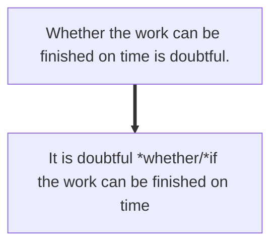

# 主语从句

**充当主语的句子**

**<u>What   | you just did</u>** had my attention
**关系词 |      从句**


___ **leaves** the room last **ought to turn off** the lights
**首先判断是不是主语从句**
1.是否有两个谓语
2.有没有关系词

若有两个谓语且没有关系词就是主语从句

答案：Who


## 关系词

### 所有的关系词

| 关系词     | 用法         |
| ---------- | ------------ |
| who / whom | 人           |
| what       | 事物         |
| which      | 事情强调选择 |
| where      | 地点         |
| when       | 时间         |
| why        | 原因         |
| how        | 方式、程度   |
| whether/if | 是否         |
| that       | 连接         |

**ever后缀**=随便任意


### 引导不完整的从句的关系词

| 关系词 | 用法         |
| ------ | ------------ |
| who    | 人           |
| whom   | 人           |
| what   | 事物         |
| which  | 事情强调选择 |

及其**ever后缀**

| 关系词     | 用法       |
| ---------- | ---------- |
| where      | 地点       |
| when       | 时间       |
| why        | 原因       |
| how        | 方式、程度 |
| whether/if | 是否       |
| that       | 连接       |

及其**ever后缀**


```what
____  I want to tell you is the deep love and respect I have for my parents.
```

```what
____ the science teacher does and says is of great importance to college student.
```

 

## 注意！

主语从句中

| 关系词  | 用法   |
| ------- | ------ |
| whether | 放句首 |
| if      | 放句中 |

Whether the work can be finished on time is doubtful.


# 形式主语从句



```what
It is by no means clear ____ the local government will do with the buildings if poor quality.
```

```that
It never occured to me ____ you could secceed in persuading him to change his mind.
解析：
1是否缺少成分
2句子是否完整，若意思完整就选择无实际意义的词
```

 