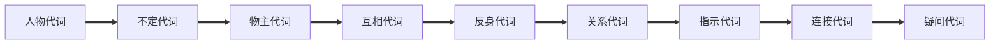
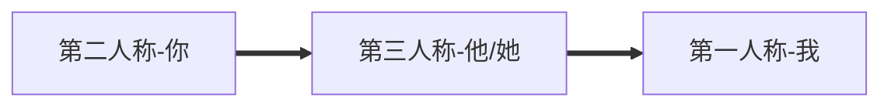

# 代词

[TOC]



## 人称代词

|              | 主格      | 宾格       | 形容词性物主代词 | 名词性物主代词 | 反身代词               |
| ------------ | --------- | ---------- | ---------------- | -------------- | ---------------------- |
| 第一人称单数 | I         | me         | my               | mine           | myself                 |
| 第二人称单数 | you       | you        | your             | yours          | yourself               |
| 第三人称单数 | he she it | him her it | his her its      | his hers its   | himself herself itself |
| 第一人称复数 | we        | us         | our              | ours           | ourselves              |
| 第二人称复数 | you       | you        | your             | yours          | yourselves             |
| 第三人称复数 | they      | them       | their            | theirs         | themselves             |

### 主格

**在句子里做主语或者表语**

```
They are students.
他们是学生

It is you.
它是你
```


### 宾格

**做及物动词或者介词之后的宾语**

I tell **her** my name

我告诉她我的名字


I should apologize to **her**

我应该向她道歉

 

### 顺序



```
You and he
He and me
You and he and me are all students
```


### It

**天气**：**It** is cloudy

**时间**：**It** is 6 o'clock

**距离**：**It** is 5 miles

**环境**：**It** is desert

**指上文提到的某物**：I have a cute cat, and **it** has blue eyes.

**不知道性别的人**：She has a cute baby, and **it** has blue eyes.

**已经发生的、正在发生的**：Stop **it**

**打电话分辨的人**：Hello，Peter ,**it's** Jack here.

**做形式主语**：**It** is confident that he will win the match

**做形式宾语**:   I realized **it** tough to learn ski well

  


## 物主代词

### 形容词性物主代词

**做修饰，后面加名词**

She is **my** aunt

They are **their** cars


### 名词性物主代词

**相当于名词可以表事物又表所属** 

You're not **mine**

Your house is huge,but **ours** is rather small


###  双重所有格

**of+名词性物主代词**

He is a friend of **mine**.

An old friend of **mine**.


### 反身代词

**表示什么....自己**

**做宾语，指一个动作返回到动作发出者身上**

Stop！You might burn **yourself**

**做同位语，表示强调，解释说明，强调名词或代词**

The book **itself** is interesting


## 指示代词

**说明近处远处、上下文的人或物**

| 单复数 | 代词  | 意思                       |
| ------ | ----- | -------------------------- |
| 单数   | This  | 较近的某人某物             |
| 单数   | That  | 较远的某人某物             |
| 单数   | Such  | 上下文提到的某人某物       |
| 单数   | Same  | 上下文提到的相同的某人某物 |
| 单数   | It    | 不清楚的某人某物           |
| 复数   | These | 较近的某人某物             |
| 复数   | Those | 较远的某人某物             |


## 不定代词

**代替或者修饰不确定的人或物，可以做主语并于表语状词**

 **单数**：some、any、each、every、either、nether

**复数**：many、few、ones、both、others

**不可数**：much、little、all

**复合**：something、someone、nothing、nobody


### Some

**肯定句，表示几个、一些、某个**

**疑问句，表示建议、请求希望**

**可以修饰可数名词或不可数名词**

I have some problems.

Do you want to get some drinks?


### Any

**肯定句，表示任何的**

**疑问句或者否定句，表示任何一些、任何一个**

**可以修饰可数名词或者不可数名词**

I don't get any question

Do you have any drinks


### No

**做定语，表示没有**

**可以修饰可数名词或者不可数名词**

We are no time

I have no answer to these


### None

**做主语宾语表语**

**表示一个人/物品**

**可以修饰可数名词或者不可数名词**

None escape the tomb

None of them could escape


### All

**指三者或三者以上的人或物品**

**可以修饰可数名词或者不可数名词**

 I know all of the five Chinese students


### Both

**指两个人或者物**

**可以修饰可数名词**

They both spoke together


### Every

**表示每一个**

**指3个或3个以上的整体中的每一个，侧重于整体**

**形容词只能定语**

**可以修饰单数名词**

I eat vegetables every day.


### Each

**表示每个各个**

**指两个或两个以上中的每一个，强调个别**

**代词做主语宾语定语**

Each life is precious


###  Either

**表示两个中间的任何一个**

The woman was either drunk or crazy


**Neighter**

**表示either的否定形式，两个都不**

I know neither of them


### Other 

**表示不同种类的另一个，其余**

Do you like other styles?


### Another 

**表示同类的另一个，又一个**

I have another story


### The other

**表示两个里面另一个**

Why not try the other box


### Others

**表示其余所有人**

Some students are play football, and others are watching them


### The others

**表示其余的人或物，指全部**

John and the others are here.

 

### Many

**表示很多，可数名词复数**

I have many friends


### Much

**表示很多，不可数复数**

I have much time


some -every开头的用在肯定句中

any-开头的用扎起否定句和疑问句和条件状语从句中

no-开头的用在否定句中

-thing结尾指物

-one -body结尾指人


### no one/nobody

**no one 和nobody指人，后面不能跟of，谓语用单数**

### none

**none指人指物，后面能跟of，谓语动词单数复数都行**


**Almost no one believed him**

**None of us agreed with him**


### a lot of,lots of, a number of, large number of,a great deal of,plenty of

**a lot of、lots of、plenty of修饰可数名词复数和不可数名词**

**A number of、large number of修饰可数名词复数**

**A great deal of修饰不可数名词**

A lot of people overlook to keep health.

A number of apples are green.

A great deal of time can reset.


**few 和 a few和little 和a little**

**few/a few跟可数名词连用，或者代指可数事物**

**little/a little跟不可数名词连用，或者指代不可数事物**

**否定表达**

**few很少几个；little少到几乎没有**

**肯定表达**

**a few有几个； a little 有一些**

I have few apples

I have little water

I have a few apples

I have a little water


### each other\one another

**表示相互关系的代词**

You can test each other

We're still attracted to one another


## 用来引导定语从句的代词，充当定语从句成分

**who指人，在定语从句做主语**

**whom之人，在定语从句做宾语**

**which指物，在定语从句作主语或者宾语**

**that指人，相当于who和whom**

**that指物，相当于which**

**在定语从句作主语或者宾语**


## 连接代词

What什么，who谁，which哪个，whose谁的等等