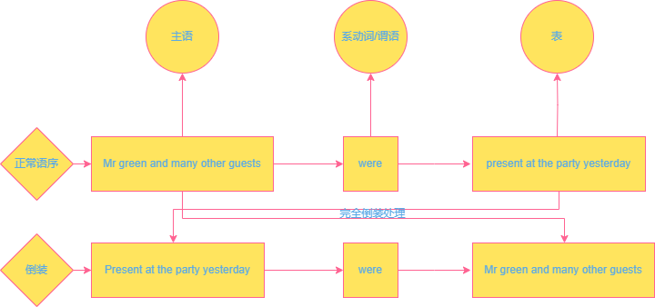
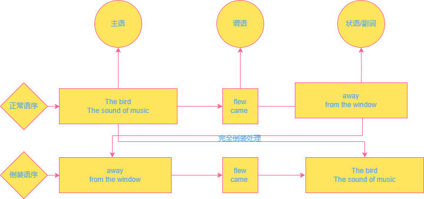
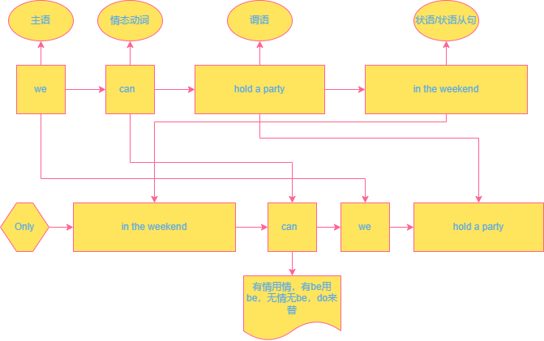

# 倒装

## 完全倒装

### There be ...句型

There are many student in our school.

### 地点介词置于句首

Near the river stands a tree.

### 特定副词至于句首

以地点副词（here，there）

时间副词（now，then）

表方位（out、in、up、down、away、off、near）

表方位的地点副词(out、in、up、down、away、of)

例：

Out rushed the boy

Then came the teacher.

### 主语太长故用倒装

例:

原句：**The days when we had nothing to eat** are gone

倒装：Gone are **the days when we had nothing to eat.**

## 部分倒装

### 特殊疑问句和一般疑问句

**部分倒装包含一般疑问句**，**一般疑问句是部分倒装**

**特殊疑问句=疑问词+一般疑问句**

Did you buy it?

**Why** did you buy it?

### 否定意义的副词及副词短语至于句首

**seldom、never、little、hardly、nowhere、by no means、in no time**等

Seldom does he watch TV.

By no means will I give up trying.

### Only+状语/状语从句

**Only when you have grown up** can you understand you parents.

**Only in the weekend** can we hold a party

### 含有no或not结构及有否定意味结构的那一句

<mark>**Not only**  does he do well in study</mark>, but also he is ready to help others

<mark>**Not until** the early years of the 19th century did man know what heat is.</mark>

<mark>**No sooner** had they started </mark>than it begin to rain.

<mark>**Neither** do I know it</mark>, <mark>**nor** do I care about it.</mark>,

### so/such....that结构中so或such那一句

<mark>**So** fast did he speak </mark>that I didn't  follow him.

<mark>**Such** good players </mark>are they that they often win.

### as/though引导的让步状语从句

<mark>Child **as** he is </mark>, he know a lot.

<mark>Young **though** he was </mark>, he understood the meaning.

### so,neither或nor表示前句的相同情况

He can play the piano.<mark> **So** can I. </mark>

We didn't win. <mark>**Neither** did they. </mark>
