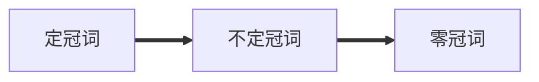

# 冠词

[TOC]



## 定冠词

**特指**

|用法|例句|
|---|---|
|表示上文提过的人和物|This car is popular, but **the** car isn't cheap (这车很热门，但是这车不便宜)|
|表示地理位置用|We are based in **the** Beijing(我们的总部设在北京) |
|表示江河湖海用|**The** Yellow River (黄河) |
|唯一存在的事物用|**The** earth(地球)|
|最高级前用|This is **the** best cup of coffee(这个最好的一杯咖啡) |
|表示强调时候前用|Beijing is **the** capital of China (北京是中国的首都) |
|乐器之前用|I like to play **the** piano (我喜欢弹钢琴) |

## 不定冠词

**泛指**

| 用法 | 例句 |
| ---- | ---- |
|第一次提到的人和物|it's **a** cat (这个一只猫)|
|如果是对唯一事物具体情况说明|Their dream is to go on **a** world tour (他们的梦想是去全世界巡回演出) |
|和名词连用作表语或者同位语，代表职业|I am **an** engineer(我是一个工程师)|
|表示价格、速度、频率|80 miles **an** hour (80英里每小时)|
|固定短语会用|have **a** good time (玩的开心)|


## 零冠词

**特定情况**


| 用法 | 例句 |
| ---- | ---- |
|很广泛的概念|Sichuan dishes are spicy (四川菜很辣)|
|书名、人名|I am reading "Journey to the West" (我正在读西游记)|
|某些城市、国家|China is a big country (中国是一个大国)|
|某些山河湖海洲|Asia(亚洲)|
|星球|Mars (火星)|
|语言、球类、学科、棋牌|I have studied English for ten years (我学了十年英语)|
|三餐、日期、季节(一般不加冠词，如果要特指可以加the)|It's September 1st(这是九月一日)|


## 注意⚠️

冠词不能和代词连用

例：

```
This car is popular(对)
This the car is popular(错误)
```

