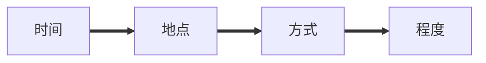
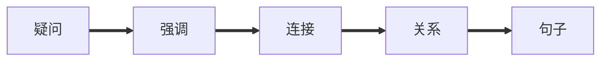

副词

[TOC]

#  副词

## 分类

|                |           |          |             | 表       | 示        | 时        | 间           |        |        |        |         |
| -------------- | --------- | -------- | ----------- | -------- | --------- | --------- | ------------ | ------ | ------ | ------ | ------- |
| **确定时间**   | 昨天      | 今天     | 今晚        | 明天     |           |           |              |        |        |        |         |
|                | yesterday | today    | tonight     | tomorrow |           |           |              |        |        |        |         |
| **不确定时间** | 以前      | 以前     | 曾经        | 刚刚     | 现在      | 最近      | 近来         | 后来   | 不久   | 最后   | 最后    |
|                | ago       | before   | ever        | just     | now       | recently  | lately       | later  | soon   | last   | finally |
|                |           |          |             | **表**   | **示**    | **频**    | **率**       |        |        |        |         |
| **频率**       | 100%      | 90%      | 80%         | 70%      | 60%       | 30%       | 10%          | 5%     | 1%     | 0.1%   | 0%      |
|                | 总是      | 常常     | 通常        | 经常     | 频繁      | 有时      | 偶尔         | 很少   | 几乎不 | 罕见   | 从不    |
|                | always    | usually  | generally   | often    | frequency | sometimes | occasionally | seldom | hardly | rarely | never   |
| **速度**       | 突然      | 突然     | 立刻        | 立刻     |           |           |              |        |        |        |         |
|                | abruptly  | suddenly | immediately | shortly  |           |           |              |        |        |        |         |
| **状态**       | 提早      | 仍然     | 然后        | 已经     | 还        | 接下来    |              |        |        |        |         |
|                | early     | still    | then        | already  | yet       | next      |              |        |        |        |         |

### 地点副词

**表示地点：**here、there、home、upstairs、downstairs、anywhere、everywhere、nowhere、somewhere、abroad、elsewhere**等**

**表示位置：**above、below、down、up、out、in、across、back、along、over、round、around、away、near、off、on、inside、outside、past**等**

Here is the remains of a mosque

这里市一座清真寺的废墟

### 方式副词

**表示行为方式：**carefully、properly、anxiously、suddenly、normally、fast、calmly、politely、proudly、softly、warmly、slowly、badly**等**

Now listen carefully

现在仔细听

### 程度副词

**表示动作程度：**nearly、rather、very、too、fully、almost、extremely、absolutely、slightly、simply、awfully、deeply、really、perfectly、quite、much**等**

It is running very fast.

它跑的很快

### 疑问副词

**隐藏特殊疑问句：**how、when、where、why

Where are you going？

你要去哪里？

### 强调副词

**强调形容词或副词：**completely、perfectly、really、totally、really、mainly、only**等**

A really cold day.

很冷的天

### 连接副词

**引导主语从句宾语从句表语从句或者并列结构：**how、when、where、why、however、therefore

The problem is how be can do it

问题是他如何做这事

You feel all things，then what did you do？

我感觉到了一切，然后你做了什么？

### 关系副词

**引导从句：**when、where、why

I never forget the day when I got the award

我永远不会忘记，我获奖的那天

### 句子副词

**修饰句子：**actually、personally、certainly、definitely

Actually，it is more than we need.

实际上，它比我们需要的还要多

## 副词结构

**以ly结尾的副词，大多数时候形容词+ly等于副词**

careful——carefully

beautiful——beautifully

important——importantly

**大部分以y结尾变成副词，变y为i加ly**

lucky——luckily

busy——busily

dirty——dirtily

**wards、wise结尾的副词**

inwards、eastwards、clockwise、likewise

**本身ly结尾的形容词，不行变成副词或者长得语一样**

ugly、lonely、likely

**形容词副词一样**

hard、late、fast、tight

**本身就是副词**

so、very、just

**副词比较变化，规则跟形容词比较级一样，形容词比较级特殊结构副词一样能用**

原级：A+实意动词+as+副词原形+as+B

You play basketball as well as Xukun Cai.

比较级：A+实意动词+as+副词比较级+than+B

I know you better than she.

最高级：A+实意动词+as+副词原形最高级+B

Rice grows the best in soil fertile.

 

## 副词用法

### 放置位置

#### 句首

Why are you always late?

#### 句中

She angrily closed the door.

#### 句尾

We must work hard.

**谓语动词和宾语之间不能加副词**

I took carefully the baby（错）

I took the baby carefully（对）

**地点副词放句首句子要倒装**

A school is located there（没倒装）

There located is a school（倒装）

### 句子成分

#### 做状语

Look at the photo carefully

#### 做表语

The meeting is over

#### 做定语

The shops around are very cheap

#### 做宾补

You come so late

## 易混情况

too、also、either、nor

**too:肯定句和疑问句句首，用逗号隔开**

Are you Chinese,too?

**also:肯定句和谓语动词之前，系动词之后**

You are also Chinese.

either:否定句句尾，用逗号隔开

I am not lucky,either.

**nor:放在句首**

Nor is Peter anywhere a good man.

------

sometimes、sometime、some times、some time

**sometimes:有时候**

Sometimes I go shopping in the mall.

**sometime：未来某个时候**

Peter,I will meet your mother sometime.

**some times：很多次（一次once、两次twice）**

You have treated me quite some times recently. Now it's my turn

**some time：一些时间**

I should stay home some time

------

farther、further表示地点距离远的时候，两个词都能用，表示更远

如果要表示更多、额外要用further

具体的用farther或者further，抽象的远用further

Can we walk farther/further tomorrow?

See under for further information

更多内容详见下文

------

most、mostly

most（名词、形容词、副词）表示最、很、十分

The most outlandish ideas

最奇特地想法

mostly（副词）表示主要的、大部分地

The atoms themselves are mostly empty space

原子本身大部分地空间是空隙