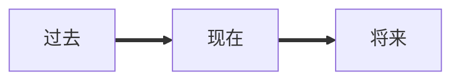
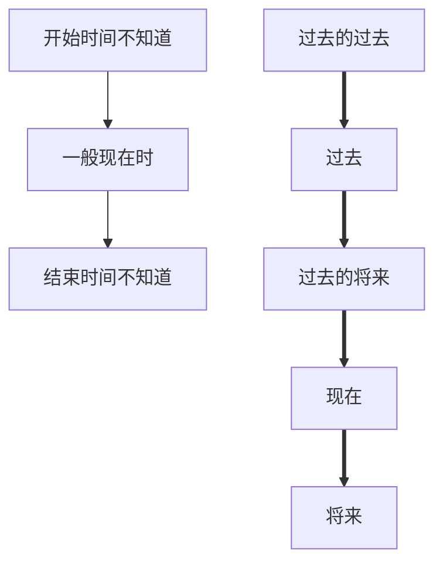

# 动词时态

[TOC]

英语地时态一共十六种，最常用地就六种

# 时间轴时态表

|      | 过去的过去                     | 过去                            | 过去将来                                      | 现在                            | 将来                                     |
| ---- | ------------------------------ | ------------------------------- | --------------------------------------------- | ------------------------------- | ---------------------------------------- |
| 一般 |                                | did 一般过去式             | would do 一般过去将来时                  | do 一般现在时              | will do 一般将来时                  |
| 进行 |                                | was/were doing 过去进行时  | would be doing 过去将来进行时            | am/is/are doing 现在进行时 | will be doing 将来进行时            |
| 进行 | had been doing 过去完成时 | have been doing 现在完成时 | would have been doing 过去将来完成进行时 |                                 | will have been doing 将来完成进行时 |
| 完成 | had done 过去完成时       | have done 现在完成时       | would have done 过去将来完成时           |                                 | will have done 将来完成时           |

## 一般现在时

**肯定:主语为第三人称单数，动词第三人称单数，其他动词用原形**
**否定:主语+do/does+not+谓语动词原形**
**疑问:疑问词+do/does+主语+谓语动词原形**

**现在发生的动作:** I love you. ( 我爱你)
**习惯发生的动作:** | usually drink water in the morning. (我通常早上喝水)
**描述客观的事实:** The earth goes round the sun. ( 地球围着太阳转)
**电影新闻比赛等的评论报道:** The film is quite different from the novel. ( 这电影和小说不太样)
**谈论时间日程:** The aircraft leaves at 9 o'clock. ( 这飞机在九点离开)
**般现在时表示将来，主为将来时态或者表示将来意思时，时间/条件状语从句要用般现在时表示将来:**
I will tell him the news when he comes back. (他回来的时候，我将告诉他这个消息)

## 现在进行时

**肯定:主语+be动词+动词现在分词**
**否定:主语+be动词+not+动词现在分词**
**疑问:疑问词+be动词+主语t动词现在分词**

**表示动作正在进行中，持续进行下去:**
You are watching TV. (你正在看电视)
**可以跟always、constantly、 forever、 repeatedly等频度词连用表示抱怨:**
My girlfriend is always complaining about ours house. (我女友总是抱怨我们的房子)
**现在进行时表示将来，表示已经安排好的事情;**
My dad is taking me to tomorrow class. (我爸明天要带我去上课)

### 不能用现在进行时的词

要用一般现在时

情感: love、 hate、prefer、 miss
归属: have、own、want、belong
感官: see、 hear、smell、seem
思想: think、 know、believe 、remember
测量: fit、 contain、consist、 analyse

## 一般将来时

**肯定:主语+will+ 动词原形**
**否定:主语+will+not+动词原形**
**疑问:疑问词+will+主语+动词原形**

**表示动作还没发生，**
**将来可能发生:**
I will buy a new car.(我要买一辆新车)

## 将来进行时

**肯定:主语+will be+动词现在分词**
**否定:主语+will be +not+动词现在分词**
**疑问:疑问词+will be+主语+动词现在分词**

**表示动作在将来发生，发生以后持续进行:**
Alibaba users will be growing. ( 阿里巴巴的用户将持续增长)

## 将来完成进行时

**肯定:主语+will have been+动词现在分词**
**否定:主语+will have been+not+动词现在分词**
**疑问:疑问词+will have been+主语+动词现在分词**

**表示动作在现在之后发生，动作在将来的一个时间点完成了一部分，动作仍然要继续**
**发生下去，并且对开始时间点有影响:**
The play is coming off in August. By then, the match will have been running for
three months.
(这个比赛要在八月暂停了，到那个时候，它已经比了三月了)

  

## 将来完成时

**肯定:主语+will have+动词过去分词**
**否定:主语+will have+not+动词过去分词**
**疑问:疑问词+will have+主语+动词过去分词**

**表示动作在现在之后发生，动作在将来的一个时间点完成，并且**
**对开始时间点有影响:**
| will have reached Beijing. ( 我将抵达北京)

## 一般过去时

**肯定:主语动词过去分词**
**否定:主语+did+not+动词原形**
**疑问:疑问词+did+主语+动词原形**

**表示动作发生在过去，动作延续不延续不知道:**
I learned English. ( 我学了英语)

## 现在完成时

**肯定:主语thave/has+动词过去分词**
**否定:主语+have/has+not+动词过去分词**
**疑问:疑问词+have/has+主 语+动词过去分词**

**表示动作发生在过去，动作在过去已经完成了，对现在有影响:**
| have finished my homework. ( 我已经完成了我的作业)
可以和still、yet、 already、 always连用
Have you finished your homework yet? (你的作业完成了吗? )
**讨论个人经历:**
I have seen her this week. ( 我这个星期见过她)

**表示动作发生在过去，动作一直延续到现在**
可以和before、since、 for、already、 many times、yet连用
I have driven a car since 2009. (我从2009年开始开车)

## 过去完成时

**肯定:主语+had+动词过去分词**
**否定:主语+had+not+动词过去分词**
**疑问:疑问词+had+主语+动词过去分词**

**表示动作发生在过去的过去，动作在过去已经完成了，对过去有影响:**
I had lived in Nanjing before I moved to Kunming.
(我搬到昆明之前我住在南京)
可以和after、as soon as、the moment that、until连用
After she had got up, I cooked breakfast,
(她起床后，我做了早餐)

## 过去完成进行时

**肯定:主语thad been+动词现在分词**
**否定:主语thad been+not+动词现在分词**
**疑问:疑问词+had been+主语t动词现在分词**

**表示动作发生在过去的过去，动作在过去已经完成了一部分，动作仍然要继续发生下**
**去，对过去有影响:**
She had been carrying out her plot to be the queen three months earlier.
(早在三个月前她就开始了自己的计划想要成为女王)

## 过去进行时

**肯定:主语+was/were+动词现在分词**
**否定:主语+was/were+not+动词现在分词**
**疑问:疑问词+was/were+主语+动词现在分词**

**表示动作发生在过去，动作持续进行下去:** 
The UFO was flying over my head last midnight.
昨天半夜不明飞行物从我头上飞过

## 过去完成进行时

**肯定:主语+have been+动词现在分词**
**否定:主语+have been+not动词现在分词**
**疑问:疑问词+have been+主语t动词现在分词**

**表示动作发生在过去，动作持续进行下去，到现在已经完成了一部分，对现在有影响:**
I have been working for seven days without a rest.
(我已经连续工作七天没休息了)

## 一般过去将来时

**肯定:主语+would+动词原形**
**否定:主语+would+not+动词原形**
**疑问:疑问词+would+主语+动词原形**

**表示动作发生在过去的将来，如果是人做主语表示意愿:**
I would win the match under cruel complete.
(我在残酷的比赛中获胜)

## 过去将来进行时

**肯定:主语+would be+动词现在分词**
**否定:主语+would be+not+动词现在分词**
**疑问:疑问词+would be+主语+动词现在分词**

**表示动作发生在过去的将来，动作一直持续下去:**
When I was young, dad said I would be fighting for my future 20 years later.
(在我小的时候，我爸跟我说20年后，我要为自己未来而奋斗)

## 过去将来完成进行时

**肯定:主语twould have been+动词现在分词**
**否定:主语+would have been+not+动词现在分词**
**疑问:疑问词+would have been+主语+动词现在分词**

**表示动作发生在过去的将来之前，动作已经在过去将来完成了部分，持续到过去将来**
**继续进行，对过去将来这个时间点有影响:**
Up to that time, he would have been translating those books . 
到那时候，他已经在翻译那些书了)

