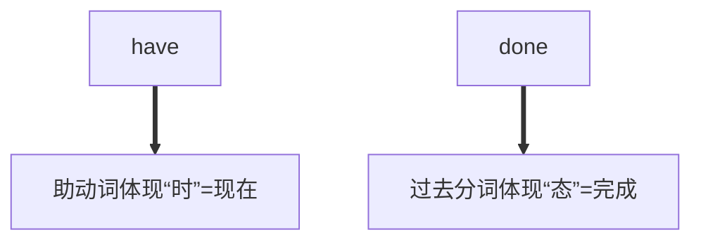

# 时态

[TOC]


| 时态         | 一般         | 进行               | 完成                | 完成经行                  |
| ------------ | ------------ | ------------------ | ------------------- | ------------------------- |
| **现在**     | do/does      | be doing           | have/has done       | have/has been doin        |
| **过去**     | did          | was/were doing     | had done            | ~~had been doing~~        |
| **将来**     | will do      | will be doing      | will have done      | ~~will have been doing~~  |
| **过去将来** | ~~would do~~ | ~~would be doing~~ | ~~would have done~~ | ~~would have been doing~~ |


## 一般现在时

**经常性习惯性动作；科学事实或客观真理**

### 标志词

| 表现在     | now,at present,at the moment                                 |
| ---------- | ------------------------------------------------------------ |
| **表频率** | **usually,offen,sometimes,always,seldom**(regulary(规律性的),normally(一般的),frequently(频繁的) |
| **每**     | **every,on(On Monday-每周一)**                               |


I **get up** at 6:00 o'clock every morning.<br/>The earth **goes** round the sun.

### 例题

```shows
My Nanny used to say:"Life is like walking on the snow,because every step ______(show)"
```


**交通工具和门票时刻表**

I have to go, my train **leaves** at 11:00.<br/>The first class **begins** at 8 o'clock.


### 主将从现


## 一般过去时

**过去发生的事**

### 标志词

| yesterday,last week,....ago,a moment ago,just now,on/in+过去的时间 |
| ------------------------------------------------------------ |


### 例题

```A
Look at the timetable.Hurry up!Flight 4025 _____ at 18:20.
A.takes off			
B.took off			
C.will be taken off			
D.has taken off
```


```C
That must have been a long trip.
Yeah,it ______ us a whole week to get there.
A.takes			
B.has taken			
C.took			
D.was taking
```


##  一般将来时

### Will

**临时决定；同意，许诺做.....**

I **will do** something:**<u>I've just decided to do it, or I offer /agree /promise to do it.</u>**

---- What would you like to drink,coffee to tea?<br/>
---- **I'll have** orange juice,please.

### be going to do

**打算，决定做；有迹象表明某事要发生**

I 	**am going to do** something:**<u>I intend to do it,or I have already decided to do it.</u>**

---- I hear Alice won the lottery.Waht **is she going to do** with the money? <br/>
---- She **is going to bug** a big house.<br/>
Look at those black clouds!It's going to rain.(We can see the cloulds now)

### 标志词

| soon,tomorrow,one day, some day,in the future,next week/month,in +时间段 |
| ------------------------------------------------------------ |


## 过去将来

在过去的时间点预计要发生的动作或存在的状态，常用于<u>主句为过去时的宾语从句</u>和<u>虚拟语气</u>中

### 例句

I **guessed** he **was going to leave** soon.<br/>Amy **promised** that she **would't be** late.<br/>They **told** me that they **would not be late** again.<br/>
He **asked** if we **could take** him.<br/>


## 现在进行时

**说话时刻正在发生；现阶段正在发生。**

Please don't make so much noise.Lisa is writing her homework.<br/>I'm reading a really good book recently.<br/>You are working hard today.

计划安排好的将来动作“来去归离（做）作死，开始旅行目送飞”<br/>The yare leaving for Hong Kong next month.<br/>She is making a speech at the conference next week.

### 进行时表感情

My father is forever criticizing me.<br/>They're constantly having parties until the early hours of morning.<br/>

#### 标志词

| constantly,always,forever,all the time,continually |
| -------- |


### 过去进行时

We **were discussing** the matter when the headmaster entered<br/>She **was reading** when he called

#### 过去进行时的标志词

| at the time,at this time yestday,at that moment |
| ----------------------------------------------- |

### 将来进行时

Don't phone between 7 and 8. We'll **be eating.**

### compare

```
It's 10:00 Tina is in her classroom.She is learning English.
```

```
At 10:00 tomorrow, Tina will be in her classroom.She will be learning English.
```


### 没有进行时的词语

**例如**

表示拥有时没有进行时！！！！

~~I'm having a good feeling now~~

对比

I have a good feeling now!<br/>They're constantly having parties.

| 含义       | 单词                                                |
| ---------- | --------------------------------------------------- |
| 表感觉     | see,hear,smell,taste,feel,notice,look,appear        |
| 表感情     | hate,love,fear,like,want,wish,prefer,refuse,forgive |
| 表存在状态 | be,exist,remain,stay,obtain                         |
| 表占有从属 | have,prossess,own,contain,belong,consist of,form    |
| 表思考理解 | understand,know,believe,think,doubt,forget,remember |


## 现在完成时



**过去完成时：**had done

**现在完成时：**have done

**将来完成时：**will have done

### 分类

#### 现在完成时 动作形式

have/has + done

#### ①动作始于过去，一直持续到现在

The housing price has risen a lot over the past decade.<br/>My Goodness,LZL,has been married for 2 years.

##### 标志词

| since + 过去时间点                                           |
| ------------------------------------------------------------ |
| **since + 过去**                                             |
| **so far,until now**                                         |
| **up to/till now**                                           |
| **in/over/during the + past/last /recent + 时间段**<br />in the last 2 years |

#### ②动作发生在过去，对现在产生影响（关键词：言外之意）

I **have washed** my hands **so that i can help you with the cooking.**<br/>I**'ve found** the book **you were looking for here you are.**

I've **already had** breakfast.I'm full<br/>I **had** breakfast.

#### ③动作从过去到现在多次发生

I have dreamed of LZL one hundred times since 22:00

※It is the+最高级/序数词+名词+（that）+带现在完成时谓语的句子<br/>It is the best movie that i've ever seen。<br/>It is **the first time** I've ever performed a surgery

```met
We met for the first time in Shanghai in 2000.
-- Rememberthe first time we _______ (meet)?
-- Of course . YOu were study in Beijing University then.
```

指某一次用过去，仍用一般过去式。

We met for **the first time** in Shanghai in 2000.


## 过去完成时

### ①表示“过去的过去”

When Tony arrived at the party,Paul **had already gone** home.<br/>They **had known** each other for ten years when they got married.

#### 标志词

| by / before + 过去时间点<br />by the end of |
| ------------------------------------------- |
| **before/when + 过去动作**                  |


### ②表示本打算做但未作的某事

I **had meant** to help you,but i was too busy at te the moment.<br/>I **had hoped** to back last night, but i did't catch the train.

#### 标志词

| hioe want mean suppose       |
| ---------------------------- |
| **intend plan thick expect** |


## 将来完成时

表示及拿过来某一时间已经完成

By this time tomorrow you **will have arrived** in Shanghai.<br/>We are late. The film **will already have started** by the time we get to the cinema.

### 标志词

| 标志词                                             |
| -------------------------------------------------- |
| by(the time/the end of)+表示将来时间的短语和句子   |
| before(the end of )+表示将来时间的句子或短语或句子 |
| when ,after等加上表示将来的句子                    |

