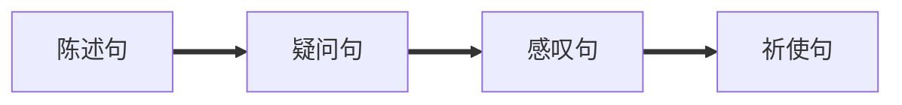
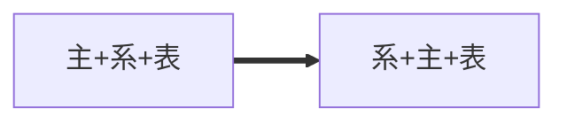
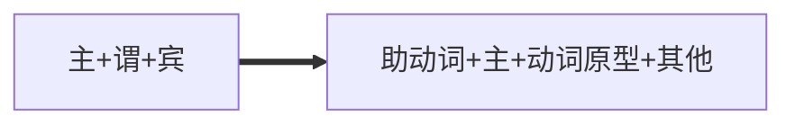
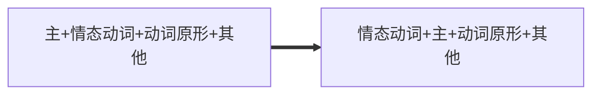

# 简单句

[TOC]




### 陈述句

#### 肯定式

```
I have money
```


#### 否定式

```
I don't have money
```


#### 主+谓


| I    | run  |
| ---- | ---- |
| 主   | 谓语 |


#### 主+谓+宾

| I    | love | you  |
| ---- | ---- | ---- |
| 主   | 谓   | 宾   |


#### 主+系+表

| I    | am   | Iron Man |
| ---- | ---- | -------- |
| 主   | 系   | 表       |


#### 主+谓+双宾


| I    | give | you  | money |
| ---- | ---- | ---- | ----- |
| 主   | 谓   | 宾   | 宾    |


#### 主+谓+宾+宾补

| They | ordered | hamburger | their lunch |
| ---- | ------- | --------- | ----------- |
| 主   | 谓      | 宾        | 宾补        |


### 疑问句

#### 一般疑问句

```
Do you love me?
```

可以用，Yes，No回答

一般由陈述句变一般疑问句




**陈述句**

```
You (are) an idiot.(你是个笨蛋)
```

**一般疑问句**

```
（Are） you an idiot？(你是不是个笨蛋)
```

**回答**

```
Yes,I am/No,I'm not.
```




**陈述句**

```
You (have) got light bulbs. (你有灯泡)
```

**一般疑问句**

```
（Have） you got light bulbs?
```

**回答**

```
Yes,I have/No,I haven't.
```




**陈述句**

```
You (can) play football
```

**一般疑问句**

```
(can) you play football?
```

**回答**

```
Yes, I can/No, I can't
```


#### 特殊疑问句

```
Why do you lone me?
```

不可以用YES，NO回答

用特殊疑问词，对句子中某个成分提问

```
Who's next?
Whose car is this?
Whom did you choose for our them leader?
What time is it?
When can we start working?
Where is the bathroom?
Why did he do it?
How heavy is it?
How much longer?
Which is your choice?
```


#### 选择疑问句

```
Do you lone my body or my heart?
```

不能用YES，NO

提问两个以上的句子供选择

```
Do you like to play football or basketball?
```

回答

```
I like to play football/I like to play basketball
```


#### 反义疑问句

```
You lone me, Don't you?
```

可以用YES和NO

```
He is your teacher, isn't he?
```

```
He isn't your teacher, is he?
```

回答

```
Yes, he is/No, he isn't
```


#### 祈使句子反义疑问句

```
Open the door, won't you?
```

```
Don't open the door, will you?
```


##### 一些特殊

**不管肯定否定，let's开头结尾就是shall we，Let us开头结尾就是will you**

```
Let's go to school,shall we?Let us go outside,will you?
Let's don't go to school,shall we?Let us don't go outside,will you?
```


**must表必须的时候，翻译疑问句用mustn't？/ needn't**

```
He must study hard at English,mustn't he?
```

**must表推测（肯定）时候，反义疑问句用must后动词的否定提问**

```
You must be joking ,aren't you?
```


#### 感叹句反义疑问句

```
What a lovely girl, isn't she?
```


#### 否定词的反义疑问句

```
He hardly goes to school,does he?
```


#### 复合句的反义疑问句

```
She never told you that she hand a baby,did she?
```


#### 宾语从句的反义疑问句

```
I don't imagine he has got it, has he?
```


### 感叹句

#### What

```
what a/an+形容词+可数名词单数+主语+谓语
```

```
What a beautiful photo it is?
```


```
what+ 形容词+不可数名词/名词复数+主语+谓语
```

```
What clearly water it is!
```

```
What clever dogs they are!
```


#### How

```
how +形容词/副词+主语+谓语
```

```
How careful he is!
```

```
How fast he runs!
```


```
how +形容词+a/an+可数名词单数+主语+谓语
```

```
How cute a doy it is!
```


#### 语气词+感叹号！

```
Wow! That's totally awesome!
```

```
Oh!You're Peter！
```


### 祈使句
#### 命令，警告
```
Get out！
Be quiet,please.
Be careful!
```
#### 祝愿请求 
```
Have a good day.
Let me help you.
```

