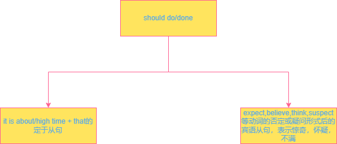
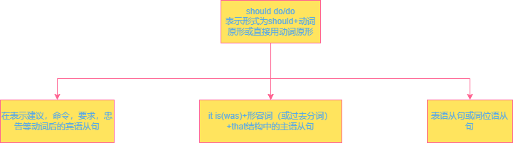

# 虚拟语气

 


 




### 状语从句的虚拟

#### 一些疑惑：

##### would

If you tried again, you would succeed 如果你再试一次，就一定会成功。

would表示必然的结果；表示可能发生的事情没有发生，是因为之前另一件事没有发生，就会发生

##### could

If you tried again, you could succeed. 如果你再试一次，你就能成功。

could表能够；

表示能力、建议或请求。在虚拟语气中表示可能不会实现的愿望。

##### should

Jack Ma insisted that there should be no excellent businessmen if everything went too smoothly and that they carried on as normal in face of hardships.

should表示预期，应该会，可能。

表示建议、命令或愿望。在虚拟语气中表示对未来可能发生的事情提出的愿望或建议。

##### might

If you tried again, you might succeed.如果你再试一次，你或许能成功。

might表可能的结果

#### 现在的虚拟：

**if引导的从句用过去时态，主句用过去将来时**

**从句的只用were 不用 was**

过去将来时：would/should/might + 动词原形

使用以下结构

```
if + 过去时态，过去将来时的主句。
```

exp：

​		If I **had** a large number of money, I **would travel** around the world

​		如果我有很多钱，我会环游世界。

​		If I **were** you,I **should study** English.

​		如果我是你，我就应该学英语。


#### 过去的虚拟：

**if引导的从句用过去完成时态，主句用过去将来完成时**

主句：主语+would(could should might) + 过去分词

过去将来完成时：would/ should have done

使用以下结构

```
if + 过去完成时，过去将来完成的主句。
```

exp：

​		If I have been admitted,I wouldn't  have studied hard.

​		如果我被录取了，我就不会努力学习了。

​		If you had come here yesterday, you would have met him.

​		如果你昨天来的话，你会见到他的。


#### 将来的虚拟：

使用以下结构:

1.

```
if + 过去时态，过去将来时的主句。
```

2.

```
If + 主语 + were to+ 动词原形，过去将来时的主句。
```

3.

```
If + 主语 + should+ 动词原形，过去将来时的主句。
```

主句：主语+would(could should might) + 动词原型

exp：

​		If it **were to / should rain** tomorrow, the meeting **would be** put off.

​		如果明天下雨，会议就会推迟。

​		If you **came** tomorrow, we **would have** the meeting.

​		如果明天你来，我们会开会


##### 条件状语和虚拟语气的区别

```
If it rains tomorrow, I will stay at home.真实条件状语

If it rained tomorrow, I would stay at home.虚拟

if it should/were to rain tomorrow, I would stay at home.虚拟
```

 

### 倒装

#### 在含有were、had、should的虚拟语气中，可以省去if，用部分倒装。请比较：

1. Were it not for the sun, there would be no life on earth.
   = If it were not for the sun, there would be no life on earth.（若不是因为有太阳，地球上就不会有生命存在。）
2. Had it not been for you, he would have drowned.
   = If it hadn't been for you, he would have drowned.（当时若不是因为你，他就淹死了。）
3. Should you have any further questions, please contact us at the address above.

= If you should have any further questions, please contact us at the address above.（如果您还有其他问题，请通过上面的地址与我们联系。）
