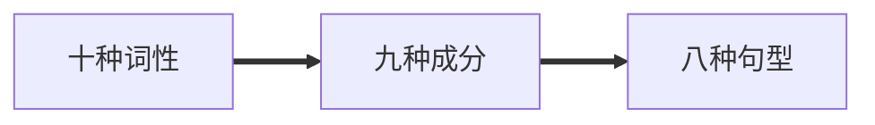
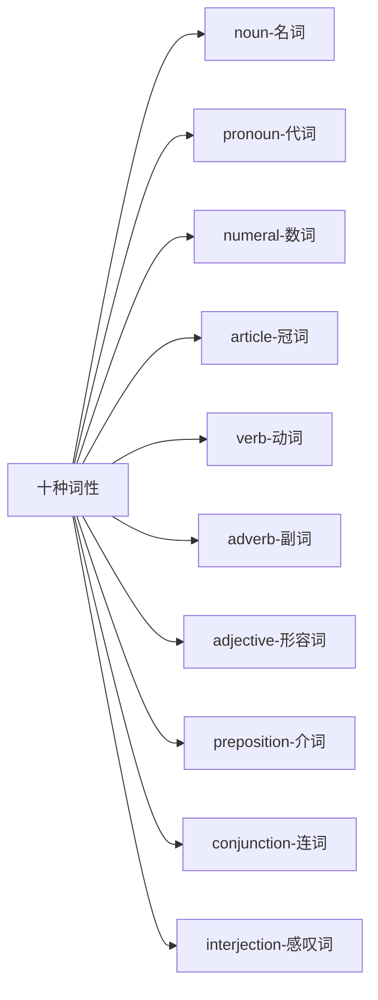
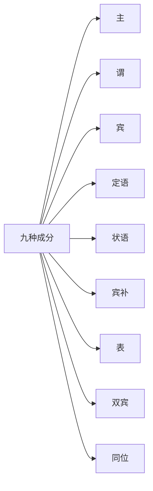

# 语法框架


## 十种词性

[TOC]







### [noun-名词]

称呼

```
apple cat China
```


### [pronoun-代词]

代替名词

```
we that all who
```


### [numeral-数词]

数字

```
one two hundred thousand
```


### [article-冠词]

放在名词前帮助说明名词所指的人或事物

```
a an the
```


### [verb-动词]

动作

```
get do play jump
```


### [adverb-副词]

修饰动词

```
next much back
```


### [adjective-形容词]

修饰名词

```
good fast hot
```


### [preposition-介词]

用于名词或者代词前面

```
at in on
```


### [conjunction-连词]

连结句子段落

```
and also but
```


### [interjection-感叹词]

感叹，表达情感

```
what yum blah
```


## 九种成分





## 八种句型

### 简单句

主+谓

主+谓+宾

主+系+表

主+谓+双宾

主+谓+宾+宾补

### 复合句

名词性从句

定语从句

状语从句
