# 非谓语动词

[TOC]


**句子中不是谓语的动词**

| 非谓语动词      | 体         | 主动形式           | 被动形式          | 否定式    |
| --------------- | ---------- | ------------------ | ----------------- | --------- |
| 不定式          | 一般式     | to do              | to be done        | not to do |
| 不定式          | 完成式     | to have done       | to have been done | not to do |
| 不定式          | 进行式     | to be doing        | X                 | not to do |
| 不定式          | 完成进行式 | to have been doing | X                 | not to do |
| 动词 - ing 形式 | 一般式     | doing              | being done        | not doing |
| 动词 - ing 形式 | 完成式     | having done        | having been done  | not doing |
| 过去分词        | 过去式     | done               | done              | not done  |

| 非谓语动词      | 主语 | 表语 | 宾语 | 补语 | 定语 | 状语 |
| --------------- | ---- | ---- | ---- | ---- | ---- | ---- |
| 不定式（to do） | V    | V    | V    | V    | V    | V    |
| 动名词          | V    | V    | V    | X    | V    | X    |
| 现在分词        | X    | V    | X    | X    | V    | V    |
| 过去分词        | X    | V    | X    | X    | V    | V    |

Being done在主语、宾语、介词后被动，其余所有都是正在被


## 作主语

**Knowing** first-aid techniques will help you respond quickly to emergencies.<br/>
**To complete** the program need much effort.

doing：常态、习惯<br/>
to do：个例，将来

### 特殊主语-形式主语


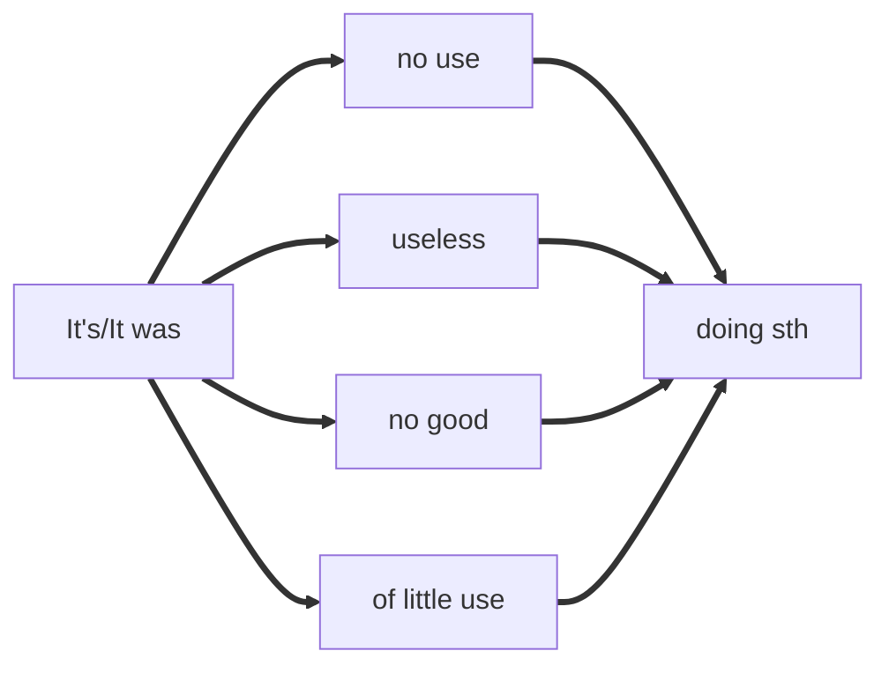


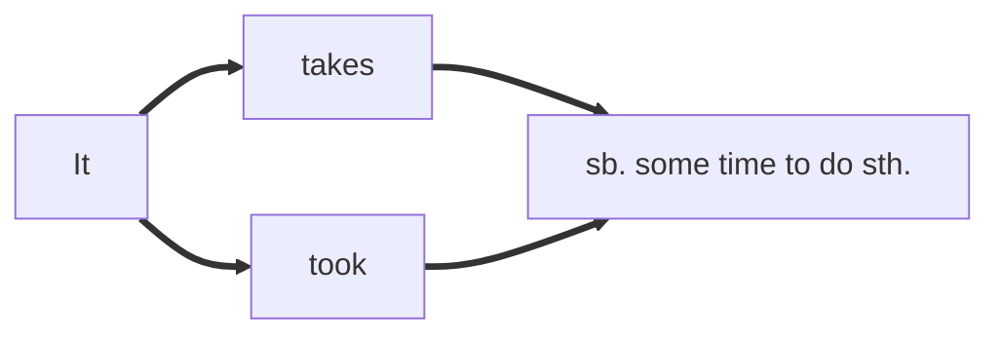


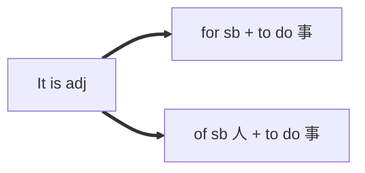

## 作宾语

### 涉及动作承接人的用法

**主要是背？似乎可以用理解。**

只有有动作承接人的句子可以用to do<br/>
不需要主语去做，或者不一定需要主语去做的非谓语动词即用doing，反之to do。

She pretended **not to see** me when I passed by.<br/>
see这个动作是**she**做的因此用**to do**的形式

I would appreciate your **calling** back yesterday.<br/>
call这个动作句中没有人称去做因此只能用**calling**


| 非谓语动词 | 含义     | 动词            |
| ---------- | -------- | --------------- |
| to do      | 假装拒绝 | pretend; refuse |
| to do      | 决定安排 | decide;arrange  |
| to do      | 目标答应 | aim;agree       |
| to do      | 设法负担 | manage;afford   |
| to do      | 打算选择 | plan;choose     |

| 非谓语动词 | 含义     | 动词                             |
| ---------- | -------- | -------------------------------- |
| doing      | 避免练习 | avoid,practice                   |
| doing      | 考虑建议 | consider;suggest                 |
| doing      | 建议想象 | advise;imagine                   |
| doing      | 注意盼望 | pay attention to;look forward to |


###  用to do 和 doing区别不大的

爱：like,love,prefer<br/>
恨：hate<br/>
始：begin,start<br/>
续：continue


### 用to do 和 doing区别巨大的

一记二忘三遗憾，四试五图六停续

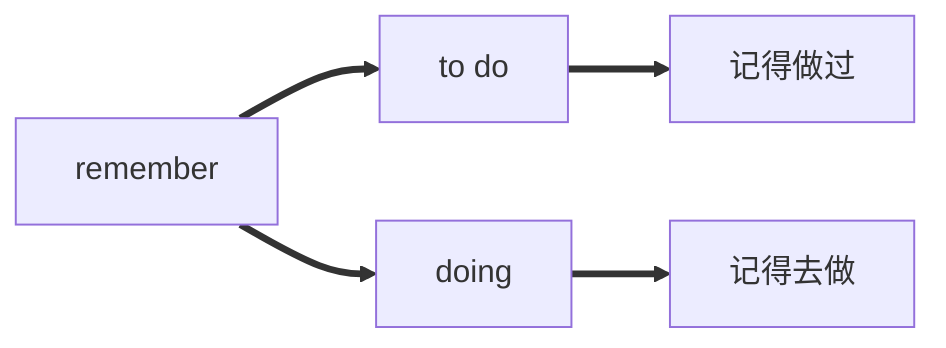


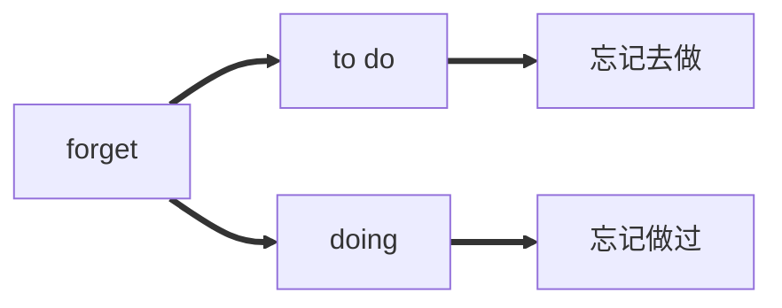


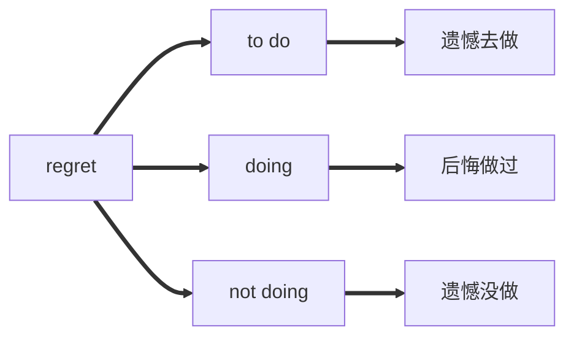


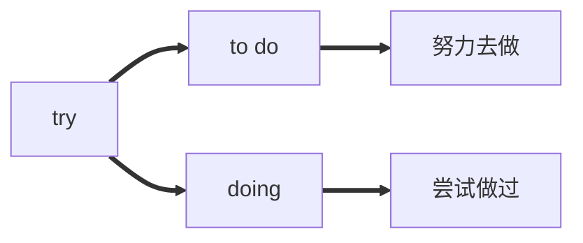


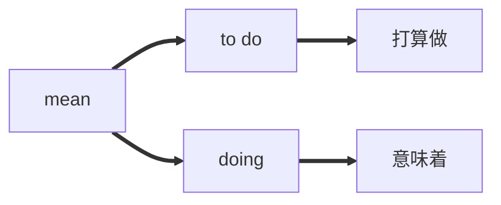


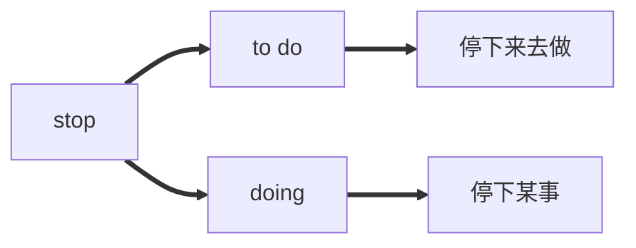


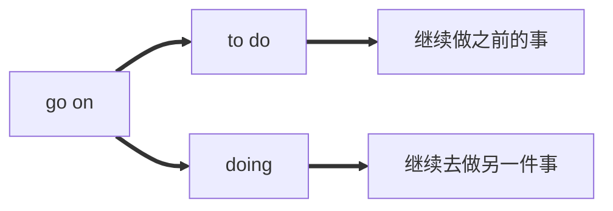

### 主动表示被动

#### 需要

need doing<br/>
My car needs **cleaning.**


want doing<br/>
My car wants **cleaning.**


require doing<br/>
My car requires **cleaning**.


#### 值得

deserve **doing**<br/>
The aim deserves **working.**


be worth **doing**<br/>
Shaanxi History Museum is worth **visiting**.<br/>
Shaanxi History Museum is worth to be visited.


### 特殊固定搭配

**be looking for forward to**

I'm looking forward to **your coming.**<br/>
I'm looking forward to **swimming.**


**insist on**

I **insist on** going with you.


| 背背背背背背背背背背背背 | 背背背背背背背背背背背背 |
| -------------------- | --------------------- |
| **add up to**        | **admit to**          |
| **be equal to**      | **devote ... to ...** |
| **get down to**      | **look forward to**   |
| **object to**        | **stick to**          |
| **see to** 负责做某事     | **lead to**           |
| **pay attention to** | **be used to**        |


## 作表语

### ①不定式

主语的职责/性质，尤其是未来有待实现的行为

Your task today is **to finish** your homework.


### ②动名词

抽象习惯动作，可与主语互换

My father's job is **directing** films.


### ③分词

当形容词考

The film being shown in the cinema is **exciting**.<br/>
I am **excited** at the news.


## 作定语

### 前置定语-动名词

**名词前**

表用途

a swimming pool<br/>
a washing machine

表正在做

a swimming dog


### 后置定语

**名词后**    -（主被动先后续）

The question **confusing** me needs to be solved.

```
主语和非谓语动词的关系：主动
非谓语动词 后于 谓语动词发生
```


The question **being discussed** now really matters

```
主语和非谓语动词的关系：被动
非谓语动词 同时 谓语动词发生
```


The question **discussed** yesterday really matters

```
主语和非谓语动词的关系：被动
非谓语动词 先于 谓语动词发生
```


### 特殊

#### ①名词或者代名词前**有序数词或the only及最高级**修饰时，用不定式作定语

He was the best man **to do** the job.<br/>
She was the first woman **to win** the competition.<br/>
He is the only one **to get** here.<br/>

demanding形容的是customers，不是最高级!<br/>
Get the technology that has proved to help the most **demanding** customers<br/>
获得已经被证明可以帮助最高要求客户的技术


#### ②不定式时若为**不及物动词**或者修饰的词为**工具**时，需加介词

We will have a spacious home **to live in**.<br/>
He needed a brush **to paint with**.


## 作状语

**逗号前后**    - （主被动先后续）

这是老师最喜欢考的谓语动词语法！！！！

**Seeing in the cat**, the mouse ran off<br/>
**Seen from the top**, the stadium looks like a bird nest.<br/>
**Given more time**,we could have done it better.


**Having spent** all morning doing the exercises,he took a short lunch break.

```
主语和非谓语动词的关系：主动
非谓语动词 先于 谓语动词发生
```


Clearly and thoughtfully **written** , the book inspires confidence in students who wish to seek their own answers.

```
主语和非谓语动词的关系：被动
非谓语动词 先于 谓语动词发生
```


**Occupied**~~（being occupied）~~with his research work, the professor cared little about any other things

```
主语和非谓语动词的关系：被动
非谓语动词 同时  谓语动词发生
```

**详见以下**<br/>

### 表状态，没有be doing、being done 

| 单词          | 意思     |
| ------------- | -------- |
| lost          | 迷路     |
| seated        | 坐       |
| hidden        | 躲藏     |
| absorbed in   | 沉溺于   |
| buried in     | 沉溺于   |
| dressed in    | 穿着     |
| tired of      | 感到厌倦 |
| occupied with | 忙于     |


## 作补语

### 感官动词

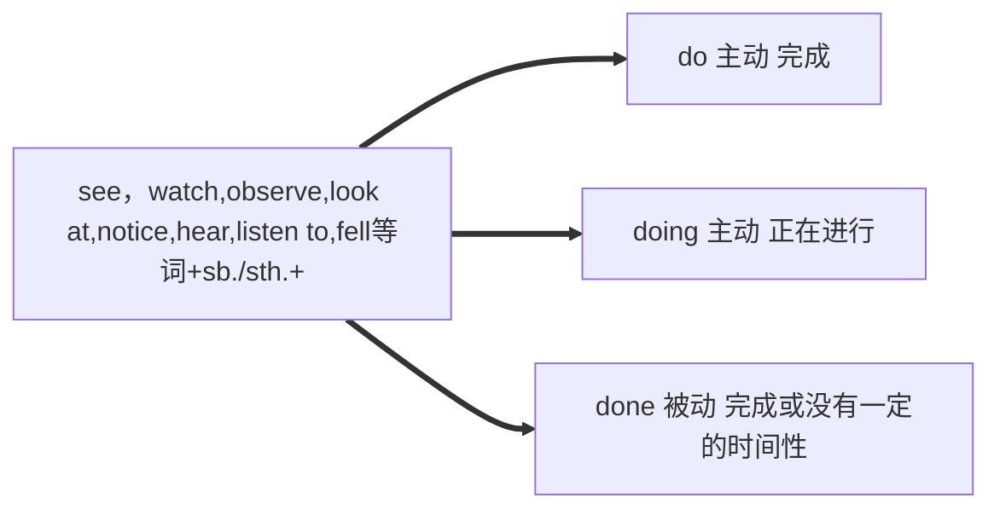

I heard her **sing** a French song.<br/>
I heard her **singing** a French song.<br/>
I would like to hear the song **sung** by her.

当上述感官动词或使役动词变为被动语态时，需还原不定式符号to：

I heard him **(to) come up** the stairs.可以省略to<br/>
Someone was heard **to come up** the stairs.不可省略to


### 使役动词

**let/have/make后面不加to**<br/>
let the work ~~（to）~~ **be done** immediately<br/>
让工作立即完成吧(等待去完成)

没有主语且使用物做宾语加be

let yourself **remembered**


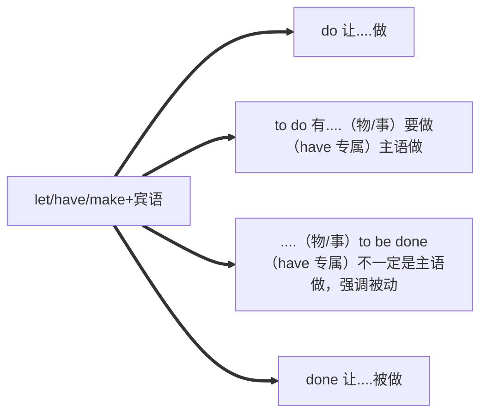


当上述感官动词或者不定式变为被动语态时，需要还原to

I heard him come up stairs.
Someone was heard to come up the stairs.

### 部分动词接不定式

只有有动作承接人的句子可以用to do

The doctor warned him **not to eat** too much meat.<br/>
They found the answer **(to be) quite satisfactory**.

**允许命令**：allow;order<br/>
**祈求期盼**：beg；expect<br/>
**建议说服**：advise；persuade<br/>
**鼓励号召**：encourage；call on<br/>


### 常见主语补足语句式

sb./sth. be said/believed/known/reported/considered + to do (及各种变形)

He is said to have gone abroad.<br/>
Heat is considered to be a form of energy.


