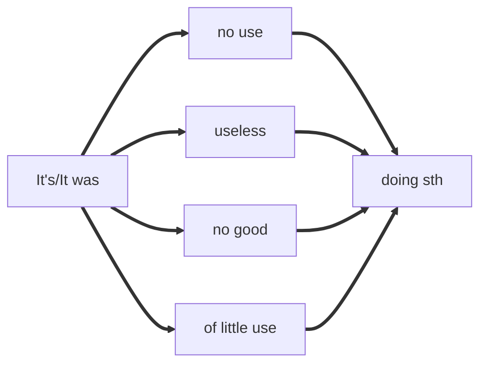
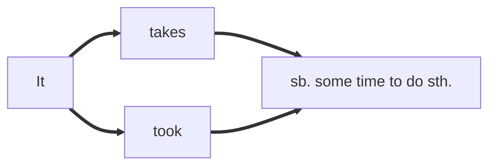
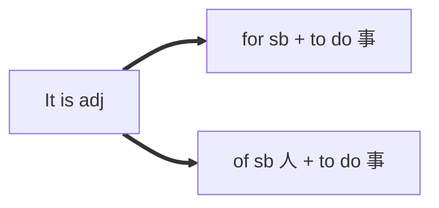

# 非谓语动词

**句子中不是谓语的动词**

| 非谓语动词      | 体         | 主动形式           | 被动形式          | 否定式    |
| --------------- | ---------- | ------------------ | ----------------- | --------- |
| 不定式          | 一般式     | to do              | to be done        | not to do |
| 不定式          | 完成式     | to have done       | to have been done | not to do |
| 不定式          | 进行式     | to be doing        | X                 | not to do |
| 不定式          | 完成进行式 | to have been doing | X                 | not to do |
| 动词 - ing 形式 | 一般式     | doing              | being done        | not doing |
| 动词 - ing 形式 | 完成式     | having done        | having been done  | not doing |
| 过去分词        | 过去式     | done               | done              | not done  |

| 非谓语动词      | 主语 | 表语 | 宾语 | 补语 | 定语 | 状语 |
| --------------- | ---- | ---- | ---- | ---- | ---- | ---- |
| 不定式（to do） | V    | V    | V    | V    | V    | V    |
| 动名词          | V    | V    | V    | X    | V    | X    |
| 现在分词        | X    | V    | X    | X    | V    | V    |
| 过去分词        | X    | V    | X    | X    | V    | V    |

Being done在主语、宾语、介词后被动，其余所有都是正在被

## 做主语

**Knowing** first-aid techniques will help you respond quickly to emergencies.
**To complete** the program need much effort.

doing：常态、习惯
to do：个例，将来

### 特殊主语-形式主语

