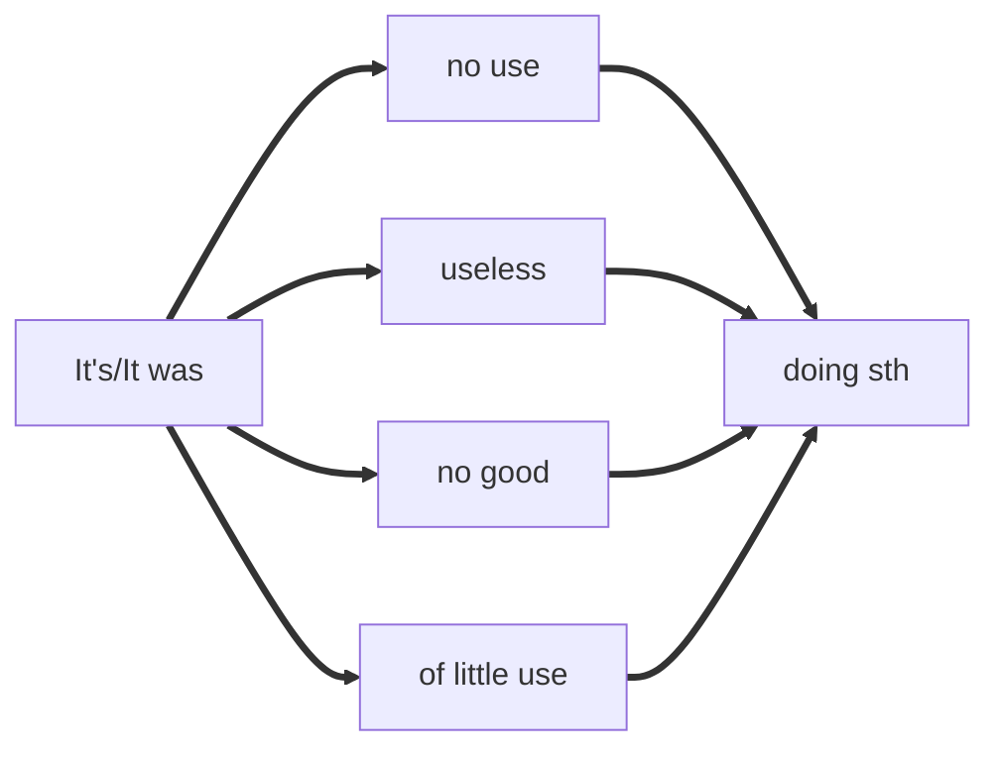
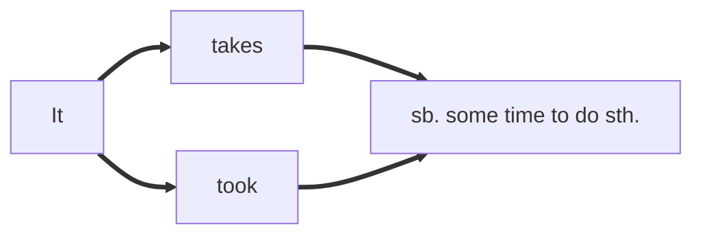
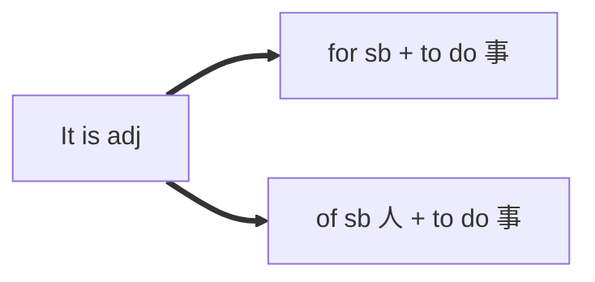
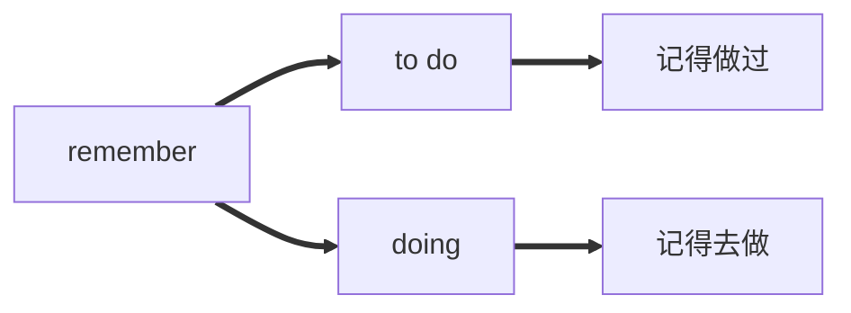
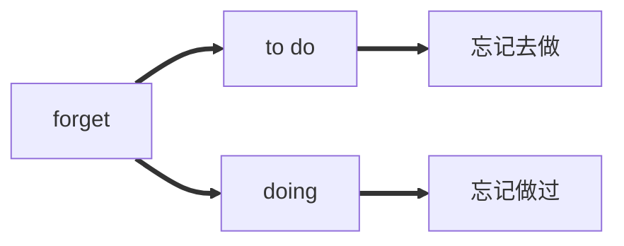
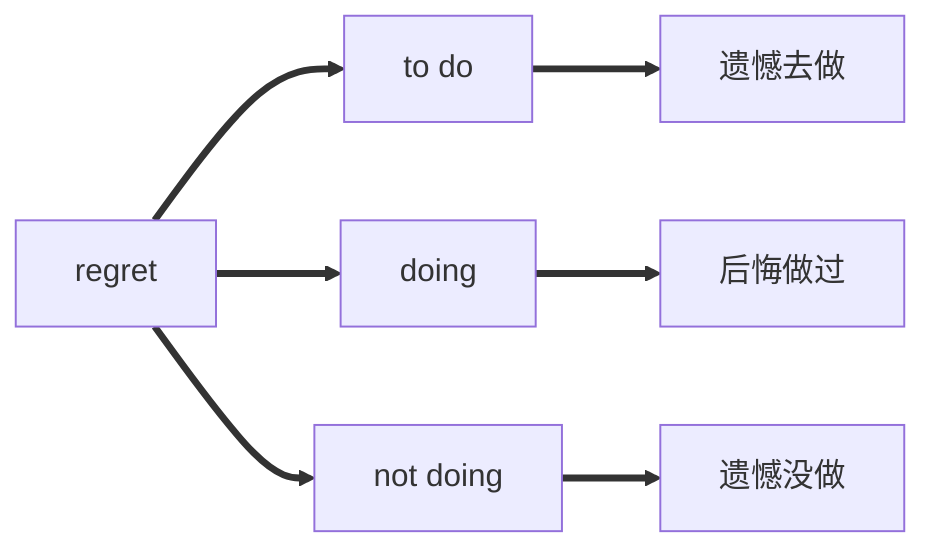
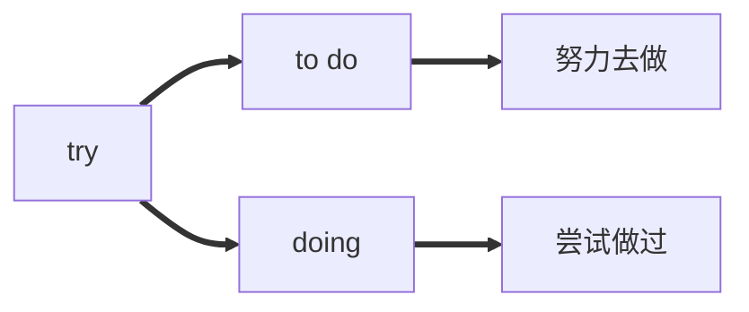
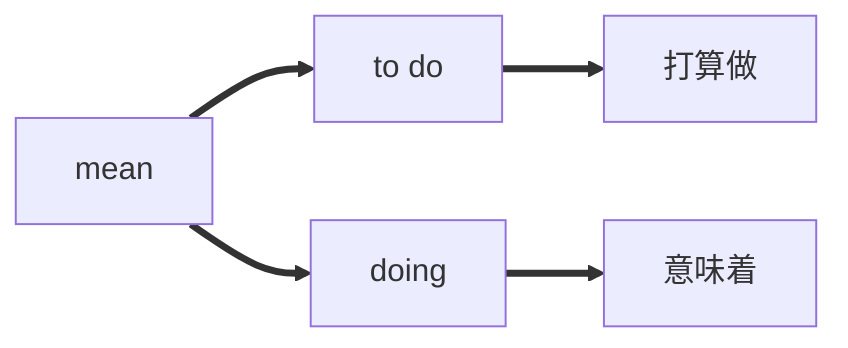
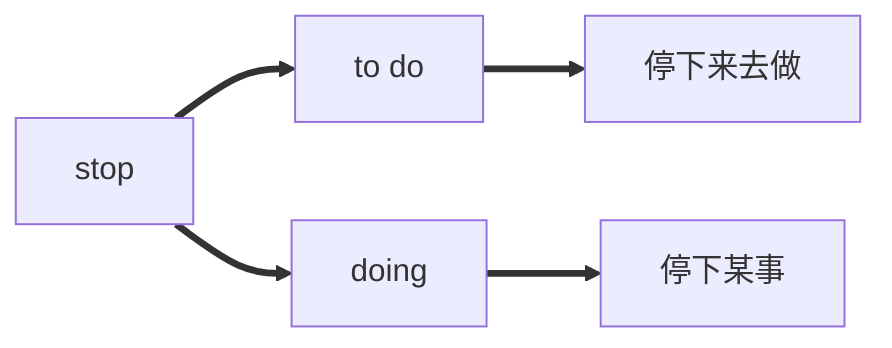
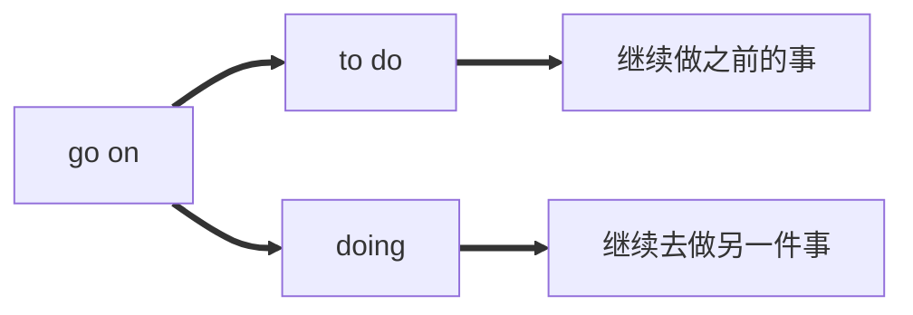

# 非谓语动词

**句子中不是谓语的动词**

| 非谓语动词      | 体         | 主动形式           | 被动形式          | 否定式    |
| --------------- | ---------- | ------------------ | ----------------- | --------- |
| 不定式          | 一般式     | to do              | to be done        | not to do |
| 不定式          | 完成式     | to have done       | to have been done | not to do |
| 不定式          | 进行式     | to be doing        | X                 | not to do |
| 不定式          | 完成进行式 | to have been doing | X                 | not to do |
| 动词 - ing 形式 | 一般式     | doing              | being done        | not doing |
| 动词 - ing 形式 | 完成式     | having done        | having been done  | not doing |
| 过去分词        | 过去式     | done               | done              | not done  |

| 非谓语动词      | 主语 | 表语 | 宾语 | 补语 | 定语 | 状语 |
| --------------- | ---- | ---- | ---- | ---- | ---- | ---- |
| 不定式（to do） | V    | V    | V    | V    | V    | V    |
| 动名词          | V    | V    | V    | X    | V    | X    |
| 现在分词        | X    | V    | X    | X    | V    | V    |
| 过去分词        | X    | V    | X    | X    | V    | V    |

Being done在主语、宾语、介词后被动，其余所有都是正在被

## 做主语

**Knowing** first-aid techniques will help you respond quickly to emergencies.
**To complete** the program need much effort.

doing：常态、习惯
to do：个例，将来

### 特殊主语-形式主语

## 做宾语

### 涉及动作承接人的用法

**主要是背？似乎可以用理解。**

只有有动作承接人的句子可以用to do
不需要主语去做，或者不一定需要主语去做的非谓语动词即用doing，反之to do。

She pretended **not to see** me when I passed by.
see这个动作是**she**做的因此用**to do**的形式

I would appreciate your **calling** back yesterday.
call这个动作句中没有人称去做因此只能用**calling**

| 非谓语动词 | 含义     | 动词            |
| ---------- | -------- | --------------- |
| to do      | 假装拒绝 | pretend; refuse |
| to do      | 决定安排 | decide;arrange  |
| to do      | 目标答应 | aim;agree       |
| to do      | 设法负担 | manage;afford   |
| to do      | 打算选择 | plan;choose     |

| 非谓语动词 | 含义     | 动词                             |
| ---------- | -------- | -------------------------------- |
| doing      | 避免练习 | avoid,practice                   |
| doing      | 考虑建议 | consider;suggest                 |
| doing      | 建议想象 | advise;imagine                   |
| doing      | 注意盼望 | pay attention to;look forward to |

###  用to do 和 doing区别不大的

爱：like,love,prefer
恨：hate
始：begin,start
续：contunue

### 用to do 和 doing区别巨大的

一记二忘三遗憾，四试五图六停续

### 主动表示被动

#### 需要

need doing

My car needs **cleaning**

want doing

My car wants **cleaning**

require doing

My car requires **cleaning**

#### 值得

deserve **doing**

The aim deserves **working**

be worth **doing**

Shaanxi History Museum is worth **visiting**.
Shaanxi History Museum is worth to be visited.

### 特殊固定搭配

**be looking for forward to**

I'm looking forward to **your coming**
I'm looking forward to **swimming**

**insist on**

I **insist on** going with you

| 背背背背背背背背背背背背 | 背背背背背背背背背背背背 |
| -------------------- | --------------------- |
| **add up to**        | **admit to**          |
| **be equal to**      | **devote ... to ...** |
| **get down to**      | **look forward to**   |
| **object to**        | **stick to**          |
| **see to**           | **lead to**           |
| **pay attention to** | **be used to**        |

