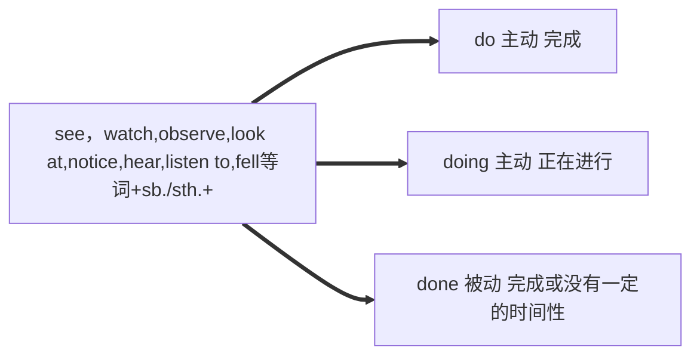

# 非谓语动词总结

## 非谓语动词（to do）有形式

|                | 主动形式               | 被动形式             | 含义                       |
| -------------- | ---------------------- | -------------------- | -------------------------- |
| **一般式**     | to do(1)               | to be done(5)        | **A与B同时进行或在B之后**  |
| **进行式**     | to be doing(2)         | **无**               | **A正在进行或与B同时发生** |
| **完成式**     | to have done(3)        | to have been done(6) | **A发生在B之前**           |
| **完成进行式** | to have  been doing(4) | **无**               | **A发生在B之前且一直进行** |

(1)she hopes **to become** a somebody in the future

(2)It happened **to be raining** when I got there.

(3)He is said **to have studied** in a university in England.

(4)I'm sorry **to have been interrupting** you

(5)There are so many homework **to be done**

(6)It’s nice **to have met **you.


## 动词ing的各种形式

|            | 动词形式       | 被动形式            | 含义                     |
| ---------- | -------------- | ------------------- | ------------------------ |
| **一般式** | doing(1)       | being done(3)       | A与B同时或者几乎同时发生 |
| **完成式** | having done(2) | having been done(4) | A发生在B之前             |


(1)They went out of the classroom,**taking** and **laughing**.

(2)**Having lived** in this city for three years, she knows it very well.

(3)It's difficult to see **being done** in a sentence

(4)Tom sees the room **having been swept**.


## 过去分词

**不及物表示动作已经完成，及物动词表示被动**

They found the train **gone**  ----完成

**Brought up** in the country side,he was interested in biology.   ----及物动词短语

I am going to have my hair **cut**.  ----被动


## 一、做主语的情况：

### 动词不定式

1.**To finish the work in ten minutes** is very hard. 十分钟之内完成这项工作是很难的。（具体的特定动作）
动词的不定式做主语，谓语是is，宾语是hard.

2.**Reading aloud** is very helpful. 朗读是很有好处的。（一般性的情况）
动词的现代分词作主语，谓语is，宾语helpful.


It is important for us to learn english

it is kind of you to help me.


### 动名词

动名词作主语和宾语的用法相同
主要由**物主代词/名词所有格 + 动名词**作句子中的主语，宾语

Do you mind me **(my) smoking** here?(宾语)
**Mary's coming** home late made her mother very angry （主语）


It's no use crying

It is useless telephoning him. He is not willing to come.

It’s no good complaining.


## 二、作宾语的情况

### 用法（一）

以去做和做过（在做）区分


| 谓语动词 | to do | doing      |
| -------- | ----- | ---------- |
| remember | 去做  | 做过，在做 |
| forget   | 去做  | 做过，在做 |
| stop     | 去做  | 做过，在做 |
| regret   | 去做  | 做过，在做 |


使用to do 或 doing的情况（根据词意可快速记忆）

```
admit doing
承认某事（承认做过某事）
```

```
mind doing
介意做某事
```

```
deny doing
否认/拒绝承认某事 （否认做过某人/拒绝承认做过某事）
```

```
hope to do
希望做某事 （希望做过某事）
pretend to do
假装做某事 （假装做过某事）
happen to do
碰巧做某事
```

```
finish doing
结束做某事 （结束在做的某事）
```

```
practive doing
练习做某事 （练习做过的某事）

练习做的事至少做过/没做过的事需要学习

1、learn to do sth. 学着去做某事(在心里打算好了准备去学,还没有去)
强调具体某次的动作.
2、learn doing sth. 学习做某事(已经在学习了,现在进行时 ) 
强调抽象的动作.
```

```
plan to do
计划某事 （计划去做某事）
```


### 用法（二）

| 谓语动词 | to do | doing |
| -------- | ----- | ----- |
| like     | 去做  | 习惯  |
| love     | 去做  | 习惯  |
| hate     | 去做  | 习惯  |
| dislike  | 去做  | 习惯  |

```
I like to swim
我喜欢去游泳 （我想要去游泳（这一次））
I love to swim
我爱去游泳 （我想要去游泳（这一次））

I like swimming
我喜欢游泳 （我一直喜欢游泳（一直））
I love swimming
我爱游泳 （我一直爱游泳（一直））
```


```
I hate to swim
我讨厌去游泳 （我不想要去游泳（这一次））
I dislike to swim
我不爱去游泳 （我不想要去游泳（这一次））

I hate swimming
我讨厌欢游泳 （我一直讨厌游泳（一直））
I dislike swimming
我不爱游泳 （我一直不爱游泳（一直））
```


### 用法（三）

| 谓语动词         | to do | doing |
| ---------------- | ----- | ----- |
| advise（劝告）   | X     | V     |
| allow（允许）    | X     | V     |
| permit（准许）   | X     | V     |
| suggest （建议） | X     | V     |

**Why?Why?Why?Why?Why?Why?Why?Why?Why?Why?Why?Why?Why?Why?Why?Why?Why?Why?Why?Why?**

只有有动作承接人的句子可以用to do

I **permit** Tom **to go swimming**
我允许汤姆去游泳

Administrators don't **permit** **swimming**
管理员们不允许游泳

I **advise** **taking** this way.
Taking this way这个动作并非是I做，因此并不能用to do

I **remember** **to do** my homework.
do my homework这个动作是由I做的，因此可以用to do

I **like** **to swim**.
swim这个动作是由I做的，因此可以用to do


**品味以下单词**

1.后面的非谓语动词已经发生而不能加to do

admit 承认
permit 准许
mind 介意
keep 继续
miss 错过

2.后面的谓语动词主导着不是主语（不是主语的动作）

suggest 建议
finish 完成
allow 允许
advise 建议
delay 延期

3.后面表示动作本身（enjoy doing）

enjoy 喜欢
avoid 避免
delay 耽误
practise 练习
put off 推迟
can't help 禁不住
escape逃脱
consider 考虑
stand 忍受


### 用法（四）

| 谓语动词 | to do        | doing |
| -------- | ------------ | ----- |
| want     | （主语）去做 | 被做  |
| need     | （主语）去做 | 被做  |
| require  | （主语）去做 | 被做  |


```
I want to swimg
我想去游泳（主语去做）
My car wants cleaning
我车想要被清理（车子被清理）
```


## 三、作定语的情况

### 动词不定式

动词不定式永远是后置定语

表将来用不定式
The car **to be bought** is for his sister

形容最高级用不定式
He was the best man **to do** the job.

抽象名词用不定式
Do you have ability **to read** and **write** in English?
常见的抽象名词有

```english
ability,chance,idea,fact,attempt,belief,way,promise
```


### 各种分词

#### doing

**与被修饰的名词为主动**
Do you know the boy standing under the tree?


#### being done

**与被修饰的名词之间为被动关系且正在进行**
The house being built is for the village


#### done

**与被修饰的名词之间为被动关系且完成**

I don't like the novel written by Mary.


## 四、非谓语动词的作宾补



I heard her **sing** an English song just now.
She was heard **to sing** an English song just now.

I heard her singing an English song when I passed by her room.
